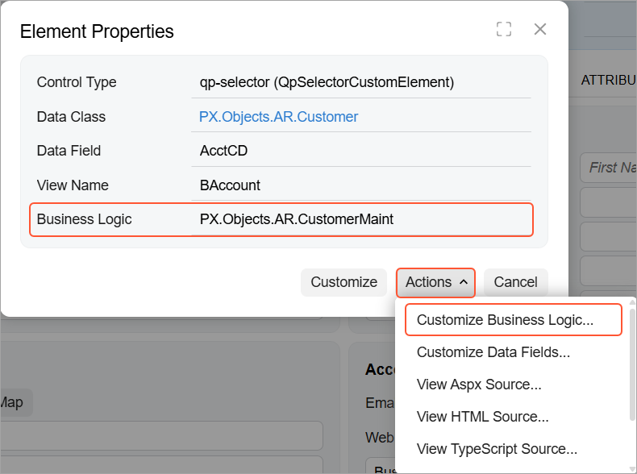
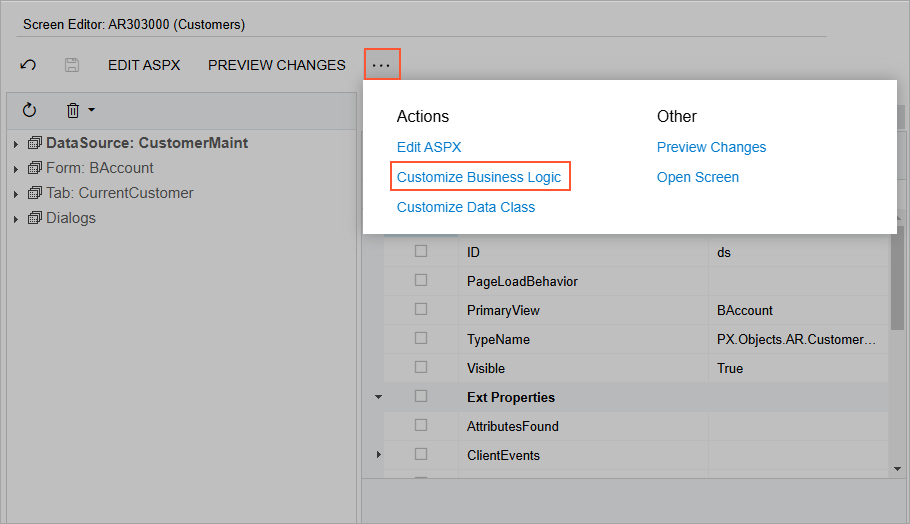
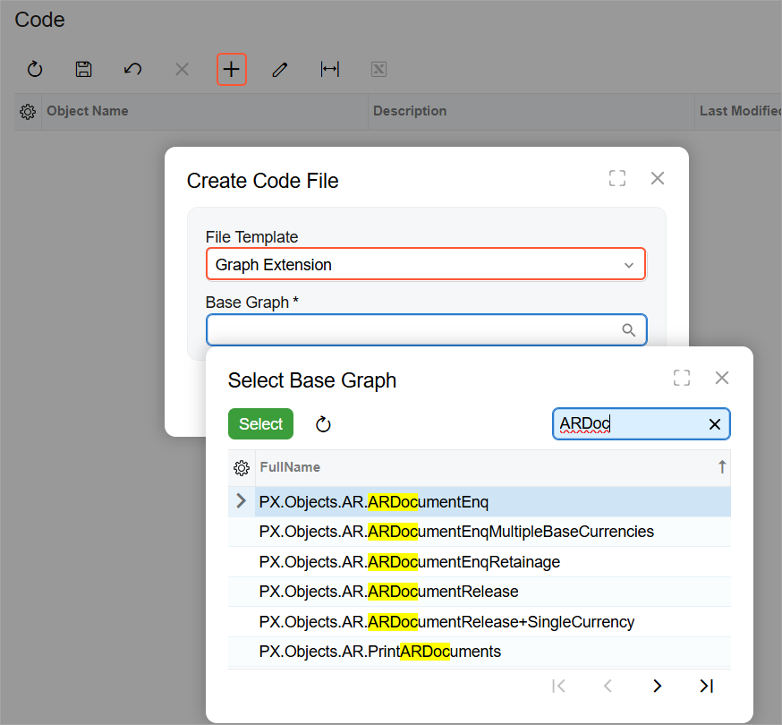

# Graph Extensions: Creating a Graph Extension Through the UI {#_8278c2df-219d-4bba-9c9d-3411f019c02c .concept}

You can create the class extension for an existing graph and add the *Code* item with the created code to a customization project in several ways, as described in the following sections:

-   [Adding a Code Item by Using the Element Inspector](#_3bee7749-689f-4efd-90c1-af8cc1915224)
-   [Adding a Code Item by Using the Screen Editor](#_273f6537-461f-47ca-b51c-0732aaa09f56)
-   [Adding a Code Item on the Code Page](#_b63fd5a3-3085-4a2d-a3bc-6f0f3eca7e82)

If you need to extend the code of a graph with no associated webpage \(such as ARReleaseProcess\), follow the instructions described in [Adding a Code Item on the Code Page](#_b63fd5a3-3085-4a2d-a3bc-6f0f3eca7e82).

As soon as you add the Code item for customizing the business logic to the project, the system generates an extension class for it and opens the code in the [Code Editor](../Shared/../UserGuide/AU_20_40_00_CodeEditor.md). You can work with the extension classes in the Code Editor. After you publish the customization project, you can develop the code in Microsoft Visual Studio.

## Adding a Code Item by Using the Element Inspector {#_3bee7749-689f-4efd-90c1-af8cc1915224 .section}

Typically, you want to modify the business logic that’s executed for an Acumatica ERP form.

You can use the [Element Inspector](../Shared/../UserGuide/AU_ElementInspector.md) to add to a customization project a *Code* item for customizing an existing form’s business logic. Perform the following actions:

1.  Open the form in the browser.
2.  On the form title bar, click **Customization &gt; Inspect Element** to launch the Element Inspector.
3.  On the form, select any UI element to open the [Element Properties Dialog Box](../Shared/../UserGuide/AU_ElementInspector.md#_8ce780b0-243f-480c-8b4c-ed6431116e3f) for it.

    The **Business Logic** box of the dialog box displays the name of the graph that provides business logic for the form \(see below\).

4.  Click **Actions &gt; Customize Business Logic**.

    

5.  If no customization project is selected and the inspector opens the [Table 1](../Shared/../UserGuide/AU_CustomizationMenu.md#_6adfabb5-9264-4273-938a-db4a41510b1c), select an existing customization project or create one.

The platform creates the template of the class that is derived from the PXGraphExtension&lt;&gt; class, saves the code as a *Code* item of the project in the database, and opens the item in the [Code Editor](../Shared/../UserGuide/AU_20_40_00_CodeEditor.md).

## Adding a Code Item by Using the Screen Editor {#_273f6537-461f-47ca-b51c-0732aaa09f56 .section}

To customize the form’s business logic, you can add a *Code* item to a customization project from the [Screen Editor](../Shared/../UserGuide/AU_20_45_20.md) in the Classic UI.

On the toolbar of the Screen Editor, click the More menu and click **Customize Business Logic**, as shown below.

The platform creates the template of the class that’s derived from the PXGraphExtension&lt;&gt; class, saves the code as a *Code* item of the project in the database, and opens the item in the [Code Editor](../Shared/../UserGuide/AU_20_40_00_CodeEditor.md).

## Adding a Code Item on the Code Page {#_b63fd5a3-3085-4a2d-a3bc-6f0f3eca7e82 .section}

If you know the name of the graph to be customized, you can create a *Code* item with the graph extension template on the Code page of the Customization Project Editor by using the **Create Code File** dialog box.

To do this, perform the following actions:

1.  Open the customization project in the editor.
2.  Click **Code** in the navigation pane to open the Code page.
3.  Click **Add New Record** on the page toolbar.
4.  In the **Create Code File** dialog box, which opens, select *Graph Extension* in the **File Template** box, as shown below.
5.  In the **Base Graph** box, select the name of the graph to be customized.
6.  Click **OK**.

    

The platform creates the template of the class that’s derived from the PXGraphExtension&lt;&gt; class, saves the code as a *Code* item of the project, and opens the item in the [Code Editor](../Shared/../UserGuide/AU_20_40_00_CodeEditor.md).

**Parent topic:**[Working with Graph Extensions](../StudioDeveloperGuide/CodeCustomization_GraphExtension_Mapref.md)

