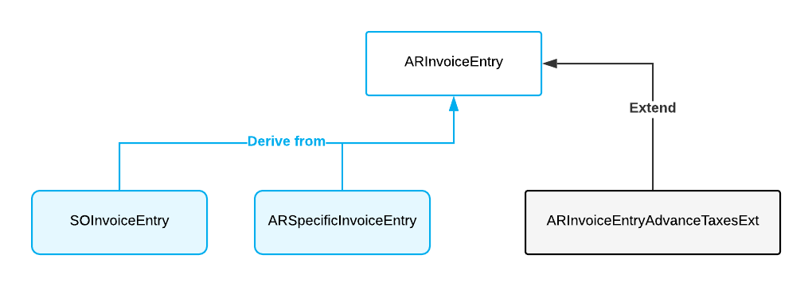

# Graph Extensions: Enabling a Graph Extension Conditionally \(with IsActive\) {#_cd70b408-b389-4bd8-8502-3d9c12b11112 .concept}

You need to disable a graph extension when it isn’t required by the system logic \(for example, when the feature that uses the extension is not enabled\). When an extension is constantly active, it can impair the system's performance. You can also disable a graph extension for a specific derived graph.

## Enabling a Graph Extension Conditionally { .section}

To disable or enable a graph extension depending on a condition, you need to implement the public static bool IsActive method in the extension. The following code shows an example of the implementation of the IsActive method.

```language-csharp
public static bool IsActive()
{
    return PXAccess.FeatureInstalled<FeaturesSet.rutRotDeduction>();
}
```

In the code above, the extension is enabled when the rutRotDeduction feature is enabled.

If the IsActive method returns false for an extension, this extension is not loaded. This means the following:

-   Form controls bound to views defined in that graph extension are automatically hidden.
-   Event handlers implemented in the graph extension are ignored. Overridden event handlers and methods with the PXOverride attribute are also ignored.
-   Views defined in the graph extension won’t be available.

**Attention:** If a graph extension has higher-level extensions, to disable each higher-level extension, you need to implement the IsActive method in it as well. If the base graph extension is disabled while the higher-level extension is not, an error is thrown. For details on higher-level extensions, see [Graph Extensions: General Information](CodeCustomization_GraphExtension_GeneralInfo.md).

## Disabling a Graph Extension for the Base Graph and All Derived Graphs { .section}

Suppose that you have the following graph and graph extensions \(shown in the diagram below\):

-   The ARInvoiceEntry base graph
-   The SOInvoiceEntry and ARSpecificInvoiceEntry graphs, which are derived from ARInvoiceEntry
-   The ARInvoiceEntryAdvanceTaxesExt graph extension, which has been declared for ARInvoiceEntry



The IsActive method in a graph extension controls whether the graph extension is enabled and applied to the graph specified in the graph extension’s declaration and all of the graph’s inheritors. In the current example, if the IsActive method is declared in ARInvoiceEntryAdvanceTaxesExt and returns false, then the ARInvoiceEntryAdvanceTaxesExt graph extension is disabled for all of the following graphs: ARInvoiceEntry, ARSpecificInvoiceEntry, and SOInvoiceEntry.

## Disabling a Graph Extension for a Derived Graph { .section}

Sometimes you may need to have more granular control over the graph extension activity. That is, you may want to do the following:

-   **Disable a graph extension for a specific graph inheritor**. For example, you may not want to apply logic from the ARInvoiceEntryAdvanceTaxesExt graph extension to the SOInvoiceEntry graph.
-   **Disable a graph extension for only derived graphs**. For example, you may need the ARInvoiceEntryAdvanceTaxesExt graph extension to be applied to only the ARInvoiceEntry graph.

The IsActive method does not help in these cases. To support these scenarios, you need to declare a public static bool-returning generic method named IsActiveForGraph&lt;TGraph&gt;, as the following code shows.

```language-csharp
public static bool IsActiveForGraph<TGraph>()
```

Inside the method, you need to check the type of the graph to which the extension is applied. You need to use the TGraph generic type argument to check the type of the graph to which the extension is applied.

You can implement the two cases described above as follows:

-   **Disabling the graph extension for a specific graph inheritor**: If you don’t want to apply the logic from ARInvoiceEntryAdvanceTaxesExt to SOInvoiceEntry, for example, the implementation of the IsActiveForGraph method should be coded as follows.

    ```language-csharp
    public static bool IsActiveForGraph<TGraph>() 
        => typeof(TGraph) != typeof(SOInvoiceEntry);
    ```

-   **Disabling a graph extension for only derived graphs**: If you want the ARInvoiceEntryAdvanceTaxesExt graph extension to be applied to only the ARInvoiceEntry graph, for example, the implementation of the IsActiveForGraph method should be coded as follows.

    ```language-csharp
    public static bool IsActiveForGraph<TGraph>() 
        => typeof(TGraph) == typeof(ARInvoiceEntry);
    ```


The full code of the ARInvoiceEntryExt graph extension in this example looks as follows.

```language-csharp
public class ARInvoiceEntryExt : PXGraphExtension<ARInvoiceEntry>
{
	public static bool IsActive()
	{
		return PXAccess.FeatureInstalled<FeaturesSet.retainage>();
	}

	public static bool IsActiveForGraph<TGraph>()
	    where Graph : PXGraph // Constraint is not obligatory
       {
	    // Check the type of the graph here
	    return typeof(TGraph) == typeof(ARInvoiceEntry);
        }
}
```

## Disabling a Generic Graph Extension {#section_ikj_n5y_1nb .section}

If you have a generic graph extension and graph extensions derived from this generic graph extension, to disable them, you implement the IsActive method in each of the derived graph extensions.

For example, suppose you have a generic graph extension declared as shown the following code.

```language-csharp
public class GraphExtBase<TGraph, TDac> : PXGraphExtension<TGraph>
    where TGraph : PXGraph
    where TDac : class, IBqlTable
{ }
```

The following code shows the derived graph extension.

```language-csharp
public class GraphExtAPInvoice : 
    GraphExtBase<APInvoiceEntry, APInvoice>{}
```

To disable the `GraphExtAPInvoice` graph extension, you need to implement the IsActive method, as the following code shows.

```language-csharp
public class GraphExtAPInvoice : 
    GraphExtBase<APInvoiceEntry, APInvoice>
{
    public static bool IsActive()
    {
        return PXAccess.FeatureInstalled<FeaturesSet.AdvancedAPInvoice>();
    }
}
```

For details on generic graph extensions, see [Generic Graph Extensions: General Information](CodeCustomization_GenericExtension_GeneralInfo.md).

## Restrictions in the IsActive Method { .section}

Inside the IsActive method, you shouldn’t create a graph instance because it can lead to deadlocks. If you need to read data from the database, you can use database slots by doing the following:

1.  In the graph extension where you need to define the IsActive method, you also define a database slot that depends on a DAC from which you need to read data. In the slot, you cache the data that you need to access.
2.  In the IsActive method, you access the data from the slot.

For example, suppose that you need to enable the extension in the IsActive method only if the `InspectionEnabled` property of `SOSetup` DAC is true. The following code shows how you can access the `InspectionEnabled` property by using a database slot.

```language-csharp
private class SOSetupInspection : IPrefetchable
{
    public static bool InspectionEnabled =>
        PXDatabase.GetSlot<SOSetupInspection>(
            "SOSetupInspection", typeof(SOSetup))._inspectionEnabled;
    private bool _inspectionEnabled;
    void IPrefetchable.Prefetch()
    {
        using (PXDataRecord soSetup =
            PXDatabase.SelectSingle<SOSetup>(
                new PXDataField<SOSetup.inspectionEnabled>()))
            if (soSetup != null) _inspectionEnabled = (bool)soSetup.GetBoolean(0);
    }
}

public static bool IsActive() => SOSetupInspection.InspectionEnabled;
```

In the code above, you’ve done the following:

1.  In the extension, defined the `SOSetupInspection` database slot, which depends on the `SOSetup` table. In the slot, you’ve cached the `SOSetup.InspectionEnabled` value.
2.  In the IsActive method, checked the `SOSetupInspection.InspecionEnabled` property, which holds the cached value of the `SOSetup.InspectionEnabled` property.

For more information on database slots, see [Use of Slots to Cache Data Objects](AD__con_Using_Slots_to_Cache_Data.md).

**Parent topic:**[Working with Graph Extensions](../StudioDeveloperGuide/CodeCustomization_GraphExtension_Mapref.md)

