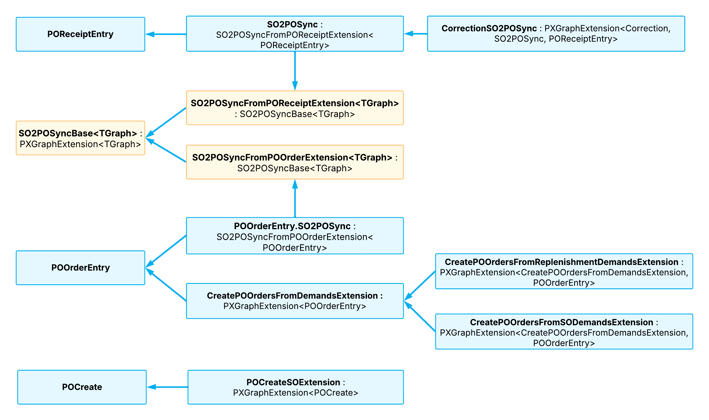

# Graph Extensions: POCreate, POOrderEntry, and POReceiptEntry Extensions {#_03f1ab3f-cae4-4f6b-b32a-352fb74f067c .concept}

Acumatica ERP provides a number of graph extensions of the POCreate, POOrderEntry, and POReceiptEntry graphs. These graph extensions manage the relationship between sales orders and purchase orders.

See the diagram below for a high-level overview of the graph extensions.

**Parent topic:**[Working with Graph Extensions](../StudioDeveloperGuide/CodeCustomization_GraphExtension_Mapref.md)

