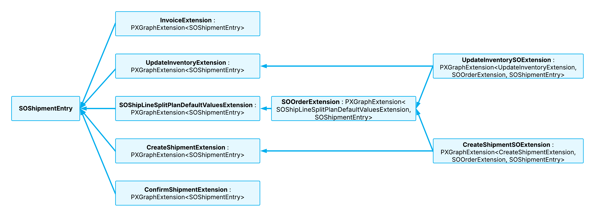

# Graph Extensions: SOShipmentEntry Extensions {#_07158e7d-8850-4308-803c-428ade7ccc97 .concept}

In this topic, you can find an overview of SOShipmentEntry graph extensions and examples of their use.

## The Big Picture { .section}

The SOShipmentEntry graph provides multiple extensions, each of which works with specific functionality. For example:

-   SOOrderExtension contains common logic for sales orders and shipments.
-   UpdateInventoryExtension handles inventory update operations and provides extension points for these operations.
-   UpdateInventorySOExtension uses these extension points to inject logic from the SOOrderExtension extension.

See the diagram below for a high-level overview of the graph extensions.



## SOOrderExtension { .section}

The PX.Objects.SO.GraphExtensions.SOShipmentEntryExt.SOOrderExtension class is an extension of the SOShipmentEntry graph. The extension contains the common business logic related to the SOOrder and SOShipment entities.

## CreateShipmentExtension { .section}

The PX.Objects.SO.GraphExtensions.SOShipmentEntryExt.CreateShipmentExtension class is another extension of the SOShipmentEntry graph. This extension handles logic related to the creation of shipments. The CreateShipmentExtension extension includes logic related to only the SOShipment entity.

## CreateShipmentSOExtension { .section}

The PX.Objects.SO.GraphExtensions.SOShipmentEntryExt.CreateShipmentSOExtension class is another extension of the SOShipmentEntry graph and the SOOrderExtension and CreateShipmentExtension graph extensions. This extension manages the relations between the SOOrder and SOShipment entities during shipment creation.

## ConfirmShipmentExtension { .section}

The PX.Objects.SO.GraphExtensions.SOShipmentEntryExt.ConfirmShipmentExtension class is another extension of the SOShipmentEntry graph. This extension contains the elements related to shipment confirmation.

## InvoiceExtension { .section}

The PX.Objects.SO.GraphExtensions.SOShipmentEntryExt.InvoiceExtension extension of the SOShipmentEntry graph contains elements related to invoice creation.

## UpdateInventoryExtension { .section}

The PX.Objects.SO.GraphExtensions.SOShipmentEntryExt.UpdateInventoryExtension class is an extension of the SOShipmentEntry graph. This extension contains the elements related to updating inventory. The UpdateInventoryExtension extension includes logic related to only the SOShipment entity.

## UpdateInventorySOExtension { .section}

The PX.Objects.SO.GraphExtensions.SOShipmentEntryExt.UpdateInventorySOExtension class is another extension of the SOShipmentEntry graph and the SOOrderExtension and UpdateInventoryExtension graph extensions. This extension manages the relations between the SOOrder and SOShipment entities when inventory is updated.

## Example: Using an Extension { .section}

If you need to use the elements of the InvoiceExtension extension in your extension, you need to define your extension as follows.

```language-csharp
public class SOShipmentEntryPXExt : 
   PXGraphExtension<**InvoiceExtension**, LabelsPrinting, SOShipmentEntry>
```

## Example: Using Data Views and Actions { .section}

If your customization project uses any of the data views or actions from a SOShipmentEntry graph extension, you work with them as shown in the following example.

```language-csharp
protected virtual void InsertDetail(PXGraph graph)
{
    var shipmentEntryOrderExt = **graph.GetExtension&lt;SOOrderExtension&gt;\(\)**;
    var filterCache = **shipmentEntryOrderExt**.addsofilter.Cache;

    ...

    **shipmentEntryOrderExt**.addSO.Press();
}
```

## Example: Adjusting the Workflow { .section}

Suppose that you need to adjust a workflow as part of a customization project. The following example uses the createInvoice action and the OnInvoiceLinked workflow event handler of the InvoiceExtension and SOOrderExtension graph extensions, respectively.

```language-csharp
fss.Add<State.confirmed>(flowState =>
{
    return flowState
        .WithActions(actions =>
        {
            actions.Add**&lt;InvoiceExtension&gt;**(g => g.createInvoice, 
                a => a.IsDuplicatedInToolbar().
                    WithConnotation(ActionConnotation.Success));
        })
        .WithEventHandlers(handlers =>
        {
            handlers.Add(g => g.**GetExtension&lt;SOOrderExtension&gt;\(\)**.
                OnInvoiceLinked);
        })
});
```

**Parent topic:**[Working with Graph Extensions](../StudioDeveloperGuide/CodeCustomization_GraphExtension_Mapref.md)

