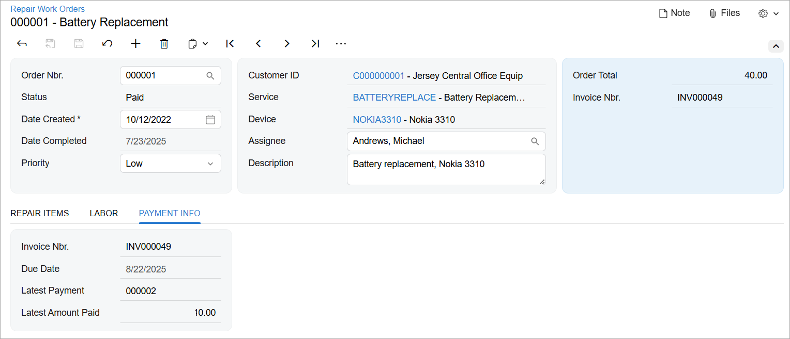

# Use of PXProjection:To Display Multiple DAC Data on a Tab {#_d0134735-0d66-44eb-9acf-9daaa78c474f .task}

This activity will walk you through deriving a set of data from multiple DACs by using the PXProjection attribute, and displaying that data on a single tab.

## Story { .section}

Suppose that in the *PhoneRepairShop* customization project, you want to display information about the invoice related to a repair work order and the most recent payment that was made for it. You need to add a tab to the Repair Work Orders \(RS301000\) form that will display this information.

The tab will have the following elements:

-   **Invoice Nbr.**: The number of the invoice that has been created for the repair work order
-   **Due Date**: The due date for the invoice
-   **Latest Payment**: The number of the most recent payment applied to the invoice
-   **Latest Amount Paid**: The amount paid in the payment that was applied to the invoice most recently

This set of data is derived from different DACs. To display the UI elements on a single tab, you’ll use the PXProjection attribute.

## Process Overview { .section}

In this activity, you will add a new tab to the Repair Work Orders \(RS301000\) form by performing the following steps:

1.  Defining the DAC for the new tab by using the PXProjection attribute
2.  Defining the data view for the new tab
3.  Adding the new tab to the form
4.  Testing the new tab

## System Preparation { .section}

Make sure that you’ve configured your instance as described in [Test Instance for Customization: To Deploy an Instance with a Custom Form that Implements a Workflow](CodeCustomization_PrepareInstance_Activity_DeployInstanceT240.md). Make sure that the Repair Work Orders \(RS301000\) form has been defined and the following elements exist:

-   `RSSVWorkOrderEntry` graph
-   `RSSVWorkOrder` DAC
-   `RS301000.ts` file
-   `RS301000.html` file

To be able to create and pay invoices, you need to configure the deployed instance as follows:

1.  On the [Enable/Disable Features](../Shared/../UserGuide/CS_10_00_00.md) \(CS100000\) form, enable the *Advanced SO Invoices* feature.
2.  On the [Item Classes](../Shared/../UserGuide/IN_20_10_00.md) \(IN201000\) form, select the *STOCKITEM* class. On the **General** tab \(**General Settings** section\), select the **Allow Negative Quantity** check box. On the form toolbar, click **Save**.
3.  On the [Accounts Receivable Preferences](../Shared/../UserGuide/AR_10_10_00.md) \(AR101000\) form, on the **General** tab \(**Data Entry Settings** section\), clear the **Validate Document Totals on Entry** and **Require Payment Reference on Entry** boxes to simplify the process of releasing an invoice. On the form toolbar, click **Save**.

## Step 1: Learning the DAC Names for the Fluent BQL Query { .section}

To retrieve the needed set of data, you’ll find out which DACs you need to use in a fluent BQL query of the PXProjection attribute. To learn the names of the required DACs, do the following:

1.  On the [Invoices](../UserGuide/SO_30_30_00.md) \(SO303000\) form, use the Element Inspector on the Summary area of the form to learn the DAC name for the invoice, and on the **Applications** tab to learn the DAC name for payments that have been applied to the invoice. Notice that these are the `ARInvoice` and `ARAdjust2` DACs, respectively.
2.  Learn the key fields of the `ARInvoice` DAC, which you’ll need to know to select records in a fluent BQL query. The key fields you need to select an invoice are `ARInvoice.refNbr` and `ARInvoice.docType`.
3.  Analyze the code of the `ARAdjust2` DAC. It is an alias of the `ARAdjust` DAC, so you can use the `ARAdjust` DAC.
4.  Analyze the code of the `ARInvoice` and `ARAdjust` DACs and the fields defined in them. You’ll need the following fields:
    -   For the invoice number, `ARInvoice.refNbr`
    -   For the invoice due date, `ARINvoice.dueDate`
    -   For the payment number, `ARAdjust.adjgRefNbr`
    -   For the payment amount, `ARAdjust.curyAdjdAmt`

## Step 2: Defining the DAC for the Tab { .section}

To define the DAC for the tab, do the following:

1.  In the `Helper/Messages.cs` file, add the `RSSVWorkOrderPayment` string to the Messages class, as shown in the following code. This message will be used in the [PXCacheName](https://help.acumatica.com/(W(4))/Help?ScreenId=ShowWiki&pageid=052f5683-d20b-da61-4e6c-47a966162fb4) attribute for the new DAC.

    ```language-csharp
            public const string RSSVWorkOrderPayment = 
                "Invoice and Payment of the Repair Work Order";
    ```

2.  In the `DAC` folder of the `PhoneRepairShop_Code` project, create the `RSSVWorkOrderPayment.cs` file.
3.  Add the following using directives.

    ```language-csharp
    using PX.Data;
    using PX.Data.BQL.Fluent;
    using PX.Objects.AR;
    ```

4.  Add the `RSSVWorkOrderPayment` DAC, as shown in the following code.

    ```language-csharp
    namespace PhoneRepairShop
    {
        [PXCacheName(Messages.RSSVWorkOrderPayment)]
        [PXProjection(typeof(
          SelectFrom<ARInvoice>.
            InnerJoin<ARAdjust>.On<
              ARAdjust.adjdRefNbr.IsEqual<ARInvoice.refNbr>.
              And<ARAdjust.adjdDocType.IsEqual<ARInvoice.docType>>>.
            AggregateTo<
              Max<ARAdjust.adjgDocDate>,
              GroupBy<ARAdjust.adjdRefNbr>,
              GroupBy<ARAdjust.adjdDocType>>))]
        public class RSSVWorkOrderPayment : PXBqlTable, IBqlTable
        {    }
    }
    ```

    In the query of the `PXProjection` attribute, you’ve selected an invoice and all payments applied to the invoice. To sort the payments by the date, you’ve used the `AggregateTo` clause. Inside the clause, you’ve grouped all payments by their invoice number and document type \(which are the same because all payments selected are applied to the same invoice\) and selected the payment with the latest document date.

5.  Add to the `RSSVWorkOrderPayment` DAC the fields you learned in Instruction 1, as the following code shows.

    ```language-csharp
            #region InvoiceNbr
            [PXDBString(15, IsUnicode = true, IsKey = true, InputMask = "",
              BqlField = typeof(ARInvoice.refNbr))]
            [PXUIField(DisplayName = "Invoice Nbr.", Enabled = false)]
            public virtual string? InvoiceNbr { get; set; }
            public abstract class invoiceNbr :
                PX.Data.BQL.BqlString.Field<invoiceNbr> { }
            #endregion
    
            #region DueDate
            [PXDBDate(BqlField = typeof(PX.Objects.AR.ARInvoice.dueDate))]
            [PXUIField(DisplayName = "Due Date", Enabled = false)]
            public virtual DateTime? DueDate { get; set; }
            public abstract class dueDate :
                PX.Data.BQL.BqlDateTime.Field<dueDate> { }
            #endregion
    
            #region AdjgRefNbr
            [PXDBString(BqlField = typeof(ARAdjust.adjgRefNbr))]
            [PXUIField(DisplayName = "Latest Payment", Enabled = false)]
            public virtual string? AdjgRefNbr { get; set; }
            public abstract class adjgRefNbr :
                PX.Data.BQL.BqlString.Field<adjgRefNbr> { }
            #endregion
    
            #region CuryAdjdAmt
            [PXDBDecimal(BqlField = typeof(ARAdjust.curyAdjdAmt))]
            [PXUIField(DisplayName = "Latest Amount Paid", Enabled = false)]
            public virtual Decimal? CuryAdjdAmt { get; set; }
            public abstract class curyAdjdAmt :
                PX.Data.BQL.BqlDecimal.Field<curyAdjdAmt> { }
            #endregion
    ```

    Note that each field has the PXDB&lt;type&gt; attribute with the `BqlField` parameter specified to set up the projection.

    Although the `RSSVWorkOrderPayment` DAC has a master-detail relationship with the `RSSVWorkOrder` DAC, you don’t need to add any PXDBDefault and PXParent attributes to the fields because all field values are determined by the query in the PXProjection attribute.

6.  Build the project.

## Step 3: Defining the Data View for the Tab { .section}

To define the data view for the tab, do the following:

1.  In the `RSSVWorkOrderEntry` class, add the following member to the `Views` region of the class.

    ```language-csharp
            public 
                SelectFrom<RSSVWorkOrderPayment>.
                Where<RSSVWorkOrderPayment.invoiceNbr.
                    IsEqual<RSSVWorkOrder.invoiceNbr.FromCurrent>>
                .View Payments = null!;
    ```

    In the view, you select data from the `RSSVWorkOrderPayment` DAC with same invoice number \(stored in the `RSSVWorkOrder` DAC\) as in the Summary area of the form.

2.  Build the project.

## Step 4: Adding a New Tab \(Self-Guided Exercise\) { .section}

To add the new tab, do the following:

1.  In the `RS301000.ts` file, define the `Payments` property for the `RSSVWorkOrderPayment` view class and then define this view class \(see the code below\).

    ```language-javascript
    	@viewInfo({ containerName: "Payment Info" })
    	Payments = createSingle(RSSVWorkOrderPayment);
    ```

2.  In the `RSSVWorkOrderPayment` view class, specify properties for all fields of the `RSSVWorkOrderPayment` DAC, as shown in the code below.

    ```language-javascript
    export class RSSVWorkOrderPayment extends PXView {
    	InvoiceNbr: PXFieldState;
    	DueDate: PXFieldState;
    	AdjgRefNbr: PXFieldState;
    	CuryAdjdAmt: PXFieldState;
    }
    ```

3.  In the `RS301000.html` file, add qp-tab in the qp-tabbar container.
4.  In the qp-tab tag, add the qp-template tag with a single qp-fieldset tag inside it. Use the 7-10-7 template.
5.  Bind qp-fieldset to the `Payments` view property in the TypeScript class.
6.  In the qp-fieldset container, include the field tags for the fields you’ve added in the view class.

    ```language-xml
    		<qp-tab id="tab-PaymentInfo" caption="Payment Info">
    			<qp-template
    				id="form-PaymentInfo"
    				name="7-10-7"
    			>
    				<qp-fieldset id="fsColumnA-PaymentInfo" slot="A" view.bind="Payments">
    					<field name="InvoiceNbr"></field>
    					<field name="DueDate"></field>
    					<field name="AdjgRefNbr"></field>
    					<field name="CuryAdjdAmt"></field>
    				</qp-fieldset>
    			</qp-template>
            </qp-tab>
    ```

7.  Publish the customization project.

For details on how to define a tab, see the *T210 Customized Forms and Master-Details Relationships* course.

## Step 5: Testing the New Tab { .section}

To test the **Payment Info** tab of the Repair Work Orders \(RS301000\) form, do the following:

1.  Open any repair work order with *Paid* or *Completed* status.
2.  Open the **Payment Info** tab, which looks as follows.

    


**Parent topic:**[Displaying Data from Multiple DACs by Using PXProjection](../StudioDeveloperGuide/CodeCustomization_MultiDacDisplayPXProjection_Mapref.md)

