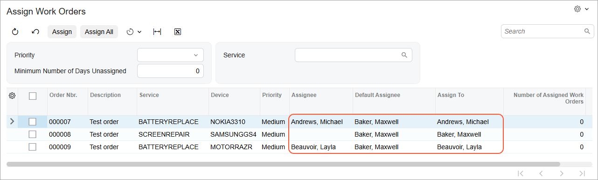

# PXAccumulator:To Modify the Processing Form to Use the Field Updated by PXAccumulator {#_dcb05ad8-6228-4206-8607-c5a44f785398 .task}

The following activity will walk you through the modification of the processing form to use the field updated by the custom PXAccumulator attribute.

## Story { .section}

The Assign Work Orders \(RS501000\) processing form was developed for the Smart Fix company, and now its managers would like to make the automatic assignment of work orders on this form more efficient:

-   Repair work orders should be automatically assigned to the employee with the fewest repair work orders assigned.
-   If multiple employees have the smallest number of repair work orders assigned, the work orders will be assigned to the first of these employees to be selected from the database.

For the Assign Work Orders form, you’ve already implemented the custom PXAccumulator attribute, which counts the number of repair work orders assigned to each employee and updates this number in the database during processing. Now you need to modify the form so that it contains information about the number of work orders assigned to the potential assignees who are listed in the table.

In the table on the Assign Work Orders form, you need to have the following columns related to the employees and the number of assigned work orders:

-   **Assignee**: The assignee selected on the Repair Work Orders \(RS301000\) form for the work order. The column is empty if no value has been selected on the Repair Work Orders form. You’ll add this column temporarily for testing purposes; it won’t be editable.
-   **Default Assignee**: The default assignee, which is calculated as the employee with the lowest number of assigned work orders. To make sure that the values in the **Assign To** column are calculated correctly during testing, you’ll display the **Default Assignee** column, and it won’t be editable. \(You'll delete this column after testing.\)
-   **Assign To**: The employee to which the repair work order will be assigned during processing. By default, the system inserts the value from the **Assignee** column for this work order if it isn’t `null`. If it’s `null`, the system inserts the value copied from the **Default Assignee** column. A user can override the default value in this column.
-   **Number of Assigned Work Orders**: An uneditable column showing the number of work orders assigned to the assignee that’s specified in the **Assignee** column.

## Process Overview { .section}

You'll modify the constructor of the `RSSVAssignProcess` graph to make the **Assign To** column editable.

In the `RSSVWorkOrderEntry` graph, you'll also modify the implementation of the `AssignOrders()` method and add the `complete()` action handler so that `1` is added to or subtracted from the number of assigned work orders. The value specified for the number of assigned work orders in the `AssignOrders()` method and the `complete()` action handler will be added to the value stored in the database by the custom PXAccumulator attribute.

You’ll then modify the TypeScript code of the Assign Work Orders \(RS501000\) form and test the changes on the form.

## System Preparation { .section}

Before you begin performing the steps of this activity, perform these prerequisite activities:

1.  [Test Instance for Customization: To Deploy an Instance with a Custom Form that Implements a Workflow](CodeCustomization_PrepareInstance_Activity_DeployInstanceT240.md)
2.  [Processing Operations: To Implement a Processing Operation by Using a Delegate](CodeCustomization_ProcessingOperations_Activity_CreateWithoutFilter_withDelegate.md)
3.  [Filtering Parameters: To Add a Filter for a Processing Form](../DeveloperGuide/UIDev_FilteringParameters_Activity_AddFilter.md)
4.  [PXAccumulator: To Implement a Custom Accumulator Attribute](CodeCustomization_PXAccumulator_Activity_CustomAttribute.md)
5.  [CacheAttached: To Replace Field Attributes in CacheAttached](CodeCustomization_CacheAttached_Activity_ReplaceAttributes.md)
6.  [To Fetch Calculated Data from a Non-Scalar Source \(in RowSelecting\)](BL__con_Process_FetchCalculatedValues_RowSelecting.md)

## Step 1: Enabling the Editing of the Field { .section}

Edit the `RSSVAssignProcess` graph as follows:

1.  In the constructor of the `RSSVAssignProcess` graph, replace the `Assignee` field with the `AssignTo` field of the `RSSVWorkOrder` DAC. The resulting code of the constructor is shown in the following code.

    ```language-csharp
            public RSSVAssignProcess()
            {
                WorkOrders.SetProcessCaption("Assign");
                WorkOrders.SetProcessAllCaption("Assign All");
                WorkOrders.SetProcessDelegate(list =>
                    AssignOrders(list, true));
                PXUIFieldAttribute.SetEnabled<RSSVWorkOrder.assignTo>(
                    WorkOrders.Cache, null, true);
            }
    ```

2.  Build the project.

## Step 2: Modifying the Assignment and Completion Operations { .section}

In this step, you'll modify the `AssignOrders()` static method of the `RSSVAssignProcess` graph and add the `assign()` and `complete()` action handlers of the `RSSVWorkOrderEntry` graph so that they change the number of assigned work orders for each employee who’s assigned a repair work order or who completed a repair work order. You’ll assign `1` or `-1` \(depending on whether the work order is assigned or completed\) to the `RSSVWorkOrder.NbrOfAssignedOrders` field; the custom accumulator attribute will add this value to the value stored in the database.

Do the following to modify the `AssignOrders()` method and add the `assign()` and `complete()` action handlers:

1.  In the `RSSVWorkOrderEntry` graph, define the data view for the calculation of the number of assigned work orders per employee, as shown in the following code.

    ```language-csharp
            //The view for the calculation of the number of assigned work orders 
            //per employee
            public SelectFrom<RSSVEmployeeWorkOrderQty>.View Quantity = null!;
    ```

2.  In the `RSSVWorkOrderEntry` graph, replace the definition of the `Assign` action with the following code.

    ```language-csharp
            public PXAction<RSSVWorkOrder> Assign = null!;
            [PXButton]
            [PXUIField(DisplayName = "Assign", Enabled = false)]
            protected virtual IEnumerable assign(PXAdapter adapter)
            {
                // Get the current order from the cache
                RSSVWorkOrder row = WorkOrders.Current;
                //Modify the number of assigned orders for the employee
                RSSVEmployeeWorkOrderQty employeeNbrOfOrders =
                    new RSSVEmployeeWorkOrderQty();
                employeeNbrOfOrders.UserID = row.Assignee;
                employeeNbrOfOrders.NbrOfAssignedOrders = 1;
                Quantity.Insert(employeeNbrOfOrders);
                // Trigger the Save action to save changes in the database
                Actions.PressSave();
                return adapter.Get();
            }
    ```

3.  In the `RSSVWorkOrderEntry` graph, replace the definition of the `Complete` action with the following code.

    ```language-csharp
            public PXAction<RSSVWorkOrder> Complete = null!;
            [PXButton]
            [PXUIField(DisplayName = "Complete", Enabled = false)]
            protected virtual IEnumerable complete(PXAdapter adapter)
            {
                // Get the current order from the cache
                RSSVWorkOrder row = WorkOrders.Current;
                //Modify the number of assigned orders for the employee
                RSSVEmployeeWorkOrderQty employeeNbrOfOrders =
                    new RSSVEmployeeWorkOrderQty();
                employeeNbrOfOrders.UserID = row.Assignee;
                employeeNbrOfOrders.NbrOfAssignedOrders = -1;
                Quantity.Insert(employeeNbrOfOrders);
                // Trigger the Save action to save changes in the database
                Actions.PressSave();
                return adapter.Get();
            }
    ```

4.  In the `AssignOrders()` method of the `RSSVAssignProcess` graph, add the following line in the beginning of the lambda expression in the ProcessRecords method.

    ```language-csharp
                        workOrder.Assignee = workOrder.AssignTo;
    ```

5.  Rebuild the project.

## Step 3: Adjusting the TypeScript Code \(Self-Guided Exercise\) { .section}

Perform the following general steps on your own:

1.  In the `RS501000.ts` file, add the **Default Assignee**, **Assign To**, and **Number of Assigned Work Orders** columns to the table on the Assign Work Orders \(RS501000\) form. Hide the selector links for the **Default Assignee** and **Assign To** columns.
2.  Remove `PXFieldOptions.CommitChanges` for the **Assignee** column.
3.  For the **Assign To** column, set the `PXFieldOptions.CommitChanges` option for the property type.
4.  Publish the customization project.

## Step 4: Testing the Form and the Attribute { .section}

In this step, you’ll test the Assign Work Orders \(RS501000\) form and the custom accumulator attribute. Do the following:

1.  On the Repair Work Orders \(RS301000\) form, create three repair work orders with the settings specified in the following table. Save each of them and click **Remove Hold** on the form toolbar.

    | |Work Order 1|Work Order 2|Work Order 3|
    |---|------------|------------|------------|
    |**Customer ID**|*C000000001*|*C000000002*|*C000000001*|
    |**Service**|*Battery Replacement*|*Screen Repair*|*Battery Replacement*|
    |**Device**|*Nokia 3310*|*Samsung Galaxy S4*|*Motorola RAZR V3*|
    |**Assignee**|*Andrews, Michael*|*Empty*|*Beauvoir, Layla*|
    |**Description**|`Test order`|`Test order`|`Test order`|

    Notice that the created work orders have the *Ready for Assignment* status.

2.  On the Assign Work Orders \(RS501000\) form, make sure that you see the three repair work orders that you have created. Also, be sure that the **Assignee**, **Default Assignee**, and **Assign To** columns are filled in for these orders.

    For the first work order, the **Assign To** setting is *Andrews, Michael*, which is also specified in the **Assignee** column. \(You specified this employee on the Repair Work Orders form.\)

    For the second work order with no value in the **Assignee** column, the **Assign To** setting is *Baker, Maxwell*—which is also specified in the **Default Assignee** column. The database currently doesn’t have information about the number of repair work orders assigned to the employee. Therefore, it has selected the employee with the first `UserID` \(the key field\) in the database.

    For the third work order, the **Assign To** setting is *Beauvoir, Layla*—which is also specified in the **Assignee** column.

    

3.  For the third work order, change the employee in the **Assign To** column to *Becher, Joseph*.
4.  On the form toolbar, click **Assign All**. The work orders should be processed successfully.
5.  In the **Processing** dialog box, make sure that the processed repair work orders have the assignees specified as follows:
    -   First work order: *Andrews, Michael*
    -   Second work order: *Baker, Maxwell*
    -   Third work order: *Becher, Joseph*
6.  Review the records in the `RSSVEmployeeWorkOrderQty` table by using Microsoft SQL Server Management Studio. The table contains three records \(one for each employee to which repair work orders have been assigned during this testing\). The value in the `NbrOfAssignedOrders` column is *1* for each row.
7.  On the Repair Work Orders \(RS301000\) form, open one of the processed work orders. Click **Complete** on the form toolbar.
8.  In SQL Server Management Studio, review the records in the `RSSVEmployeeWorkOrderQty` table. Now for the row representing the completed order, the value of `NbrOfAssignedOrders` is *0*.

## Step 5: Removing Unnecessary Columns from the Form \(Self-Guided Exercise\) { .section}

You should now remove the **Assignee** and **Default Assignee** columns from the table on the Assign Work Orders \(RS501000\) form on your own.

You can remove the columns by editing the TypeScript code of the form on the [Modern UI Files](../UserGuide/AU_20_46_00.md) page of the Customization Project Editor or by editing the code in Visual Studio Code or another code editor.

**Parent topic:**[Updating Data with a Custom PXAccumulator Attribute](../StudioDeveloperGuide/CodeCustomization_PXAccumulator_Mapref.md)

