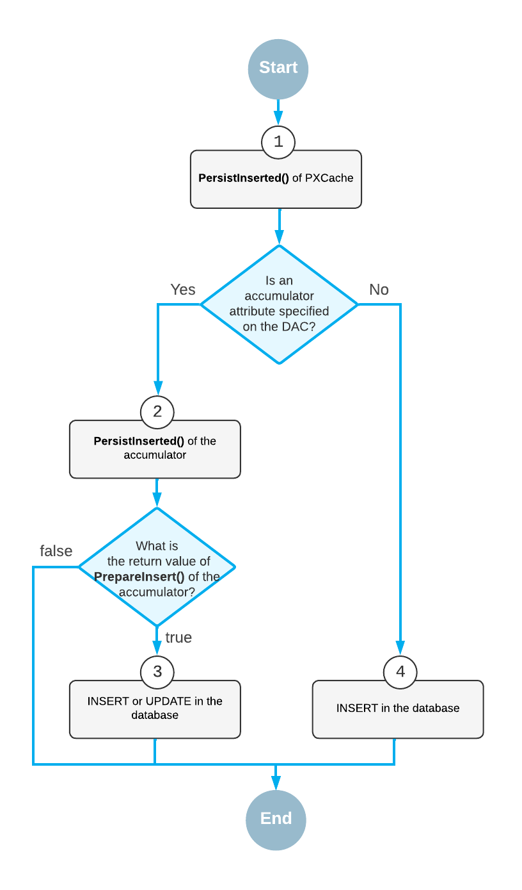

# PXAccumulator: How an Accumulator Attribute Works {#_16ac5d6e-88a2-4514-a28f-47b6fb5cffdc .concept}

During the database transaction that applies changes from cache objects to the database, the graph invokes the PersistInserted\(\) method of each PXCache object. The PersistInserted\(\) method that is executed for the Inserted records of the cache object checks whether an accumulator attribute is specified for the data access class \(DAC\). If the accumulator attribute exists, the PersistInserted\(\) method of the accumulator is invoked. If there is no accumulator attribute on the DAC, the method executes an ordinary INSERT \(see the diagram below\).

The PersistInserted\(\) method of the accumulator invokes the PrepareInsert\(\) method, which initializes the collection of columns, sets the restrictions, and composes the SQL query. If the PrepareInsert\(\) method returns *true*, the framework executes the composed query, which can be `INSERT` or `UPDATE` depending on the attribute parameters and the record. Otherwise, the record is not updated in the database.

**Parent topic:**[Updating Data with a Custom PXAccumulator Attribute](../StudioDeveloperGuide/CodeCustomization_PXAccumulator_Mapref.md)

