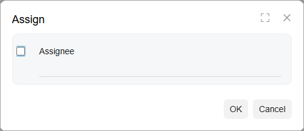
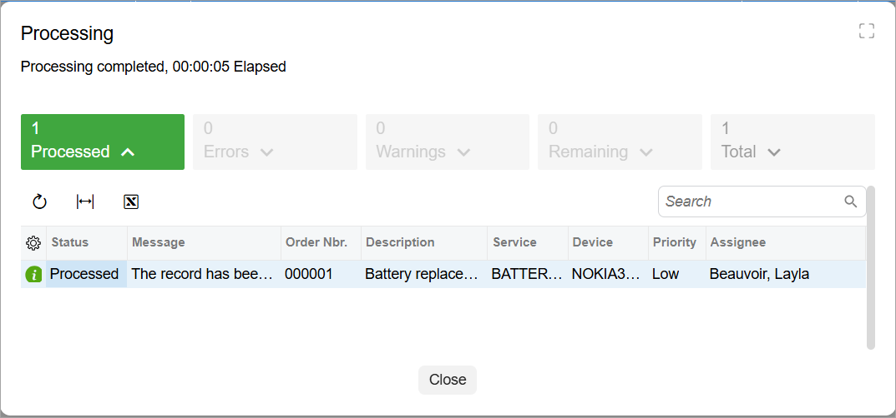
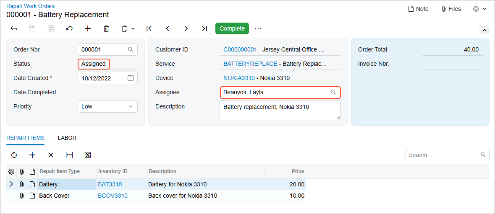

# Processing Operations:To Implement a Processing Operation by Using the Workflow {#_f0c1a34a-7021-4916-9495-247e07efee9d .task}

The following activity will walk you through the process of implementing a processing operation by using the workflow. Usually you use this approach if a workflow is implemented for the records that you are going to process on a processing form.

## Story { .section}

You’ve created the UI of the Assign Work Orders \(RS501000\) processing form. Now you need to implement the processing operation for this form. A user can assign a repair work order on the Repair Work Orders \(RS301000\) form, where a workflow is implemented for the records. Because repair work order records have a workflow implemented, you’ve decided to implement the processing operation for the Assign Work Orders \(RS501000\) processing form by using this workflow.

## Process Overview { .section}

In this activity, you'll define the processing operation by using the workflow. You’ll also test the form.

## System Preparation { .section}

Before you begin performing the steps of this activity, do the following:

1.  Prepare an Acumatica ERP instance by performing the [Test Instance for Customization: To Deploy an Instance with a Custom Form that Implements a Workflow](CodeCustomization_PrepareInstance_Activity_DeployInstanceT240.md) prerequisite activity.
2.  Create a processing form without filtering parameters by performing the [Processing Form: To Create a Simple Processing Form](../DeveloperGuide/UIDev_ProcessingScreen_Activity_CreateWithoutFilter_UI.md) prerequisite activity.

## Step 1: Specifying a Workflow Action for Processing { .section}

In this step, you'll specify the `Assign` action of the Repair Work Orders \(RS301000\) form to be used for processing on the Assign Work Orders \(RS501000\) form. You'll also adjust the workflow of the Repair Work Orders \(RS301000\) form. Do the following:

1.  In the `RSSVAssignProcess` graph, make sure you have defined the `Cancel` action for the toolbar and the `WorkOrders` data view, which provides the data records to be processed on the form.

    ```language-csharp
            public PXCancel<RSSVWorkOrder> Cancel = null!;
            public 
                SelectFrom<RSSVWorkOrder>.
                // Inside the Where condition, use a fluent BQL statement 
                // that selects only the repair work orders with 
                // the Ready for Assignment status. 
                Where<RSSVWorkOrder.status.
                    IsEqual<RSSVWorkOrderEntry_Workflow.States.readyForAssignment>>.
                ProcessingView WorkOrders = null!;
    ```

2.  In the `RSSVAssignProcess` graph, define the following RowSelected event handler.

    ```language-csharp
            protected virtual void _(Events.RowSelected<RSSVWorkOrder> e)
            {
                WorkOrders.SetProcessWorkflowAction<RSSVWorkOrderEntry>(
                    graph => graph.Assign);
            }
    ```

3.  In the `RSSVWorkOrderEntry_Workflow` class, in the lambda expression for the WithActions method, adjust the `Assign` action definition so that it can be used on the Assign Work Orders \(RS501000\) processing form as follows.

    ```language-csharp
    					actions.Add(graph => graph.Assign, action => action
    					    .WithCategory(processingCategory)
    					    .WithForm(formAssign)
    					    .WithFieldAssignments(fields => {
    					        fields.Add<RSSVWorkOrder.assignee>(field =>
    					            field.SetFromFormField(formAssign, "Assignee"));
    					    })
    					    .MassProcessingScreen<RSSVAssignProcess>()
    					    .InBatchMode());
    ```

4.  Rebuild the project.

## Step 2: Specifying the Default Value for the Workflow Action { .section}

The `Assign` action of the Repair Work Orders \(RS301000\) form assigns a repair work order to the employee selected in a dialog box displayed for the action. Because a user cannot select the assignee for each record during processing on the processing form, you need to assign the default value for the assignee in the dialog box. The default value will be the assignee specified in the **Assignee** box on the Repair Work Orders \(RS301000\) form. The **Assignee** box will obtain its default value from the default employee specified on the Repair Work Order Preferences \(RS101000\) form. A user can change the assignee in the **Assignee** box.

In this step, you'll configure the `RSSVAssignProcess` graph, which works with the Assign Work Orders \(RS501000\) form, and adjust the workflow of the form. Do the following:

1.  In the `RSSVWorkOrder` DAC, add the PXDefault attribute to the `Assignee` field. The default value of the `Assignee` field is the value of the `DefaultEmployee` field of the `RSSVSetup` DAC, which is specified on the Repair Work Order Preferences \(RS101000\) form.

    ```language-csharp
            #region Assignee
            [Owner(DisplayName = "Assignee")]
            [PXDefault(typeof(RSSVSetup.defaultEmployee))]
            public virtual int? Assignee { get; set; }
            public abstract class assignee : PX.Data.BQL.BqlInt.Field<assignee> { }
            #endregion
    ```

2.  In the `RSSVWorkOrderEntry_Workflow` class, specify the default value for the field in the dialog box for the `Assign` action as follows. The DefaultValueFromSchemaField method specifies that the default value is the value of the `Assignee` field of the `RSSVWorkOrder` DAC.

    ```language-csharp
                var formAssign = context.Forms.Create("FormAssign", form =>
                    form.Prompt("Assign").WithFields(fields =>
                    {
                        fields.Add("Assignee", field => field
                           .WithSchemaOf<RSSVWorkOrder.assignee>()
                           .DefaultValueFromSchemaField()
                           .IsRequired()
                           .Prompt("Assignee"));
                    }));
    ```

3.  Rebuild the project.

## Step 3: Testing the Processing Form { .section}

In this step, you'll test the Assign Work Orders \(RS501000\) form. Do the following:

1.  On the Repair Work Orders \(RS301000\) form, do the following:
    1.  Open the *000001* repair work order. Specify *Beauvoir, Layla* as the assignee and click **Remove Hold**.
    2.  Open the *000002* repair work order. Specify *Baker, Maxwell* as the assignee and click **Remove Hold**.
2.  Open the Assign Work Orders \(RS501000\) form. Select the check box in the first column for the *000001* work order and click **Assign** on the form toolbar. The **Assign** dialog box opens \(shown below\).

    

    Leave the check box in the dialog box unselected, which indicates that the default value of the `Assignee` field should be used to process the record. In the previous step you have already specified that this field should use the value specified in the `Assignee` field of the `RSSVWorkOrder` DAC by calling the .DefaultValueFromSchemaField\(\) method.

    Click **Ok**.

3.  The **Processing** dialog box is displayed, which shows the progress and then the result of the operation \(see below\). Close the dialog box.

    

4.  On the Repair Work Orders form, make sure that the *000001* work order now has the *Assigned* status and that the assignee is *Beauvoir, Layla*, as shown below.

    


**Parent topic:**[Implementing Processing Operations](../StudioDeveloperGuide/CodeCustomization_ProcessingOperations_Mapref.md)

