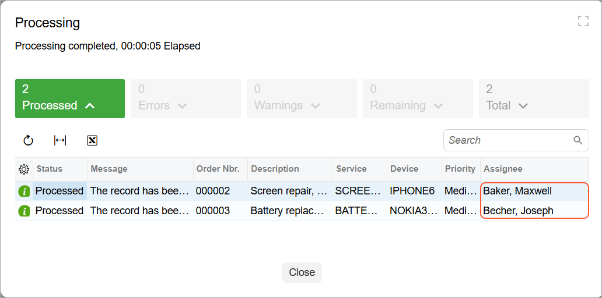

# Processing Operations:To Implement a Processing Operation by Using a Delegate {#_9c52a8bb-a21d-4f95-818c-4a422403a1d6 .task}

The following activity will walk you through the process of implementing a processing operation by using a delegate. Usually you use this approach if no workflow is implemented for the records that you are going to process on a processing form.

## Story { .section}

You’ve created the UI of the Assign Work Orders \(RS501000\) processing form. Now you need to implement the processing operation for this form. A user can assign a repair work order on the Repair Work Orders \(RS301000\) form, where a workflow is implemented for the records. You'll reuse the workflow action from the Repair Work Orders form in the processing delegate.

## Process Overview { .section}

In this activity, you'll define the processing operation and specify the processing delegate for the form. You’ll also test the form.

## System Preparation { .section}

Before you begin performing the steps of this activity, complete the following prerequisite activities:

1.  [Test Instance for Customization: To Deploy an Instance with a Custom Form that Implements a Workflow](CodeCustomization_PrepareInstance_Activity_DeployInstanceT240.md)
2.  [Processing Form: To Create a Simple Processing Form](../DeveloperGuide/UIDev_ProcessingScreen_Activity_CreateWithoutFilter_UI.md)

## Step 1: Defining the Processing Operation { .section}

In this step, you'll define the processing operation for the Assign Work Orders \(RS501000\) form as follows:

1.  In the `RSSVAssignProcess` graph, define the `AssignOrders()` static method as follows.

    ```language-csharp
            public static void AssignOrders(List<RSSVWorkOrder> list,
                bool isMassProcess = false)
            {
                var workOrderEntry = PXGraph.CreateInstance<RSSVWorkOrderEntry>();
                    
                // The processing method uses the error handling
                // and progress tracking functionality of the PXProcessing class.
                PXProcessing<RSSVWorkOrder>.ProcessRecords(list, isMassProcess,
                    workOrder =>
                    {
                        workOrderEntry.Clear();
                        workOrderEntry.WorkOrders.Current = workOrder;
                        // If the assignee is not specified,
                        // specify the default employee.
                        if (workOrder.Assignee == null)
                        {
                            // Retrieve the record with the default setting
                            RSSVSetup setupRecord =
                                workOrderEntry.AutoNumSetup.Current;
                            workOrder.Assignee = setupRecord.DefaultEmployee;
                        }
                        // Assign the work order in the cache.
                        workOrderEntry.Assign.Press();
                    });
            }
    ```

2.  Rebuild the project.

## Step 2: Specifying the Processing Delegate { .section}

In this step, you'll specify the processing delegate in the constructor of the `RSSVAssignProcess` graph. Do the following:

1.  In the `RSSVAssignProcess` graph, make sure you have defined the `Cancel` action for the toolbar and the `WorkOrders` data view, which provides the data records to be processed on the form.

    ```language-csharp
            public PXCancel<RSSVWorkOrder> Cancel = null!;
            public 
                SelectFrom<RSSVWorkOrder>.
                // Inside the Where condition, use a fluent BQL statement 
                // that selects only the repair work orders with 
                // the Ready for Assignment status. 
                Where<RSSVWorkOrder.status.
                    IsEqual<RSSVWorkOrderEntry_Workflow.States.readyForAssignment>>.
                ProcessingView WorkOrders = null!;
    ```

2.  In the `RSSVAssignProcess` graph, define the constructor of the graph as follows.

    ```language-csharp
            public RSSVAssignProcess()
            {
                WorkOrders.SetProcessCaption("Assign");
                WorkOrders.SetProcessAllCaption("Assign All");
                WorkOrders.SetProcessDelegate(list =>
                    AssignOrders(list, true));
            }
    ```

3.  Rebuild the project.

## Step 3: Testing the Processing Form { .section}

In this step, you'll test the modified Assign Work Orders \(RS501000\) form. Do the following:

1.  Create a repair work order with the following settings on the Repair Work Orders \(RS301000\) form:
    -   **Customer ID**: *C000000001*
    -   **Service**: *Battery Replacement*
    -   **Device**: *Nokia 3310*
    -   **Description**: `Battery replacement, Nokia 3310`
2.  Leave the **Assignee** box empty.
3.  Click **Remove Hold**.
4.  On the Assign Work Orders form, make sure that two work orders are displayed on the form. Click **Assign All** on the form toolbar. The **Processing** dialog box shows that two records have been processed \(see below\).

    

5.  Make sure that for the *000002* work order, the assignee is *Baker, Maxwell*, which has been specified in the work order. Notice that for the other work order, the assignee is *Becher, Joseph*—the default assignee specified on the Repair Work Order Preferences \(RS101000\) form.


**Parent topic:**[Implementing Processing Operations](../StudioDeveloperGuide/CodeCustomization_ProcessingOperations_Mapref.md)

