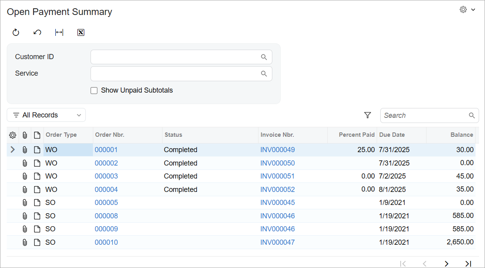

# Redirection to Webpages:To Add Redirection Links to the Grid by Using the PXSelector Attribute {#_61cb616b-8dbd-4271-8e0a-06d651e6085e .task}

This activity will walk you through the process of adding redirection links to the grid of a form by using the PXSelector attribute.

## Story { .section}

Suppose that you want to improve the navigation between the rows of the grid on the Open Payment Summary \(RS401000\) form and the invoices listed in these rows. You plan to do this by adding redirection links so users can navigate to the entry form with the detailed information about the invoice.

You need to replace the text numbers in the **Invoice Nbr.** column with links that a user can click to open the data entry form for the invoice whose number the user has clicked. The user can then view the settings and make any needed modifications. You’ll add these links by configuring the TypeScript file of the form.

## Process Overview { .section}

In this activity, you will add redirection links to the **Invoice Nbr.** column of the Open Payment Summary \(RS401000\) inquiry form by performing the following steps:

1.  Adding redirection links by using the PXSelector attribute for the `InvoiceNbr` DAC field
2.  On the Open Payment Summary \(RS401000\) form, testing the redirection links to make sure they redirect the user to the [Invoices](../UserGuide/SO_30_30_00.md) \(SO303000\) form with the record selected

## System Preparation { .section}

Make sure that you have completed the steps described in the following prerequisite activities:

1.  [Test Instance for Customization: To Deploy an Instance with a Custom Form that Implements a Workflow](CodeCustomization_PrepareInstance_Activity_DeployInstanceT240.md)
2.  [Inquiry Forms: To Set Up an Inquiry Form](../DeveloperGuide/UIDev_InquiryForm_Activity_SetupForm.md)

## Step 1: Adding a Link by Using the PXSelector Attribute { .section}

In this step, you will add the redirection link to the Open Payment Summary \(RS401000\) form.

To add a redirection link by using the PXSelector attribute, do the following:

1.  Make sure that the DAC that holds invoice records has the [PXPrimaryGraph](https://help.acumatica.com/(W(4))/Help?ScreenId=ShowWiki&pageid=842ed8f6-e659-45ef-3083-6696cf1fecaf) attribute or its descendants declared on it. This DAC can be either ARInvoice or SOInvoice \(which extends ARInvoice\).
2.  In the `RSSVWorkOrder` DAC, add the PXSelector attribute to the `InvoiceNbr` field, as shown in the following code.

    ```language-csharp
            [PXSelector(typeof(SearchFor<SOInvoice.refNbr>.
                Where<SOInvoice.docType.IsEqual<ARDocType.invoice>>))]
    ```

    The `RSSVWorkOrderToPay` DAC, which is used on the Open Payment Summary form, inherits the `InvoiceNbr` field, including its attributes. Because the `InvoiceNbr` field of the `RSSVWorkOrder` DAC has the PXSelector attribute assigned, you can configure the same link for other forms where this DAC is used, such as the Repair Work Orders \(RS301000\) form.

    **Tip:** You can also add the PXSelector attribute in an extension of the `RSSVWorkOrder` DAC by using the [PXMergeAttributes](https://help.acumatica.com/(W(5))/Help?ScreenId=ShowWiki&pageid=dce254b6-4fff-887a-4d0c-914284b2ad8b) attribute. For details, see [Customization of Field Attributes in DAC Extensions](../CustomizationPlatform/CG_Platform_Framework_CS_DACExt_FieldAttributes.md).

3.  Add the necessary using directives.
4.  Build the project.
5.  In the `RS401000.ts` file, add the CommitChanges property for the `InvoiceNbr` field.

    ```language-javascript
    export class RSSVWorkOrderToPay extends PXView {
    	OrderType: PXFieldState;
    	OrderNbr: PXFieldState;
    	Status: PXFieldState;
    	InvoiceNbr: PXFieldState<PXFieldOptions.CommitChanges>;
    	PercentPaid: PXFieldState;
    	ARInvoice__DueDate: PXFieldState;
    	ARInvoice__CuryDocBal: PXFieldState;
    }
    ```

6.  Publish the customization project.

## Step 2: Testing the Redirection Links { .section}

To test the redirection links that you’ve implemented, do the following:

1.  In Acumatica ERP, open the Open Payment Summary \(RS401000\) form.

    The form should look similar to the one shown below, with links shown in the **Invoice Nbr.** column.

    

2.  In any row with a repair work order \(that is, any row with **Order Type** set to *WO*\), click the invoice number.

    The [Invoices](../UserGuide/SO_30_30_00.md) \(SO303000\) form should open in a new window with the invoice displayed.

    **Tip:**

    The type of invoice determines which form may be opened:

    -   Sales invoice: [Invoices](../UserGuide/SO_30_30_00.md) \(SO303000\)
    -   AR invoice: [Invoices and Memos](../UserGuide/AR_30_10_00.md) \(AR301000\)
    The logic that determines which form to open is embedded in Acumatica ERP.


**Parent topic:**[Redirecting the User to Webpages](../StudioDeveloperGuide/CodeCustomization_Redirection_Mapref.md)

