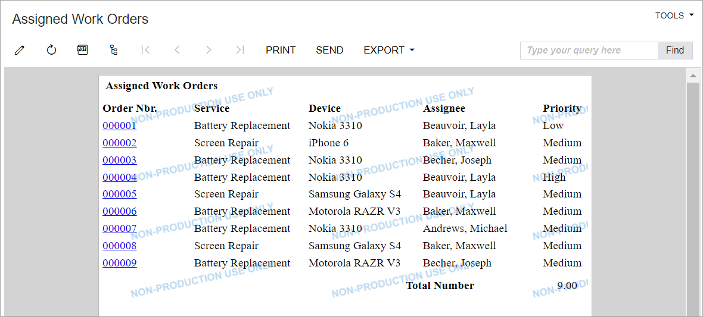
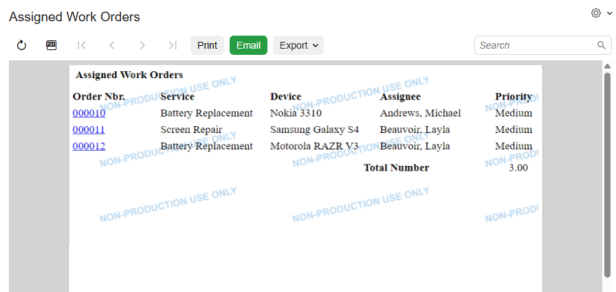

# Redirection to Webpages:To Add Redirection to a Report at the End of Processing {#_62ccb1f3-b3cc-4484-8b71-85eadda26773 .task}

The following activity will walk you through the process of implementing redirection to a report at the end of processing.

## Story { .section}

For better usability of the custom Assign Work Orders \(RS501000\) processing form, the managers of the Smart Fix company have requested that the form be modified so that at the end of the processing, the system displays a report that lists all processed work orders and shows the employees to which they have been assigned during the processing. The report has already been developed.

## Process Overview { .section}

You'll add the [`RS601000.rpx`](https://github.com/Acumatica/Help-and-Training-Examples/blob/HEAD/Customization/T240/SourceFiles/Report/RS601000.rpx) report file to the *PhoneRepairShop* customization project. You'll then modify the processing operation of the Assign Work Orders \(RS501000\) form so that it displays the report at the end of the operation. you'll also test the updated functionality of the form.

**Tip:** The creation of reports with Acumatica Report Designer is outside of the scope of this activity. To learn more about the creation of reports, see [Acumatica Report Designer Guide](../UserGuide/ReportDesigner_Main.md).

## System Preparation { .section}

Before you begin performing the steps of this activity, do the following:

1.  Prepare an Acumatica ERP instance by performing the [Test Instance for Customization: To Deploy an Instance with a Custom Form that Implements a Workflow](CodeCustomization_PrepareInstance_Activity_DeployInstanceT240.md) prerequisite activity.
2.  Create a processing form without filtering parameters by performing the [Processing Operations: To Implement a Processing Operation by Using a Delegate](CodeCustomization_ProcessingOperations_Activity_CreateWithoutFilter_withDelegate.md) prerequisite activity.
3.  Add filtering parameters to the form by performing the [Filtering Parameters: To Add a Filter for a Processing Form](../DeveloperGuide/UIDev_FilteringParameters_Activity_AddFilter.md) prerequisite activity.

## Step 1: Including RS601000.rpx in the Customization Project { .section}

In this step, you'll add the `RS601000.rpx` report file to the customization project. You must include the report file in the customization project so that the report is available in each Acumatica ERP instance to which you publish the *PhoneRepairShop* customization project.

To include the report file in the customization project, do the following:

1.  Copy the `RS601000.rpx` file to the `ReportsCustomized` folder of your Acumatica ERP instance for the training course. The system uses this folder to search for custom and customized Acumatica ERP reports.
2.  In the Customization Project Editor, open the *PhoneRepairShop* customization project.
3.  On the [Files](../UserGuide/AU_20_45_00.md) page, add the `ReportsCustomized\RS601000.rpx` file, and save your changes.

    **Tip:** For details on adding files to the customization project, see [To Add a Custom File to a Project](../CustomizationPlatform/CG_GL_Items_Files_Adding.md#) in the documentation.

4.  Publish the customization project.
5.  On the [Site Map](../UserGuide/SM_20_05_20.md) \(SM200520\) form of Acumatica ERP, add a new row with the following settings, and save your changes:
    -   **Screen ID**: `RS.60.10.00`
    -   **Title**: `Assigned Work Orders`
    -   **UI**: `Classic`
    -   **URL**: `~/frames/reportlauncher.aspx?id=RS601000.rpx`
    -   **Graph Type**: Empty
    -   **Workspaces**: Empty

        The report is not supposed to be used directly from the UI of Acumatica ERP; therefore, you do not include it in any workspace.

    -   **Category**: Empty
    -   **Is Substitute**: Empty
6.  On the [Access Rights by Screen](../UserGuide/SM_20_10_20.md) \(SM201020\) form, provide *Granted* access rights for the Assigned Work Orders \(RS601000\) report form for the *Administrator* and *Customizer* user roles. You can find the **Assigned Work Orders** item that corresponds to the report by expanding the **Hidden** node in the left pane.
7.  In the Customization Project Editor \(with it opened for the *PhoneRepairShop* customization project\), on the [Site Map](../UserGuide/AU_20_80_00.md) page, add the site map item for the Assigned Work Orders report.
8.  On the [Access Rights](../UserGuide/AU_20_52_00.md) page, include access rights for the new report in the customization project.
9.  Publish the customization project.

## Step 2: Testing the Report and Switching its UI { .section}

In Acumatica ERP, make sure that the report is displayed correctly by doing the following:

1.  Open the Assigned Work Orders \(RS601000\) report form.

    **Tip:** Because the report has no workspace specified, you cannot find it in the UI by typing its name in the **Search** box or browsing the main menu. The only way to open the report is to type the ID of the report as the value of the *ScreenId* parameter of the URL in the address line of the browser, as shown in the following screenshot.

    

2.  On the report form toolbar, click **Run Report**. The report is displayed, as shown in the following screenshot. Because no filtering is specified in the report settings, the report displays all the repair work orders that exist in the application database. When the system redirects the user to this report from the Assign Work Orders \(RS501000\) form, it will filter the list to show only the orders that have been assigned during the processing.

    

3.  Switch the report to the Modern UI by clicking **Tools** &gt; **Switch to Modern UI** on the report form's title bar.

## Step 3: Implementing Redirection to a Report { .section}

In this step, you'll implement redirection to the Assigned Work Orders \(RS601000\) report at the end of the `AssignOrders()` method. The report will display the repair work orders that have been assigned during the processing operation the user invoked on the form. To implement the redirection, do the following:

1.  In the `Messages.cs` file, add the following constant, which specifies the name of the webpage that will display the report.

    ```language-csharp
            public const string ReportRS601000Title = "Assigned Work Orders";
    ```

2.  In the `RSSVAssignProcess.cs` file, modify the `AssignOrders()` method, as follows:
    1.  In the beginning of the method, add the following lines.

        ```language-csharp
                    PXReportResultset assignedOrders =
                        new PXReportResultset(typeof(RSSVWorkOrder));
        ```

    2.  In the end of the lambda expression in the ProcessRecords method, add the following code.

        ```
                            // Add to the result set the order
                            // that has been successfully assigned.
                            if (workOrder.Status == WorkOrderStatusConstants.Assigned)
                            {
                                assignedOrders.Add(workOrder);
                            }
        ```

    3.  In the end of the `AssignOrders()` method, add the following code.

        ```
                    if (assignedOrders.GetRowCount() > 0 && isMassProcess)
                    {
                        throw new PXReportRequiredException(assignedOrders, "RS601000",
                                                            Messages.ReportRS601000Title);
                    }
        ```

        To redirect the user to the report, you have thrown the PXReportRequiredException exception. Once an exception is thrown, it interrupts the current context and propagates up the call stack until it is handled by Acumatica Framework, which performs the redirection. You do not need to implement the handling of the exceptions that are used for redirection.

        The Assigned Work Orders report has no filtering parameters. You have passed the data to be displayed in the report \(that is, the repair work orders that have been assigned\) in the parameters of the PXReportRequiredException constructor.

3.  Build the project.
4.  Update the customization project to include the latest version of the extension library in the customization project and publish it.

## Step 4: Testing the Redirection to the Report { .section}

In this step, you'll test the redirection to the Assigned Work Orders \(RS601000\) report, which should occur at the end of the assignment operation that is invoked on the Assign Work Orders \(RS501000\) form. To test the redirection to the report, do the following:

1.  On the Repair Work Orders \(RS301000\) form, create three repair work orders with the settings specified in the following table. Once you have entered the settings of each order, save the order and then click **Remove Hold**.

    | |First Work Order|Second Work Order|Third Work Order|
    |---|----------------|-----------------|----------------|
    |**Customer ID**|*C000000001*|*C000000002*|*C000000001*|
    |**Service**|*Battery Replacement*|*Screen Repair*|*Battery Replacement*|
    |**Device**|*Nokia 3310*|*Samsung Galaxy S4*|*Motorola RAZR V3*|
    |**Assignee**|*Andrews, Michael*|*Empty*|*Beauvoir, Layla*|
    |**Description**|`Test order`|`Test order`|`Test order`|

    Notice that each of the created work orders has the *Ready for Assignment* status.

2.  On the Assign Work Orders \(RS501000\) form, make sure that three repair work orders are listed.
3.  On the form toolbar, click **Assign All**. At the end of the processing, the Assigned Work Orders \(RS601000\) report is displayed. Make sure that it shows the three work orders that you entered and that all three have been assigned, as shown in the following screenshot.

    


**Parent topic:**[Redirecting the User to Webpages](../StudioDeveloperGuide/CodeCustomization_Redirection_Mapref.md)

