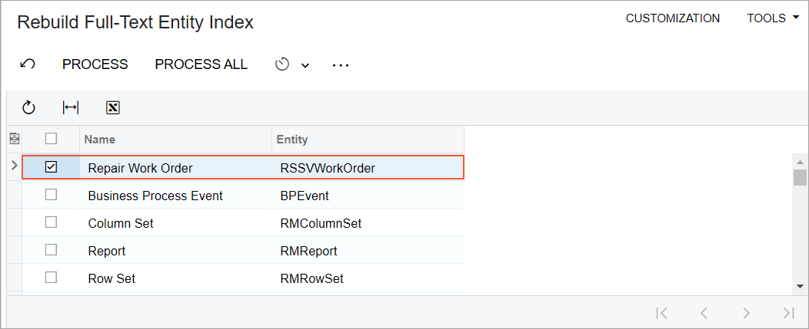
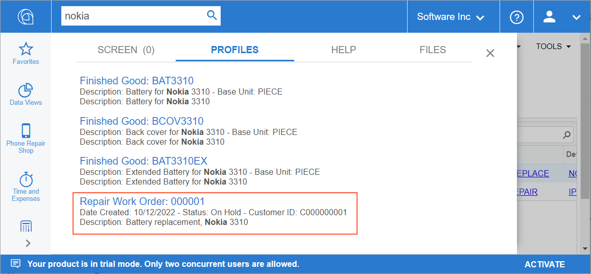

# Search Customization: To Display a DAC in Universal Search Results {#_3b417be7-81b6-4d83-ad42-034b3cb44105 .task}

This activity will walk you through the process of including the records of a data access class \(DAC\) in a universal search in Acumatica ERP.

## Story { .section}

Suppose that you have added the `RSSVWorkOrder` DAC, which contains information about repair work orders, to the *PhoneRepairShop* customization project. You need to make this DAC available in a universal search so that a user can search through the work order number and description.

## Process Overview { .section}

To implement the universal search for the DAC, you will specify the PXPrimaryGraph attribute for the DAC and declare the PXSearchable attribute for the NoteID field of the DAC. You will then rebuild the search index and test the search.

## System Preparation { .section}

Before you begin performing the steps of this activity, do the following:

1.  Prepare an Acumatica ERP instance by performing the [Test Instance for Customization: To Deploy an Instance with Custom Maintenance and Data Entry Forms](CodeCustomization_PrepareInstance_Activity_DeployInstanceT230.md) prerequisite activity.
2.  Make sure that you have installed full-text search for the Microsoft SQL Server. For details, see [Preparation for the Acumatica ERP Installation: System Environment](../UserGuide/INST_Preparing_Installation_System_Environment.md).

## Step 1: Supporting Universal Search in the DAC { .section}

To support universal search in the `RSSVWorkOrder` DAC, do the following:

1.  In the `PhoneRepairShop_Code` Visual Studio project, make sure that the `RSSVWorkOrder` DAC has the [PXCacheName](https://help.acumatica.com/(W(4))/Help?ScreenId=ShowWiki&pageid=052f5683-d20b-da61-4e6c-47a966162fb4) attribute, which defines the name that is displayed for the DAC on the [Rebuild Full-Text Entity Index](../UserGuide/SM_20_95_00.md) \(SM209500\) form. See the following code.

    ```language-csharp
        [PXCacheName(Messages.RSSVWorkOrder)]
        public class RSSVWorkOrder : PXBqlTable, IBqlTable
    ```

2.  For the `RSSVWorkOrder` DAC, add the [PXPrimaryGraph](https://help.acumatica.com/(W(4))/Help?ScreenId=ShowWiki&pageid=842ed8f6-e659-45ef-3083-6696cf1fecaf) attribute, as the following code shows. The attribute specifies the graph that corresponds to the default editing form for records of the DAC. The records of the `RSSVWorkOrder` DAC can be edited on the Repair Work Orders \(RS301000\) form, whose graph is `RSSVWorkOrderEntry`.

    ```language-csharp
        [PXPrimaryGraph(typeof(RSSVWorkOrderEntry))]
        [PXCacheName(Messages.RSSVWorkOrder)]
        public class RSSVWorkOrder : PXBqlTable, IBqlTable
    ```

3.  In the RSSVWorkOrder DAC, make sure that the NoteID field is decorated with the PXNote attribute, as the following code shows.

    ```language-csharp
            [PXNote()]
            public virtual Guid? NoteID { get; set; }
            public abstract class noteID : PX.Data.BQL.BqlGuid.Field<noteID> { }
    ```

4.  Add the [PXSearchable](https://help.acumatica.com/(W(7))/Help?ScreenId=ShowWiki&pageid=3fcecc8e-f198-2488-5671-91713e77fe49) attribute to the NoteID field of the `RSSVWorkOrder` DAC, as the following code shows.

    ```language-csharp
            #region NoteID
            [PXSearchable(
                // The category of the search
                PX.Objects.SM.SearchCategory.All,
                // The format string for the title of the search result
                "Repair Work Order: {0}",
                // The value of the format argument for the title
                new Type[] { typeof(RSSVWorkOrder.orderNbr) },
                // The list of fields where the search should be performed
                new Type[] { typeof(RSSVWorkOrder.orderNbr),
                    typeof(RSSVWorkOrder.description) },
                // The field that contains numbers with prefixes 
                // that should be indexed
                NumberFields = new Type[] { typeof(RSSVWorkOrder.orderNbr) },
                // The format string for the first line of the result
                Line1Format = "{0:d}{1}{2}", 
                // The values of the format arguments 
                // for the first line of the result
                Line1Fields = new Type[] { typeof(RSSVWorkOrder.dateCreated),
                    typeof(RSSVWorkOrder.status), typeof(RSSVWorkOrder.customerID)},
                // The format string for the second line of the result
                Line2Format = "{0}", 
                // The values of the format arguments 
                // for the second line of the result
                Line2Fields = new Type[] { typeof(RSSVWorkOrder.description) }
                )]
            [PXNote()]
            public virtual Guid? NoteID { get; set; }
            public abstract class noteID : PX.Data.BQL.BqlGuid.Field<noteID> { }
            #endregion
    ```

    **Tip:** Currently, the category of the search is not used anywhere in the UI.

5.  Rebuild the Visual Studio project.

## Step 2: Rebuilding the Search Index { .section}

Rebuild the search index as follows:

1.  On the [Rebuild Full-Text Entity Index](../UserGuide/SM_20_95_00.md) \(SM209500\) form, find the `RSSVWorkOrder` DAC.
2.  Select the unlabeled check box for the DAC, as shown in the following screenshot.

    

3.  Click **Process** on the form toolbar.

## Step 3: Testing the Search { .section}

To test the search for a record of the `RSSVWorkOrder` DAC, do the following:

1.  In the Search box in the top pane of the Acumatica ERP screen, type `nokia`.
2.  On the Search form, which opens, click the **Transactions and Profiles** tab.

    Review the results of the search, which include the record of the `RSSVWorkOrder` DAC, as shown in the following screenshot.

    

3.  Click the record of the `RSSVWorkOrder` DAC.

    The record opens on the Repair Work Orders \(RS301000\) form.


**Parent topic:**[Customizing the Acumatica ERP Search](../StudioDeveloperGuide/CodeCustomization_Search_Mapref.md)

