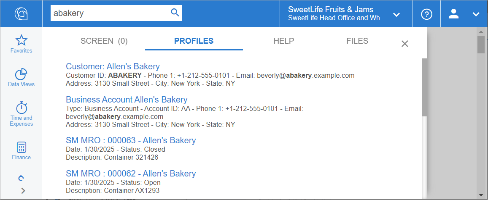

# Search Customization: General Information {#_48763210-7355-4067-b3cf-e2629131bfcc .concept}

Acumatica ERP provides universal search capabilities. With this search, a user can find the records of data access classes \(DACs\) whose data matches the text entered in the search box.

## Learning Objectives { .section}

In this chapter, you will learn how to customize the universal search in Acumatica ERP.

## Applicable Scenarios { .section}

You customize the universal search in the following cases:

-   You need to implement a search for a record in the system by the value of a new DAC field that you have added. For example, you need to implement the search for a document by the value of its external reference number.
-   You have added a new DAC and you need the records of this DAC to be available in the universal search results.

## Search in DACs {#section_vv2_1y4_y4b .section}

The DAC search results are displayed on the **Documents and Transactions** tab \(shown below\). Each result includes the following lines:

-   The title \(the blue text in the screenshot below\)
-   The first information line \(optional\)
-   The second information line \(optional\)

## Requirements for a DAC { .section}

A DAC record can be displayed in the search results if the DAC meets the following requirements:

-   The DAC is marked with the [PXPrimaryGraph](https://help.acumatica.com/(W(4))/Help?ScreenId=ShowWiki&pageid=842ed8f6-e659-45ef-3083-6696cf1fecaf) attribute or another attribute derived from the PXPrimaryGraphBaseAttribute class. The system uses this attribute to provide navigation to search results. The records of the DACs that do not support this navigation are not included in the search results.
-   The DAC has the NoteID field, which is marked with the PXNote attribute.

    The NoteID field is the main and unique identifier of any record in the Acumatica ERP database.

    **Important:** The name of the DAC property field that has the PXNote attribute must be NoteID. This name is case-sensitive.

-   The NoteID field of the DAC has the [PXSearchable](https://help.acumatica.com/(W(7))/Help?ScreenId=ShowWiki&pageid=3fcecc8e-f198-2488-5671-91713e77fe49) attribute declared on it.
-   The DAC is present in the search index.

    To add a DAC to a search index, you should rebuild the search index. For details, see [Search Indexes: To Rebuild Search Indexes](../UserGuide/SA_Building_Search_Indexes_Activity.md).

    **Important:** You should rebuild the search index after every database upgrade.

-   Optional: The DAC is marked with the [PXCacheName](https://help.acumatica.com/(W(4))/Help?ScreenId=ShowWiki&pageid=052f5683-d20b-da61-4e6c-47a966162fb4) attribute. This attribute defines the name that is displayed for the DAC on the [Rebuild Full-Text Entity Index](../UserGuide/SM_20_95_00.md) \(SM209500\) form.

## PXSearchable Attribute { .section}

You use the [PXSearchable](https://help.acumatica.com/(W(7))/Help?ScreenId=ShowWiki&pageid=3fcecc8e-f198-2488-5671-91713e77fe49) attribute for the following purposes:

-   To specify the DAC fields that the system will use to build search index \(see the fields, titlePrefix, and titleFields parameters in the attribute constructor and the NumberFields property\).
-   To specify format of the search result \(see the titlePrefix and titleFields parameters of the attribute constructor and the Line1Format, Line1Fields, Line2Format, and Line2Fields properties of the attribute\).
-   To configure access restrictions \(see the SelectDocumentUser property\).
-   To configure row-level security \(see the MatchWithJoin property\).
-   To specify conditions that determine whether the DAC is displayed in the search results \(see the WhereConstraint property\).

You can find an example that uses basic properties of this attribute in [Search Customization: To Display a DAC in Universal Search Results](CodeCustomization_Search_Activity.md). You can find more examples in the API Reference \(see [PXSearchable](https://help.acumatica.com/(W(7))/Help?ScreenId=ShowWiki&pageid=3fcecc8e-f198-2488-5671-91713e77fe49)\).

## Examples in Acumatica ERP Source Code { .section}

You can find examples of the implementation of the DAC search in the following DACs in the Acumatica ERP source code:

-   PX.Objects.AP.APInvoice, which is used on the [Invoices](../UserGuide/SO_30_30_00.md) \(SO303000\) form
-   PX.Objects.SO.SOOrder, which is used on the [Sales Orders](../UserGuide/SO_30_10_00.md) \(SO301000\) form

**Parent topic:**[Customizing the Acumatica ERP Search](../StudioDeveloperGuide/CodeCustomization_Search_Mapref.md)

