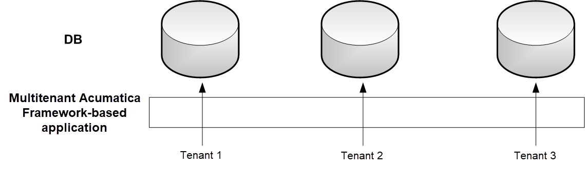
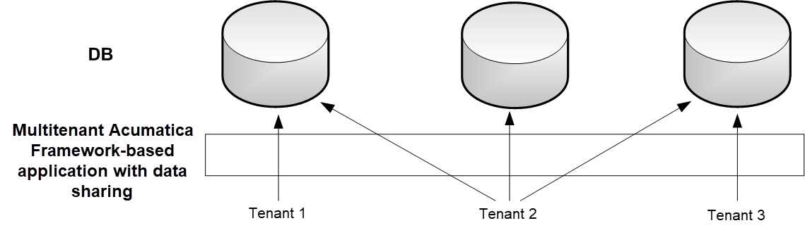

# Multitenancy Support \(CompanyID, CompanyMask\) {#_d0945e20-1949-40b1-bd0f-92c7c432aa24 .concept}

Multiple tenants can work on the same instance of an Acumatica Framework-based application with completely isolated data. The application looks identical to all tenants, but each tenant has exclusive access to its data only. Data is isolated at the lowest level of the application, in the data access layer that executes SQL queries for the tenant of the user who is currently signed in.

## Multitenancy Support {#section_wmd_vqr_dm .section}

The following graphic illustrates how different logical tenants work with the Acumatica Framework-based application in a multitenant configuration. They work with the same application but have isolated data access, as if they are working with different database instances.



Multitenancy support is turned on or off for each particular table individually. To turn on multitenancy support for a table, add the `CompanyID` column to it and include the column in the primary key \(see the column parameters in the table below\) and all indexes. The `CompanyID` column is handled automatically by the framework and should not be declared in data access classes. If a table does not have the `CompanyID` column, all data from the table is fully accessible to all tenants that exist in the database. For more information, see [Managing Tenants Locally](../UserGuide/SA_MNG_Managing_Tenants_Locally.md) and [Managing Tenants by Using the Web Interface](../UserGuide/SA_Managing_Tenants_Using_Web_Mapref.md).

|Database Column Name|Data Type \(SQL Server\)|Data Type \(MySQL\)|Type Attribute on the Data Field|
|--------------------|------------------------|-------------------|--------------------------------|
|`CompanyID`|`int`; not null; included in primary key and all indexes|`INT`; not null; included in primary key and all indexes|Not declared in DAC|

## Support for Shared Data Access Between Tenants { .section}

Acumatica Framework provides shared data access in a multitenant configuration. Acumatica Framework supports a hierarchy of logical tenants that may work with a combination of shared and individual data. In shared access mode, every tenant may work with its individual copy of a data record; copies differ by `CompanyID`. All copies represent the same logical object in the application but different data records in the database. For instance, each tenant may use the individual settings of the application.

The graphic below shows a possible multitenant configuration with shared data access between Tenant 1, Tenant 2, and Tenant 3. The users of Tenant 2 have access to the data of all three tenants. The users from each of the other two tenants have access to their company's individual data only. Physically, the data of all three tenants is stored in a single database instance.



Support for shared data access is turned on or off for each particular table individually. To turn on support for shared data access for a table, add the `CompanyMask` column to the table \(see the column parameters in the table below\). The `CompanyMask` column is handled automatically by the framework and should not be declared in data access classes. If a table does not have the `CompanyMask` column, shared data access is not available for this table.

|Database Column Name|Data Type \(SQL Server\)|Data Type \(MySQL\)|Type Attribute on the Data Field|
|--------------------|------------------------|-------------------|--------------------------------|
|`CompanyMask`|`varbinary(32)`, not null, default 0xAA|`VARBINARY(32)`, not null, default 0xAA|Not declared in DAC|

`CompanyMask` is a 32-bit mask. In this mask, each two bits correspond to each tenant. The first of these two bits specifies whether the record may be read by this tenant, and the second bit specifies whether the record may be written to by this tenant. For example, suppose that `CompanyMask` is set to 0xBE02 for a record. That is, it specifies the following mask: `10 11 11 10 00 00 00 10`, which designates that the record may be both read and written to by the tenants with company IDs 2 and 3, the record may be read by the tenants with IDs 4 and 5 and the System tenant \(which has ID 1\), and the record may not be read or written to by other tenants.

```
CompanyMask:  10 11 11 10 00 00 00 10
CompanyID:     4  3  2  1  8  7  6  5
```

The default value of `CompanyMask` is 0xAA, which means that the record may be read by all tenants.

**Parent topic:**[Designing the Database Structure and DACs](../StudioDeveloperGuide/DA__mng_Designing_Database_Structure.md)

