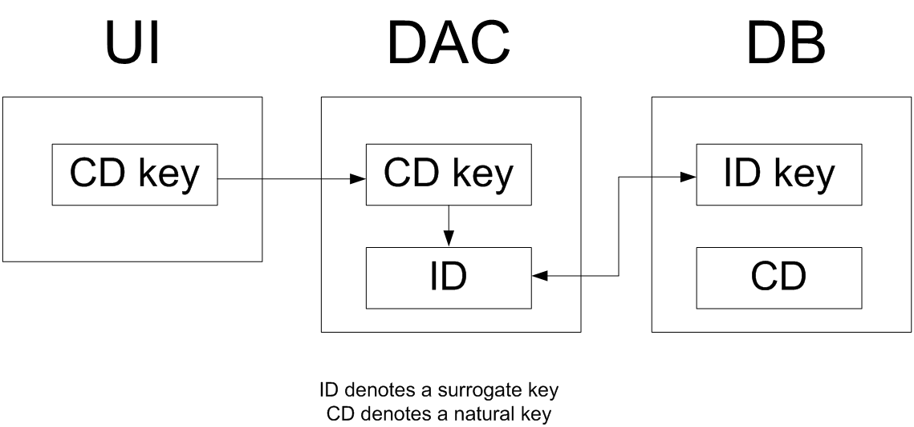

# Primary Key {#_9e533998-5a08-452d-9490-a02db1cf4c19 .concept}

You have to define the primary key in each application table that you create. The primary key may consist of one column or multiple columns. The primary key must include the `CompanyID` column if one is defined in the table. For details on the `CompanyID` column, see [Multitenancy Support \(CompanyID, CompanyMask\)](DA__con_Multitenancy_Support.md).

For each table, you can use one of the following typical variants of primary keys:

-   One key column included in the primary key in the table and set as the key in the data access class
-   A pair of columns, with one column included in the primary key in the table and the other column set as the key in the data access class
-   Multiple columns that are included in the primary key and set as the compound key in the data access class

**Note:** In a setup table, only the `CompanyID` column must be included in the primary key.

## One Key Column { .section}

You may use one key column for rather short tables. For instance, you can use the two-letter country code from ISO 3166 as the key in the `Country` table.

## A Pair of Columns with Key Substitution in the UI { .section}

If you want to represent a user-friendly key in the user interface \(UI\) that corresponds to a surrogate key in the database, you can use a pair of columns and the key substitution mechanism provided by Acumatica Framework. You can define two columns in a table, one for the surrogate key \(typically the database identity column\) and one for the natural key, and set only the surrogate key as primary in the table. In the application object model, you set the key to only the data field that is a natural key. In this case, Acumatica Framework provides the ability to transparently work with different keys at the database and application levels. In the UI, users work with only the natural key while the database operates with the surrogate key \(see the graphic below, which illustrates key substitution\).

For instance, you can define two columns in the `Product` table, `ProductID` and `ProductCD`. `ProductID` is the identity column that is the only column included in the primary key of the table. `ProductCD` is the string key of a product instance, which is entered by the user through the UI. The `ProductCD` column is not included in the primary key and is handled as the unique key column by Acumatica Framework.

## Multiple Column Key { .section}

A compound key consisting of multiple columns may be used for complex entities. For instance, you can include two columns, `DocType` and `DocNbr`, in the primary key for the `Document` table. In the `DocDetail` table, you may use `DocNbr` and `DocDetailNbr` as the compound primary key. The corresponding data fields should be also set as the key fields in the data access class.

**Parent topic:**[Designing the Database Structure and DACs](../StudioDeveloperGuide/DA__mng_Designing_Database_Structure.md)

