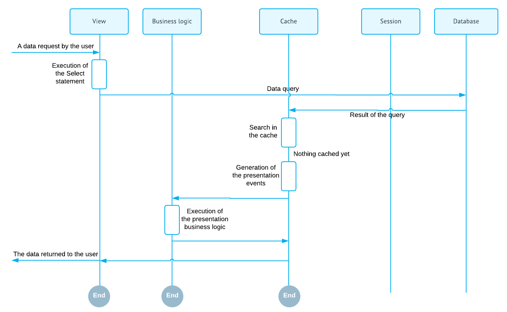
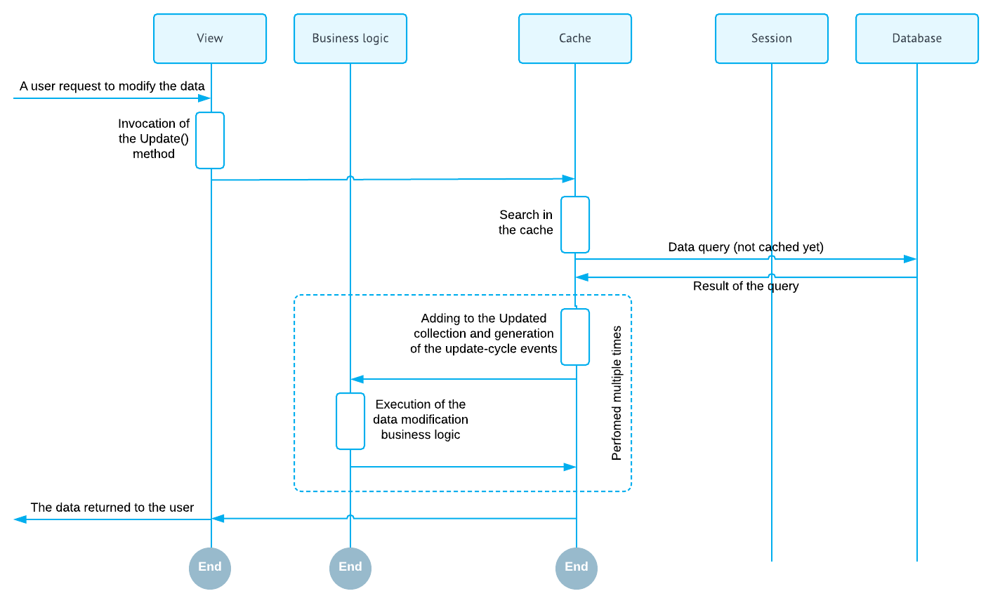
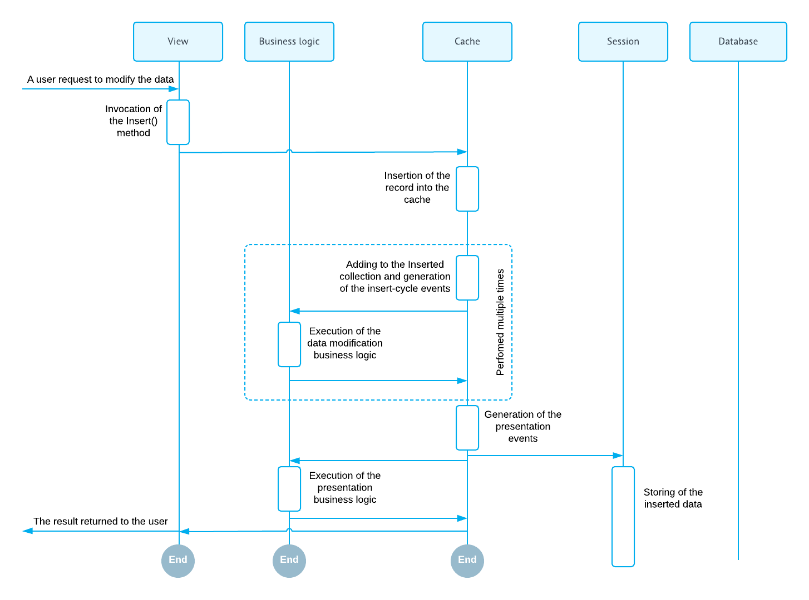
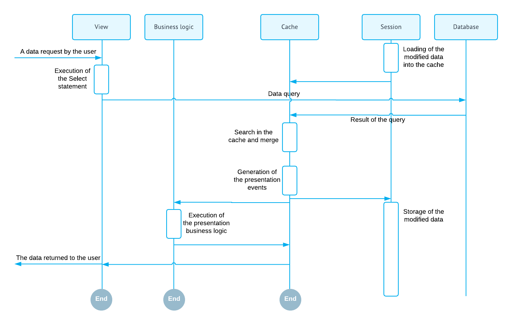
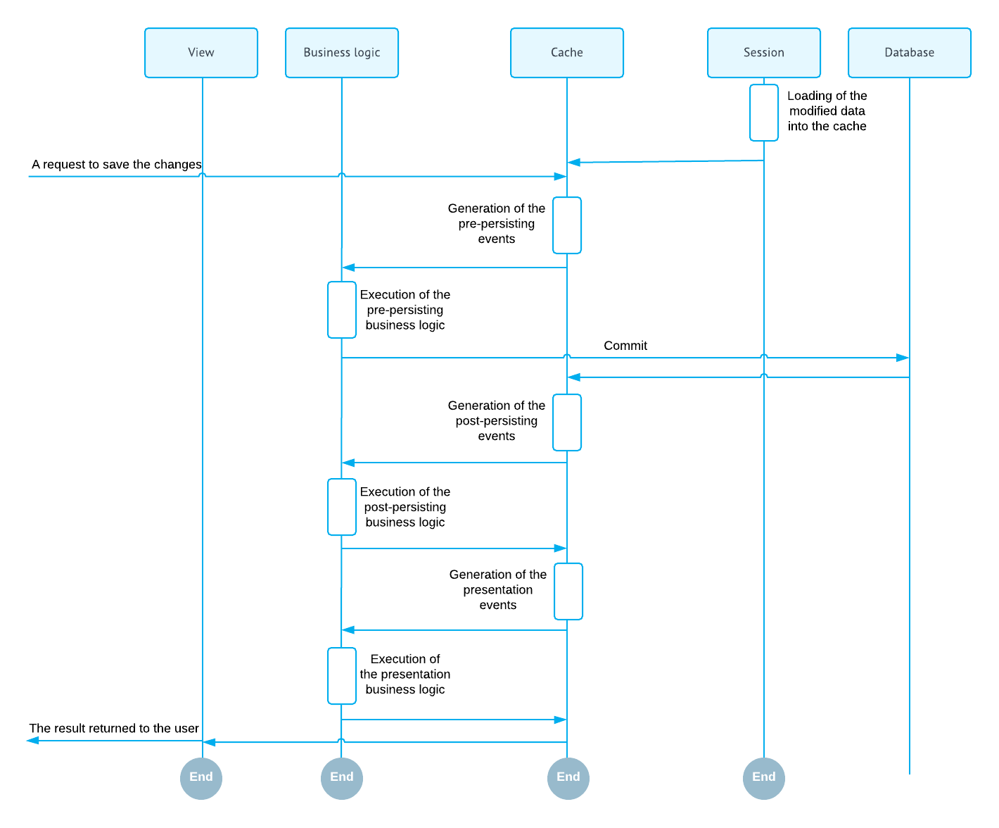
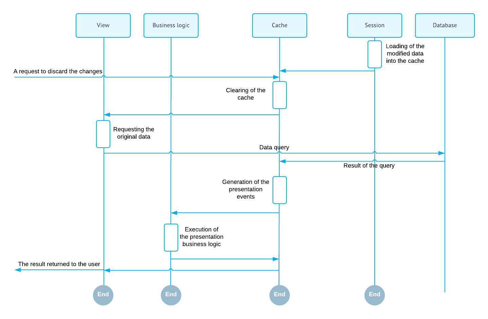

# Data Modification Scenarios {#_e6fb8c00-e144-489a-9648-d66ada46e67f .concept}

In this topic, you can find the basic data manipulation scenarios that can be executed from the graph business logic or from the user interface. Entity data manipulation through the user interface indirectly invokes the same methods as the direct call from the business logic controller.

## Querying the Data for the First Time { .section}

The data can be requested through the Select method of the data view. During this operation, the systems executes BQL command from the data view declaration. The data returned by the BQL command is passed to the requester. The following diagram illustrates this process.

## Updating an Existing Record { .section}

An existing record can be updated through the Update\(record\) method of the data view. This method places the modified record into the cache.

If the data record is not found in the Cached collection, the cache controller loads the data record from the database, adds it to the Cached collection, marks it as updated, and updates it with the new values. The search of the data record in the Cached collection and loading of the data record from the database is based on the DAC key fields. The diagram below illustrates this scenario.

If the updated record exists in the Cached collection the cache controller locates it and updates it with the new values. The diagram below illustrates this scenario.

 record")

## Inserting a New Record { .section}

A new record can be inserted into the cache through the Insert\(record\) method of the data view. The new inserted record is added to the Cached collection and marked as inserted. The diagram below illustrates this scenario.

## Deleting an Existing Record { .section}

An existing record can be deleted from the cache using the Delete\(record\) method, of the data view.

If the data record is not found in the Cached collection, the cache controller loads the data record from the database, adds it to the Cached collection, and marks it as deleted. The search of the data record in the Cached collection and loading of the data record from the database is based on the DAC key fields. The diagram below illustrates this scenario.

 record")

If the deleted record is found in the Cached collection, the cache controller locates it and marks as deleted. The diagram below illustrates this scenario.

 record")

## Querying Updated Data { .section}

The data can be modified and then queried again. In this scenario, the data records stored in the cache memory are merged with the result of the BQL command execution. Data record merge is based on DAC key fields. The final result of the Select\(\) execution incorporates all the earlier record modifications that have not been preserved to the database yet. The diagram below illustrates this scenario.

## Persisting Changes to the Database { .section}

When the data is modified, the system has two different versions of the data: the new one stored in the caches memory and the original one persisted in the database. At this point you have two options:

-   Save the new version of data to the database using the Persist\(\) method of the graph
-   Discard all in-memory changes and load the original data version using the Clear\(\) method of the graph

From the user interface these methods are called by invocation of the Save and Cancel actions. These actions are predefined and mapped to the Persist\(\) and Clear\(\) methods.

The diagram below illustrated saving of the changes to the database.

The diagram below illustrates discarding of all in-memory entity changes.

## Preserving the Data Version Between the Round Trips and Handling the Subsequent Selects from the Views { .section}

It is important to understand that a graph is a stateless object. It is discarded after each data request. In order to preserve the modified data version between the requests, the cache controller serializes the Cached collection into the session state and restores it later when the graph is instantiated on the subsequent request. In this scenario, it is very important that the cache contains only the modified entity records, not the complete entity record set.

**Parent topic:**[Getting Started with Acumatica Framework](../StudioDeveloperGuide/FGS__mng.md)

