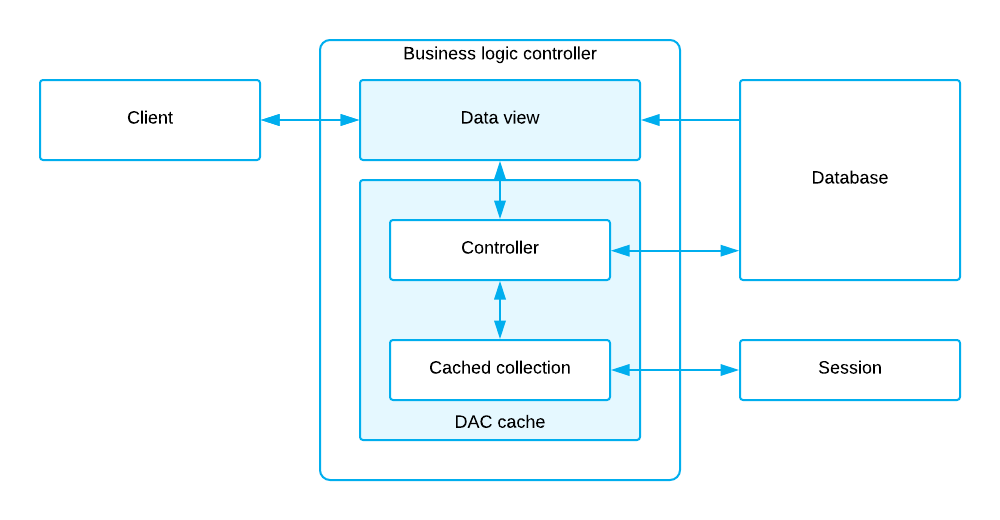

# Data View and Cache {#_cd8f9db9-2965-4ce4-9ae8-4714898fdc44 .concept}

Data views implement the interfaces for querying the data from the database and submitting modified data to the cache.

Data views are declared in business logic controllers as public fields of PXSelectBase-derived type. The following data view declaration uses the SelectFrom&lt;Type&gt;.View class, which is derived from PXSelectBase.

```
public SelectFrom<Product>.View Products;
```

The data view type is a business query language \(BQL\) statement that selects data to be manipulated through the data view. The main DAC of a data view is the first type parameter in the declaration. The data view that is specified as the primary view for the ASPX page must be defined the first one in the graph. For details about, BQL, see [Querying Data in Acumatica Framework](AD__mng_Querying_Data.md).

Based on this declaration, the system automatically instantiates the DAC cache.

A *DAC cache* object in the Acumatica Framework is the primary interface for working with individual records from the graph business logic. It has two components and two primary responsibilities:

-   The Cached collection: In-memory cache that contains modified entity records. The Cached collection is instantiated based on the corresponding DAC declaration and managed by the cache.
-   The controller: The cache component that implements basic CRUD \(create, read, update, delete\) operations on the Cached collection and triggers a sequence of data manipulation events when modifying or accessing the data in the Cached collection. These events can be later subscribed from the graph to implement the business logic associated with the data modification.

The diagram below shows the internal graph structure and responsibilities of the data view and the cache.



## Master-Detail Relationship Between Data Views { .section}

The framework executes data views in the order requested by the form. You do not have to execute a data view explicitly to retrieve data for the UI.

The following code shows the declaration of two data views.

```
public SelectFrom<SalesOrder>.View Orders;
public SelectFrom<OrderLine>.
           Where<OrderLine.orderNbr.
               IsEqual<SalesOrder.orderNbr.FromCurrent>>.View OrderDetails;
```

In this example, the framework first executes the `Orders` data view to retrieve the master data record, and then executes the `OrderDetails` data view. To pass the `OrderNbr` field value as a parameter to the `OrderDetails` data view, we use the Current property of the cache that keeps the data record that is currently selected in the UI. Thus the last data record retrieved by the `Orders` data view is available through the Current property of the cache. \(But we expect to have only one master record available at a time.\) Also, when you create the new master data record, it also gets available through the Current property of the cache.

If the Current property is null or the field value is null, the parameter is replaced by the default value.

**Parent topic:**[Getting Started with Acumatica Framework](../StudioDeveloperGuide/FGS__mng.md)

