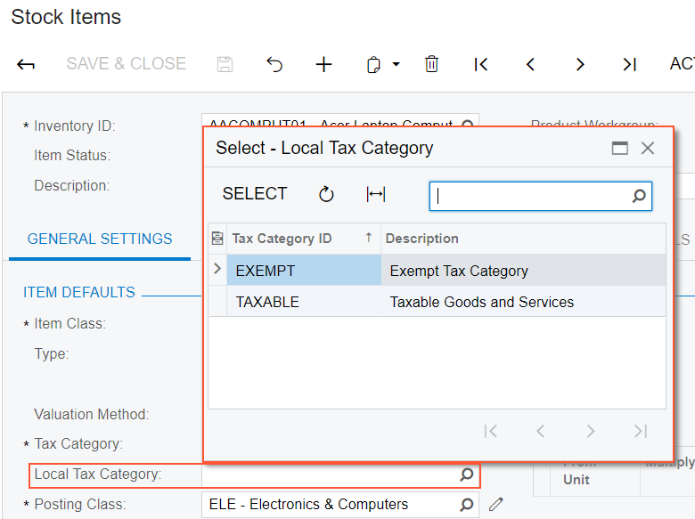
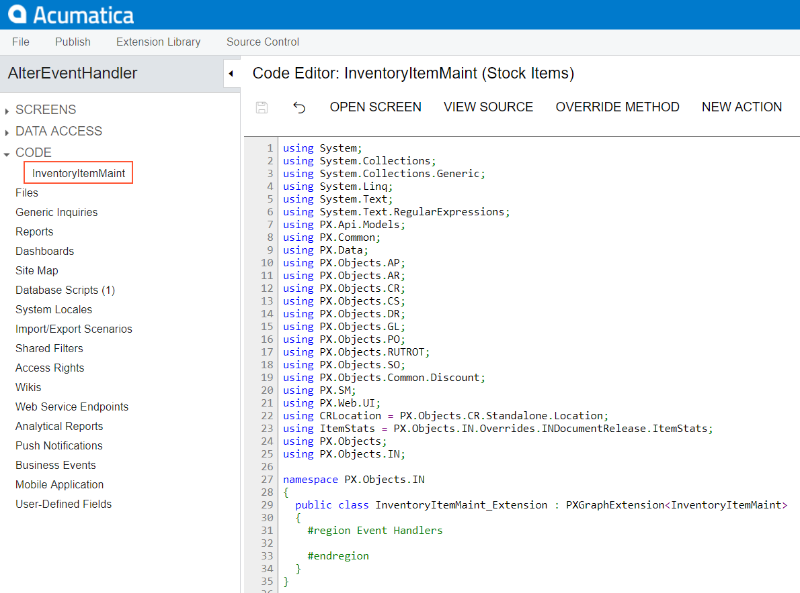
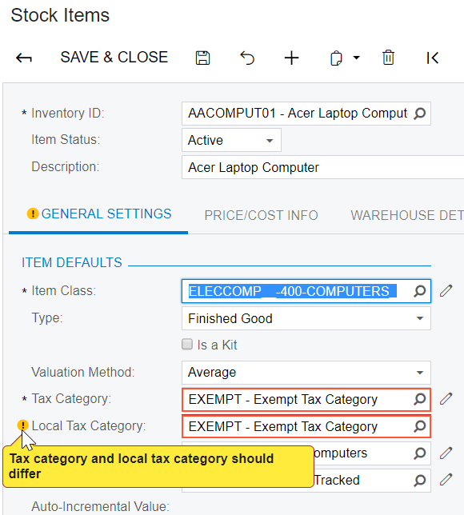
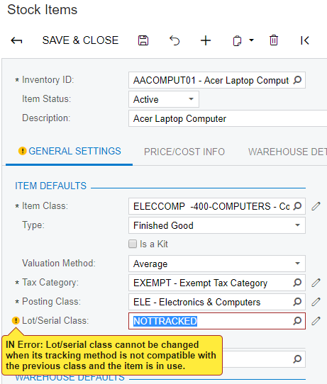
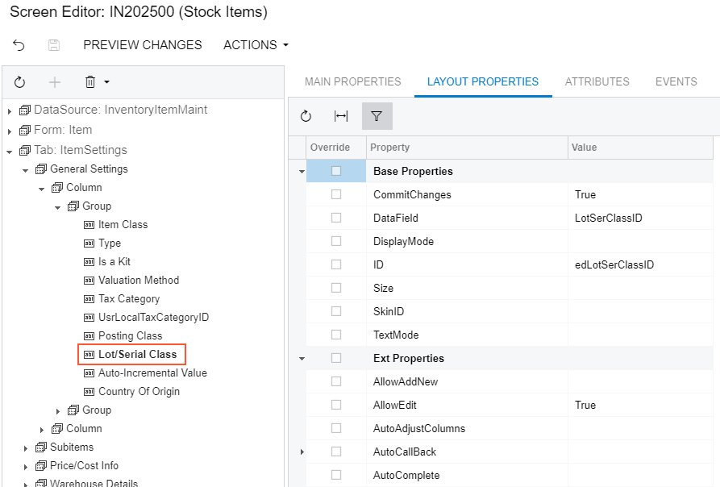
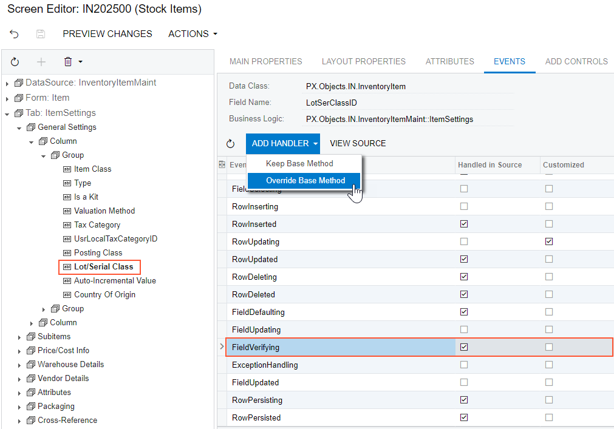
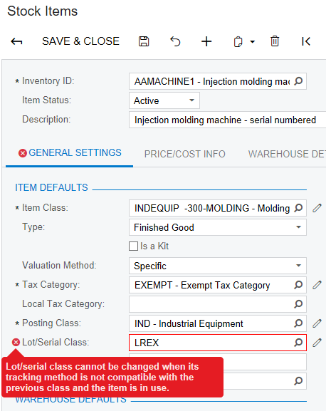

# Examples of Adding or Altering Graph Event Handlers {#_65fb547f-3c07-4495-b939-f37baa2d2d15 .concept}

The following examples of customization tasks demonstrate how you can implement custom handlers for events in graph extension classes.

-   [Implementing a Handler That is Appended to the Collection of Base Handlers](#section_fvt_gy5_kq)
-   [Implementing a Handler That Replaces the Collection of Base Handlers](#section_xn4_3y5_kq)
-   [Adding an Event Handler From the Screen Editor](#section_e1k_zt4_lq)

## Implementing a Handler That is Appended to the Collection of Base Handlers {#section_fvt_gy5_kq .section}

When you define an event handler in the graph extension class with the same declaration, as it is defined in the base \(original\) graph, this handler is added to the appropriate event handler collection. Depending on the event type, the event handler is appended to either the end of the collection or the start of it. When the event occurs, all event handlers in the collection are executed, from the first one to the last one. For details, see [Event Handlers](../CustomizationPlatform/CG_Platform_TO_Code_CS_GraphExtensions_Event.md).

Suppose that you need to add validation of **Local Tax Category** on the **General** tab of the Stock Items \(IN202500\) form. **Local Tax Category** that is shown in the screenshot below is a custom field that has been added to the form, as described in the example of [Adding Data Fields](../CustomizationPlatform/HowACE_AddField.md). **Local Tax Category** is linked to the custom UsrLocalTaxCategoryID data field defined in the DAC extension for the `InventoryItem` data access class.

Your task is to check whether the selected **Local Tax Category** is the same as the selected **Tax Category** of the item and add a warning message that appears for the **Local Tax Category** box if they are the same.



To resolve the task, you implement validation of fields on the RowUpdating event handler that you will add to the graph extension for the [Stock Items](../UserGuide/IN_20_25_00.md) \(IN202500\) form. In this variant of implementation, the validation will occur when the user attempts to save the InventoryItem record. In the handler, you compare the TaxCategoryID and UsrLocalTaxCategoryID fields and return an error message that displays for the **Local Tax Category** box if the values are equal. Do the following:

1.  Select the business logic controller for customization by clicking **Customization &gt; Inspect Element** and clicking the **Warehouses** tab on the [Stock Items](../UserGuide/IN_20_25_00.md) form. The system should retrieve the following information that appears in the **Element Properties** dialog box:
    -   **Business Logic**: *InventoryItemMaint*. The business logic controller that provides the logic for the Stock Items form.

        Select **Actions** &gt; **Customize Business Logic** in the **Element Properties** dialog box. In the **Select Customization Project** dialog box, specify the project to which you want to add the customization item for the business logic controller of the form and click **OK**.

        The Code Editor opens for customization of the business logic code of the form \(see the screenshot below\). The system generates the graph extension class in which you can develop the customization code. \(See [Graph Extensions](../CustomizationPlatform/CG_Platform_TO_Code_CS_GraphExtensions.md) for details.\)

        

2.  Add the following code to the graph extension class for InventoryItemMaint:

    ```
    #region Event Handlers
    protected void _(Events.RowUpdating<InventoryItem> e, 
      PXRowUpdating InvokeBaseHandler)
    {
          InventoryItem row = e.NewRow as InventoryItem;
          InventoryItemExt rowExt = sender.GetExtension<InventoryItemExt>(row);
          if (row.TaxCategoryID != null && rowExt.UsrLocalTaxCategoryID != null &&
             row.TaxCategoryID == rowExt.UsrLocalTaxCategoryID)
          {
             sender.RaiseExceptionHandling<InventoryItemExt.usrLocalTaxCategoryID>(
                 row,
                 rowExt.UsrLocalTaxCategoryID,
                 new PXSetPropertyException("Tax category and local tax category should differ",
                     PXErrorLevel.Warning));
          }
    }
    #endregion
    ```

    The event handler checks whether the TaxCategoryID and UsrLocalTaxCategoryID field values are not null and do not equal each other. If these conditions are not satisfied, the handler issues the warning that will be shown on the **Local Tax Category** box in the UI, which corresponds to the UsrLocalTaxCategoryID field.

    **Note:** The field is accessed by its string name by using the `GetValue()` method on the cache. There is a number of ways how you can access customization objects from code. See [Access to a Custom Field](../CustomizationPlatform/CG_Platform_Framework_CS_DACExt_Access.md) for details.

3.  Click **Save** in the Code Editor to save the changes.

    The system adds the customization to the business logic code to the **Code** list of project items. See [Code Editor](../UserGuide/AU_20_40_00_CodeEditor.md) for details.


To view the result of the customization, publish the customization project and open the Stock Items form. To test the validation, select an item on the form, set the **Local Tax Category** the same as the **Tax Category** of the item and click **Save**. The warning message appears for the **Local Tax Category** box, as it was required by the task. To view the warning message, point the mouse to the warning icon, as shown on the screenshot below.



## Implementing a Handler That Replaces the Collection of Base Handlers {#section_xn4_3y5_kq .section}

In a graph extension, you can define an event handler so that the handler replaces the base graph event handler collection. To do this, you declare the event handler with an additional parameter, as described below. When the event is raised, the system calls the event handler with an additional parameter of the highest-level graph extension. The system passes the link to the event handler with an additional parameter from the extension of the previous level, if such an event handler exists, or to the first item in the event handler collection \(also described in [Event Handlers](../CustomizationPlatform/CG_Platform_TO_Code_CS_GraphExtensions_Event.md)\). In the event handler that replaces the collection of handlers of the base graph, you can invoke the collection of base handlers as well as implement the logic to be executed before and after the base collection.

Suppose that you need to resolve the same customization task, as described above—that is, you have to add validation of **Local Tax Category** on the **General** tab of the Stock Items form. To resolve the task, you implement validation in the RowUpdating event handler that you define in the graph extension for the `InventoryItemMaint` class.

If you define the event handler, as listed below, the handler will replace the collection of handlers of the base graph. The code of the replacing handler that is given below introduces the same behavior of the Stock Items form as the code of the event handler that is added to the collection, as described above in [Adding a Handler to the Collection of Base Handlers](#section_fvt_gy5_kq). In the handler below, you invoke the base handlers first and then validate the TaxCategoryID and UsrLocalTaxCategoryID fields and return an error message that displays for the **Local Tax Category** box if the validation fails.

```
#region Event Handlers
protected void _(Events.RowUpdating<InventoryItem> e, 
  PXRowUpdating InvokeBaseHandler)
{
    //execute the collection of base handlers
    if(InvokeBaseHandler != null) InvokeBaseHandler(cache, e);
    //add the validation of Local Tax Category
    InventoryItem row = e.NewRow as InventoryItem;
    InventoryItemExt rowExt = cache.GetExtension<InventoryItemExt>(row);
    if (row.TaxCategoryID != null && rowExt.UsrLocalTaxCategoryID != null &&
        row.TaxCategoryID == rowExt.UsrLocalTaxCategoryID)
    {
        cache.RaiseExceptionHandling<InventoryItemExt.usrLocalTaxCategoryID>(
            row,
            rowExt.UsrLocalTaxCategoryID,
            new PXSetPropertyException("Tax category and local tax category should differ",
                PXErrorLevel.Warning));
    }
} 
#endregion
```

**Note:** When the event is raised, the system calls the event handler, passing a link to the first item in the base graph event handler collection. You execute `InvokeBaseHandler()` to invoke the collection of event handlers defined in the base graph. Depending on a customization task, you can skip the execution of base handlers or implement the needed logic before the base handlers are invoked.

## Adding an Event Handler From the Screen Editor {#section_e1k_zt4_lq .section}

To add a custom handler for a row or field event to the customization project, you can use the Screen Editor, as described below.

**Note:** For this example, you have to enable the *Lot and Serial Tracking* feature on the [Enable/Disable Features](../UserGuide/CS_10_00_00.md) \(CS100000\) form to view the **Lot/Serial Class** box on the **General** tab of the [Stock Items](../UserGuide/IN_20_25_00.md) \(IN202500\) form.

Suppose that on the [Stock Items](../UserGuide/IN_20_25_00.md) form you need to replace the warning message that appears on the **Lot/Serial Class** box for an incompatible class selected in the box \(see the screenshot below\) with an error message.



To resolve the task, you have to modify the logic of validation of the DAC field that corresponds to the **Lot/Serial Class** box. You have to implement a custom handler for the `FieldVerifying` event on the DAC field. Do the following:

1.  Find the DAC field and add the event handler to the customization project for it, open the form in the Screen Editor. To do this, on the **Customization** menu, select **Inspect Element** and click the label or the box area of the **Lot/Serial Class** control. The system should retrieve the following information that appears in the **Element Properties** dialog box:
    -   **Control Type**: *Selector*. The type of the inspected UI control.
    -   **Data Class**: *InventoryItem*. The data access class that contains the field corresponding to the inspected control.
    -   **Data Field**: *LotSerClassID*. The data field that is linked to the inspected control.
    -   **Business Logic**: *InventoryItemMaint*. The business logic controller that provides the logic for the Stock Items form.
2.  Click **Customize** in the Element Inspector. In the **Select Customization Project** dialog box, specify the project to which you want to add the customization item for the business logic controller of the form and click **OK**.

    The Screen Editor opens for the form already navigated to the inspected control, as the screenshot below shows.

    

3.  Add the `FieldVerifying` event handler for data field underlying the **Lot/Serial Class** control. To do this, first select the **Events** tab and find the `FieldVerifying` event in the grid. The selected check box in the **Handled in Source** column means that the `FieldVerifying` event is already handled for the `LotSerClassID` field in the original business logic controller, `InventoryItemMaint` class.

    **Note:** The **Events** tab displays the events depending on the control selected in the tree. The tab shows the field events if you select a control that is linked to a data field \(that is, has the `DataField` property specified\) and the row events of the parent container that is linked to a data view \(that is, has the `DataMember` property specified\). If you select a container that is not linked to a data view or data field, the tab shows no events.

    Add a custom handler for the `LotSerClassID` field to the customization project by clicking the **FieldVerifying** event in the table and then clicking **Add Handler** &gt; **Override Base Method** on the toolbar \(see the screenshot below\).

    

    The system generates the definition of the event handler, adds the definition to the graph extension class for the form, and opens the Code Editor with the generated code. The handler replaces the collection of event handlers implemented in the original graph, which is described in [Implementing a Handler That Replaces the Collection of Base Handlers](#section_xn4_3y5_kq).

4.  Modify the generated code, as listed below, and click **Save** in Code Editor to save the changes to the customization project. In the code, you catch the exception that could be thrown from the original handlers and create another exception with the error message instead of the original one.

    ```
    protected void _(Events.FieldVerifying<InventoryItem, 
      InventoryItem.lotSerClassID> e, PXFieldVerifying InvokeBaseHandler)
    {
        try
        {
            if(InvokeBaseHandler != null) InvokeBaseHandler(cache, e);
        }
        catch (PXSetPropertyException ex)
        {
            cache.RaiseExceptionHandling<InventoryItem.lotSerClassID>(
                e.Row,
                e.NewValue,
                new PXSetPropertyException(
                    ex.MessageNoPrefix, PXErrorLevel.Error));
        }  
    }
    ```

5.  Publish your customization project.

To view the result of the customization, publish the customization project and open the Stock Items form. To test the validation, select an incompatible class in the **Lot/Serial Class** box, as shown in the screenshot below. The error message appears for the box instead of a warning message.



**Parent topic:**[Working with Events](../StudioDeveloperGuide/BL__mng_Working_With_Events.md)

