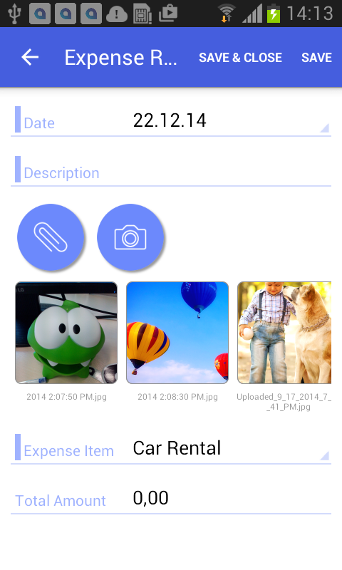

# Configuring Attachments {#_37205b0a-b4d9-4b2c-be4a-3c53112cccd0 .concept}

By default, the mobile application enables attachments and displays them on a screen if the screen supports the attachments. However, the default handling of attachments can be overridden.

## Example: Configuring a Screen with Attachments { .section}

To see an example of changing the way attachments are handled, copy the code below to an `.xml` file, put the file in the `\App_Data\Mobile` folder of the Acumatica ERP website, and start the mobile application.

```
<?xml version="1.0" encoding="UTF-8"?>
<sm:SiteMap xmlns:sm="http://acumatica.com/mobilesitemap" xmlns:xsi="http://www.w3.org/2001/XMLSchema-instance">

    <sm:Folder DisplayName="Expense Receipts" Type="HubFolder" Icon="system://NewsPaper" >
        <sm:Screen Id="EP301010" Type="SimpleScreen" DisplayName="Expense Receipts" >
            <sm:Container Name="ExpenseReceipts" >
                <sm:Field Name="Date" />
                <sm:Field Name="ClaimAmount" />
                <sm:Field Name="DescriptionTranDesc" />
                <sm:Field Name="Currency" />

                <sm:Action Name="addNew" Context="Container" Behavior="Create" Redirect="true" Icon="system://Plus" />
                <sm:Action Name="editDetail" Context="Container" Behavior="Open" Redirect="true" />
                <sm:Action Name="Delete" Context="Selection" Behavior="Delete" Icon="system://Trash" />
            </sm:Container>
        </sm:Screen>
    </sm:Folder>

    <sm:Screen Id="EP301020" Type="SimpleScreen" Icon="system://Display1" DisplayName="Expense Receipt" Visible="false" OpenAs="Form">
        <sm:Container Name="ReceiptDetails" AttachmentsControlPriority="75">

            <sm:Attachments Disabled="false">
                <sm:Type Extension="jpg" />
                <sm:Type Extension="png" />
                <sm:Type Extension="pdf" />
            </sm:Attachments>

            <sm:Field Name="Date" FormPriority="90"/>
            <sm:Field Name="Description" FormPriority="80" />
            <sm:Field Name="ExpenseItem" FormPriority="70" />
            <sm:Field Name="TotalAmount" FormPriority="60" />

            <sm:Action Name="Save" Context="Record" Behavior="Save" />
            <sm:Action Name="Cancel" Context="Record" Behavior="Cancel" />
        </sm:Container>
    </sm:Screen>
</sm:SiteMap>
```

**Note:** If a screen does not support attachments, the attachments will not be displayed even if you specify `<sm:Attachments Disabled="false">`.

You specify the position of the attachments by using the AttachmentsControlPriority container attribute and the FormPriority field attribute. The fields and attachments are aligned vertically according to the priority—the higher the priority, the higher the element's position.

To disable attachments and configure the file types that are allowed, you use the sm:Attachments tag inside the sm:Container tag.

The screenshot below shows the resulting screen in the mobile application.



## Enhancing Images Taken from the Camera { .section}

The functionality of enhancing images taken from the camera of a mobile device is implemented in the Acumatica mobile app. This image enhancement makes the image look better and more readable. This functionality is useful for photos of expense receipts that may be attached to documents in Acumatica ERP.

To switch on image enhancement in the Acumatica mobile app, you should set the ImageAdjustmentPreset attribute to *Receipt* in the sm:Attachments tag of the mobile site map as follows:

```
<sm:Attachments ImageAdjustmentPreset="Receipt"/>
```

When the ImageAdjustmentPreset attribute is set to *Receipt*, a special camera mode is switched on in the Acumatica mobile app. In this mode, the following enhancements of the image captured by the camera are preformed automatically:

-   The image is cropped by the bounding box of the detected edges.
-   The image distortion is removed.
-   The image is converted into black and white.
-   The contrast of the image is maximized.

If the ImageAdjustmentPreset attribute is not specified or has another value, the Acumatica mobile app attaches an original image taken from the camera.

**Parent topic:**[Screens](../StudioDeveloperGuide/MOBILE_Screens.md)

