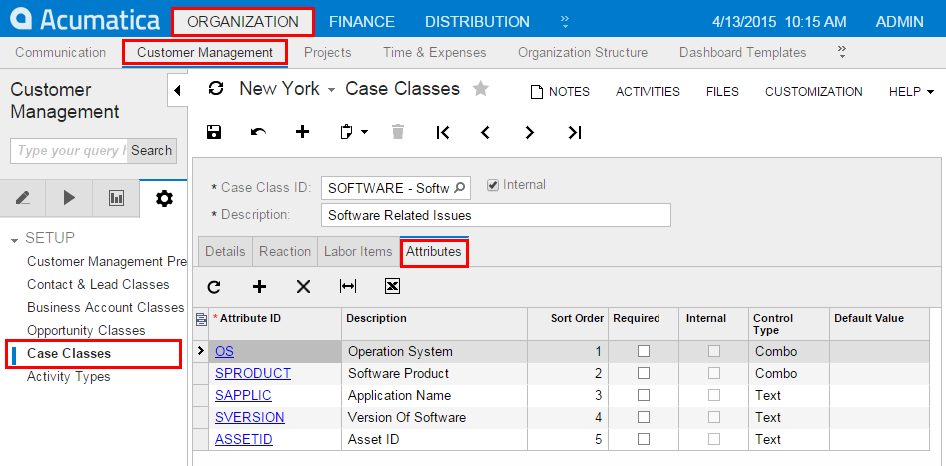
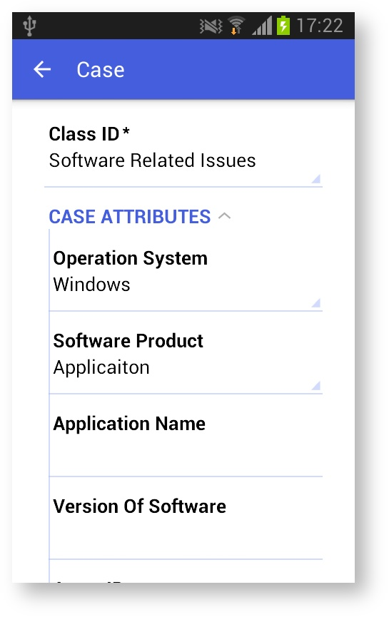

# Adding Entity Attributes to Mobile Screens {#_2980fede-2c3c-41cf-8277-a7f27a9fb17f .concept}

In Acumatica ERP, for a class as a business object, you can define a list of entity attributes to gather specific information about members of the class. Attributes are defined for a particular class, which is a grouping of entities—such as leads, opportunities, customers, cases, projects, and stock or non-stock items—that have similar properties.

On an Acumatica ERP form where attributes for an entity is defined, the attributes are usually displayed on a separate tab as a table that contains a set of key-value pairs. Because entity attributes are dynamic, it is not possible to explicitly specify them in a mobile site map. Therefore, specific definitions are used to show the attributes in a mobile application.

Thus, in a mobile application, entity attributes are displayed as a form or part of a form with input fields rather than as a table. For improved usability, you can apply a group as a container for attributes.

Suppose that in the mobile app you need to display the attributes of the [Case Classes](../UserGuide/CR_20_60_00.md) form \(CR206000\) of Acumatica ERP, which are shown in the screenshot below.



## Example: Configuring a Screen with a Group of Attributes { .section}

To see an example of creating a group for the attributes of a particular form, copy the code below to an `.xml` file, put the file in the `\App_Data\Mobile` folder of the Acumatica ERP website, and start the mobile application.

```
<?xml version="1.0" encoding="UTF-8"?>
<sm:SiteMap xmlns:sm="http://acumatica.com/mobilesitemap" xmlns:xsi="http://www.w3.org/2001/XMLSchema-instance">

    <sm:Screen DisplayName="Case" Id="CR306000" OpenAs="Form" Type="SimpleScreen">

        <sm:Container FormActionsToExpand="1" Name="CaseSummary">

            <sm:Field Name="ClassID">
                <sm:SelectorContainer PickerType="Attached" />
            </sm:Field>

            <sm:Group Collapsable="true" Collapsed="true" DisplayName="Case Attributes">
                <sm:Attributes From="Attributes" />
            </sm:Group>

        </sm:Container>
    </sm:Screen>

</sm:SiteMap>
```

The From attribute of the sm:Attributes tag specifies the name of the screen container that holds the entity attributes.

In this code, note that the sm:Attributes tag is wrapped in the group named *Case Attributes*.

The screenshot below shows the resulting screen in the mobile application.



Also, you can use the sm:Attributes tag to map a pair of columns from any grid of Acumatica ERP to a form view in the mobile app as a key-value pair. For example, if a grid contains a key field, a value field, and a field for sorting, to create a sorted group of key-value pairs of the grid on a form view of the mobile app, you might define the following &lt;sm:Attributes&gt; tag \(see [&lt;sm:Attributes&gt;](MOBILE_sm_Attributes.md) for details\).

```
...
<sm:Container ...>
...
  <sm:Group ...>
    <sm:Attributes From="GridDataView" IDField="Column1_FieldName"
        IDValue="Column5_FieldName" OrderField="Column3_FieldName" />
  </sm:Group>

</sm:Container>
...

```

In the example above, `GridDataView` is the DataMember defined for the grid; `Column1_FieldName`, `Column5_FieldName`, and `Column3_FieldName` are correspondingly the key field, the value field, and the field for sorting.

**Parent topic:**[Screens](../StudioDeveloperGuide/MOBILE_Screens.md)

