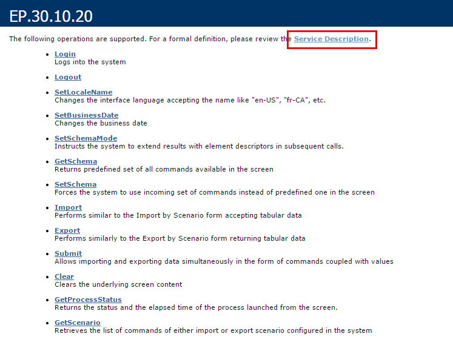
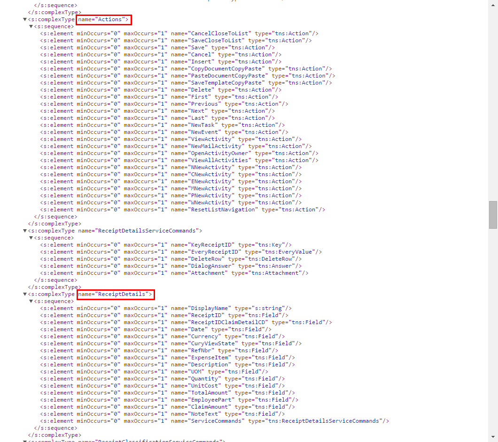

# Getting the WSDL Schema {#_a36c007a-a860-4808-8da1-4721f7616acb .concept}

You can get the needed information to configure a screen from the WSDL schema, which is available on the title bar of the form in Acumatica ERP through **Tools** &gt; **Web Service** in the UI.

**Note:** For any container \(that is, a form, tab, grid, tree, or panel\), element, or action with the **\#** or **%** title, the generated WSDL file contains `NUMBER` instead of the `#` symbol, and `PERCENT` instead of the `%` symbol.

To obtain the WSDL schema, perform the following steps:

1.  In Acumatica ERP, open the form for which you want information.
2.  On the title bar of the form, click **Tools** &gt; **Web Service** in the UI.
3.  On the screen with the web service links, click **Service Description**, as shown in the following screenshot.

    

See the following screenshot for an example of the WSDL schema. The schema includes containers \(such as the ReceiptDetails container in this example\), the list of container fields, and the Actions list.

With this information, you can start configuring the screen.

Before configuring a screen in the mobile app, you should check how the form looks in the web version of Acumatica ERP to decide how to configure the screen.

**Parent topic:**[Screens](../StudioDeveloperGuide/MOBILE_Screens.md)

