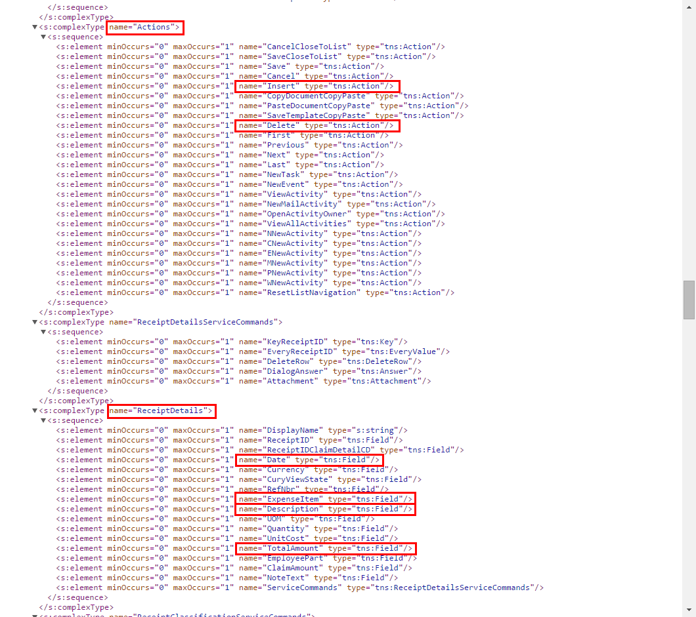
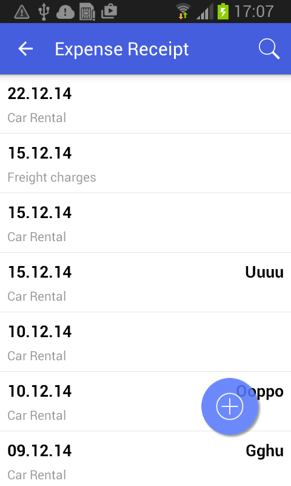
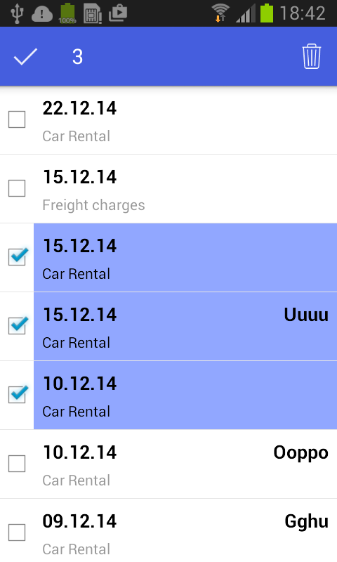
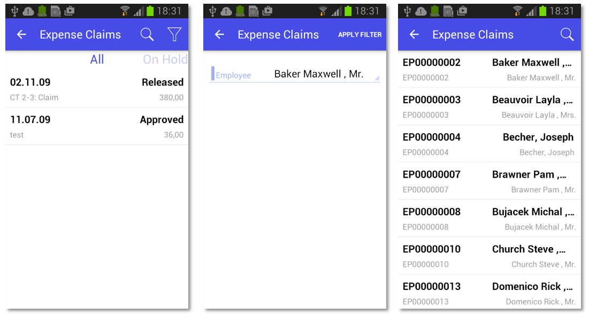

# Configuring Lists {#_e8b287bf-ffbe-4c7f-84a1-894c3bdbac02 .concept}

This topic describes how to configure a screen that contains a list of records.

## Example: Creating a Simple List View Layout {#_95fe7b23-bce2-4ef8-b56e-8b142d413547 .section}

A list of records is the simplest screen layout.

To complete an example of configuring the simplest screen layout, copy the code below to an `.xml` file, put the file in the `\App_Data\Mobile` folder of the Acumatica ERP website, and start the mobile application.

```
<?xml version="1.0" encoding="UTF-8"?>
<sm:SiteMap xmlns:sm="http://acumatica.com/mobilesitemap" xmlns:xsi="http://www.w3.org/2001/XMLSchema-instance">

    <sm:Screen DisplayName="Expense Receipt" Icon="system://Display1" Id="EP301020" Type="SimpleScreen">
        <sm:Container FieldsToShow="3" Name="ReceiptDetails">
            <sm:Field Name="Date" />
            <sm:Field Name="Description" />
            <sm:Field Name="ExpenseItem" />
            <sm:Field Name="TotalAmount" />

            <sm:Action Behavior="Create" Context="Container" DisplayName="Add" Icon="system://Plus" Name="Insert" />
            <sm:Action Behavior="Delete" Context="Selection" Icon="system://Trash" Name="Delete" />
        </sm:Container>
    </sm:Screen>
</sm:SiteMap>
```

This example uses the WSDL schema elements marked in the screenshot below.



The following screenshot shows the resulting screen you will see in the mobile application.



The FieldsToShow attribute of the sm:Container tag is used to limit the number of fields for a record that will be shown in the list. You use this attribute only when the same screen description is used for both the list view and form view.

You use the sm:Action tag for actions that are available in the UI. \(You can get the list of actions from the WSDL schema; see [Getting the WSDL Schema](MOBILE_BasicInfo.md).\) The Name attribute should be set to the name of the action, as found in the WSDL schema.

Actions are divided into standard actions \(such as **Open**, **Save**, and **Cancel**\) and all other actions \(such as **Void**\). The placement of the standard actions can be different from that of other actions, and some standard actions \(such as **Open**\) are not displayed on the UI at all. Whether an action is considered standard depends on the value of the Behavior attribute.

The Context attribute is used to set the target of the action. For example, you can use an action with `Context="Selection"` when the multiple selection of records, as shown in the screenshot below, is activated.



You use the Icon attribute to set the icon that is displayed on the UI.

**Note:** See [&lt;sm:Action&gt;](MOBILE_sm_Action.md#) for more information about the attributes of the sm:Action tag.

## Example: Creating a Screen with a Filtered List { .section}

To see an example of configuring a screen with a filtered list, copy the code below to an `.xml` file, put the file in the `\App_Data\Mobile` folder of the Acumatica ERP website, and start the mobile application.

```
<?xml version="1.0" encoding="UTF-8"?>
<sm:SiteMap xmlns:sm="http://acumatica.com/mobilesitemap" xmlns:xsi="http://www.w3.org/2001/XMLSchema-instance">

    <sm:Folder DisplayName="Expense Claims" Type="HubFolder" Icon="system://Folder" >

        <sm:Screen Id="EP301030" Type="FilterListScreen" DisplayName="Expense Claims" >

            <sm:Container Name="Selection" >
                <sm:Field Name="Employee" />
            </sm:Container>

            <sm:Container Name="Claim" >
                <sm:Field Name="Date" />
                <sm:Field Name="Status" />
                <sm:Field Name="Description" />
                <sm:Field Name="ClaimTotal" />
            </sm:Container>
        </sm:Screen>

    </sm:Folder>

</sm:SiteMap>
```

To configure a screen with a filtered list, do the following:

1.  Specify the screen type: Type="FilterListScreen".
2.  In the WSDL schema, find the container corresponding to the filter, and add it to the screen description \( `sm:Container Name="Selection"` in the example above\).
3.  In the WSDL schema, find the container corresponding to the list of records, and add it to the screen description \( `sm:Container Name="Claim"` in the example above\).

As a result, in the mobile application, the screen will include a button that opens the filter. When you tap the button, you open the form so you can edit the filter fields \(see the screenshots below\).



**Parent topic:**[Screens](../StudioDeveloperGuide/MOBILE_Screens.md)

