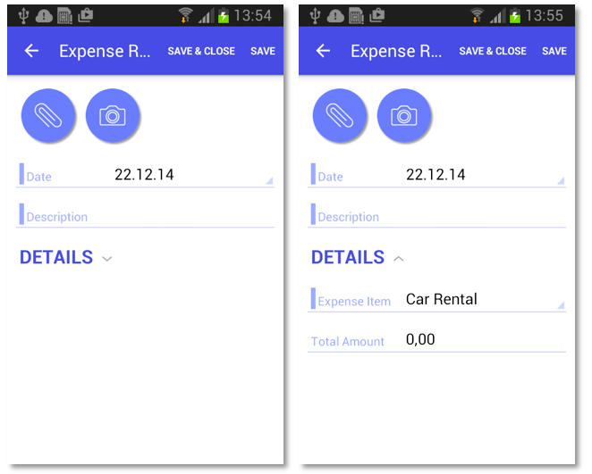

# Grouping Fields on a Form {#_1ee7cd7b-7f4c-4f06-9129-b3a72772e671 .concept}

You can combine fields into groups, as the following example shows, to make data entry more logical and intuitive.

## Example: Grouping Fields { .section}

To see an example of grouping fields into groups, copy the code below to an `.xml` file, put the file in the `\App_Data\Mobile` folder of the Acumatica ERP website, and start the mobile application.

```
<?xml version="1.0" encoding="UTF-8"?>
<sm:SiteMap xmlns:sm="http://acumatica.com/mobilesitemap" xmlns:xsi="http://www.w3.org/2001/XMLSchema-instance">

    <sm:Folder DisplayName="Expense Receipts" Type="HubFolder" Icon="system://NewsPaper" >
        <sm:Screen Id="EP301010" Type="SimpleScreen" DisplayName="Expense Receipts" >
            <sm:Container Name="ExpenseReceipts" >
                <sm:Field Name="Date" />
                <sm:Field Name="ClaimAmount" />
                <sm:Field Name="DescriptionTranDesc" />
                <sm:Field Name="Currency" />

                <sm:Action Name="addNew" Context="Container" Behavior="Create" Redirect="true" Icon="system://Plus" />
                <sm:Action Name="editDetail" Context="Container" Behavior="Open" Redirect="true" />
                <sm:Action Name="Delete" Context="Selection" Behavior="Delete" Icon="system://Trash" />
            </sm:Container>
        </sm:Screen>
    </sm:Folder>

    <sm:Screen Id="EP301020" Type="SimpleScreen" Icon="system://Display1" DisplayName="Expense Receipt" Visible="false" OpenAs="Form">
        <sm:Container Name="ReceiptDetails" >
            <sm:Field Name="Date" />
            <sm:Field Name="Description" />

            <sm:Group DisplayName="Details" Collapsable="true" Collapsed="true">
                <sm:Field Name="ExpenseItem" />
                <sm:Field Name="TotalAmount" />
            </sm:Group>

            <sm:Action Name="Save" Context="Record" Behavior="Save" />
            <sm:Action Name="Cancel" Context="Record" Behavior="Cancel" />
        </sm:Container>
    </sm:Screen>
</sm:SiteMap>
```

While entering data, the user may collapse or expand a particular group of fields. You can prevent a group from being collapsed by setting the Collapsable attribute of the group to *false* \(by default, the attribute value is *true*\). If a group is collapsible \(the Collapsable attribute is set to *true*\), the Collapsed attribute indicates whether a group is initially collapsed \(by default, the attribute value is *false*\).

You can see the result in the mobile application in the following screenshots.



The left screenshot shows the **Details** group that is initially collapsed. If the user clicks on the header of the group, the group will expand, as shown in the right screenshot.

**Parent topic:**[Screens](../StudioDeveloperGuide/MOBILE_Screens.md)

