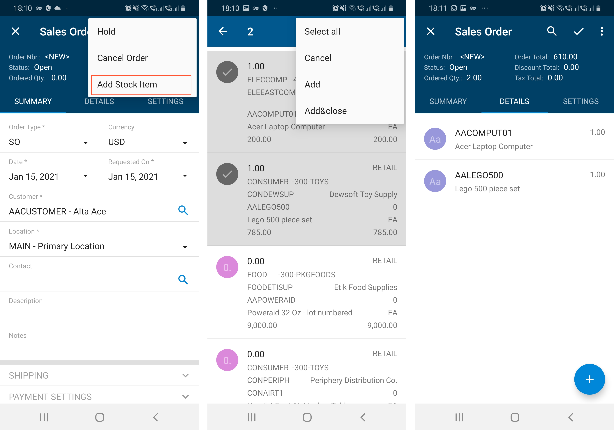

# Mapping a Smart Panel {#_e238d9b9-2d0c-4335-b74c-e64054c1bdda .concept}

This section describes how to map a smart panel \(a complex dialog box\) to the Acumatica mobile app. For details on smart panels, see [Dialog Box \(PXSmartPanel\)](../CustomizationPlatform/CG_GL_UI_Dialogs.md).

To map a smart panel, you need to perform the following steps, which are described in a greater detail below:

1.  In the form ASPX, learn the name of the smart panel and the name of the action which opens it. See [Locating of Objects to Be Mapped](#_6364cd2a-3865-46dd-a045-04a244187f4b).
2.  In the screen mapping, add an action that opens the smart panel. See [Mapping of an Action That Opens a Smart Panel](#_cf15f3c5-8c2e-4db2-8aff-7d1c0a67cda7).
3.  In the screen mapping, map the smart panel, including its containers and actions. [Mapping of a Smart Panel](#_d36ec85d-534c-4a4c-ba3b-e4b557867f76)

You can see a complete example of a smart panel mapping in [Example: Adding a Smart Panel on the Sales Orders \(SO301000\) Form](#_7900dd3b-ec6b-49e5-84a0-75c8174ee2ea).

## Locating of Objects to Be Mapped {#_6364cd2a-3865-46dd-a045-04a244187f4b .section}

The general idea of learning the object names that you need to map is the following: To learn the name of an action, you search for the name of the action in the ASPX file of the form. To learn the name of a container and its fields, you search for the container and its fields in the WSDL schema of the form.

Before mapping an action to the mobile app, you need to learn its name. You can do this by analyzing the WSDL schema and the form ASPX.

Before mapping a smart panel to the mobile app, you need to learn the names of the UI controls on the smart panel as follows:

1.  Open the WSDL schema of the form. For details on opening the WSDL schema, see [Getting the WSDL Schema](MOBILE_GettingWSDLSchema.md).
2.  In the WSDL schema, find the complexType element with the fields that match the fields you see on the smart panel.

    **Note:** If a smart panel consists of multiple containers, such as a Summary area and a grid, you should map these containers separately.

3.  Learn the name of the complexType element and the names of the elements inside it.

To map actions on the smart panel, you should learn their names by doing the following:

1.  Open the form ASPX by using the Element Inspector.
2.  Find the PXSmartPanel element that defines the smart panel. You can do this by using comments in the ASPX and comparing elements in the UI and in the ASPX.
3.  In the PXSmartPanel element, locate the PXPanel element. The PXPanel element contains the PXButton elements, which define actions on the smart panel. In the PXButton element you want to map, learn the value of the CommandName or DialogResult attribute \(either of which exists in the definition of an action\). You will later use the CommandName attribute value for the action name, and the DialogResult attribute value for the DialogResult action attribute.

    **Note:** If an action does not have the `CommandName` attribute, you can use any name for it in the mapping. For example, for the action with no `CommandName` and DialogResult = "Ok", you can add the action under the "Ok" name.


## Mapping of an Action That Opens a Smart Panel {#_cf15f3c5-8c2e-4db2-8aff-7d1c0a67cda7 .section}

To map an action that opens a smart panel, do the following:

1.  Learn the name of the action in the WSDL schema.
2.  In the screen mapping, inside the update container or add container instruction, add the recordAction object. For the object, specify the following attributes:

    -   displayName: The name to be displayed in the UI
    -   redirect: *true*
    -   redirectToDialog: The custom name of the smart panel you will map later
    An example of the mapping is shown below.

    ```
    add recordAction "AddInvBySite" {
      displayName = "Add Stock Item"
      redirect = true
      redirectToDialog  = "SO301000D1"
    }
    ```

    For details, see [recordAction](mobile_ref_msdl_objtypes_recordaction.md).


## Mapping of a Smart Panel {#_d36ec85d-534c-4a4c-ba3b-e4b557867f76 .section}

To map a smart panel, do the following:

1.  Learn the names of containers, fields, and actions that you want to map inside the smart panel as described in [Locating of Objects to Be Mapped](#_6364cd2a-3865-46dd-a045-04a244187f4b).
2.  In the screen mapping, inside the update screen or add screen instruction, add the dialog object. For the dialog object, specify the following attributes:

    -   Type: The type of the smart panel
    -   OpenAs: The display type of the smart panel
    See the following example of a dialog object. For details on the dialog object, see [dialog](MOBILE_Ref_MSDL_ObjType_dialog.md).

    ```
    add dialog SO301000D1 {
      type = FilterListScreen
      openAs = List
      ...
    }
    ```

3.  Inside the dialog object, add the actions that you want to display on the smart panel. For each action, add the dialogAction object, and specify the following attributes for it:

    -   DisplayName: The name of the action in the UI.
    -   DialogResult: The same value that is specified in the DialogResult attribute of the action in the form ASPX.

        **Note:** If the DialogResult attribute is not specified for the action in the form ASPX, you do not need to map it in MSDL.

    -   CloseDialog: An indicator of whether the app should close the smart panel after the user taps the action.
    An example of the dialog action is shown in the following code. For details on the dialogAction object, see [dialogAction](MOBILE_Ref_MSDL_ObjTypes_action.md).

    ```
    add dialogAction "Ok" {
      DisplayName = "Add&Close"
      DialogAnswer = "OK"
      closeDialog = true
    }
    ```

4.  Inside the dialog object, add the containers that you want to display on the smart panel.

    If the container should contain actions such as listAction and containerAction, in the container, specify `includeDialogActions = true`.

    An example of a container is shown in the following code. For details, see [container](mobile_ref_msdl_objtype_container.md).

    ```
    add container "AddTag" {
      includeDialogActions = True
      add field "Customer"
      add field "Contact"
      add field "Barcode" {
        special = BarCodeScan
    }
    ```

5.  If you have added any dialogAction objects \(in Instruction 3\), for each dialogAction object, you also need to add a recordAction, containerAction, or listAction object inside a container where you want the action to be displayed. The new object should have the same name as the dialogAction object.

    Suppose that you have added the `dialogAction "Ok"`, as described in Instruction 3, and a container, as described in Instruction 4. Then you need to add the recordAction object inside the container as shown in the following code.

    ```
    add container "AddTag" {
      ... 
      add recordAction "Ok"
    }
    ```


## Example: Adding a Smart Panel on the Sales Orders \(SO301000\) Form {#_7900dd3b-ec6b-49e5-84a0-75c8174ee2ea .section}

The following code demonstrates how to map the **Inventory Lookup** smart panel, which is implemented on the **Details** tab of the [Sales Orders](../UserGuide/SO_30_10_00.md) \(SO301000\) form. For details on creating a mapping of a form in a customization project, see [To Update a Screen of a Mobile App](mobile_updatescreen.md) and [To Add a Screen to the Mobile Site Map \(Example\)](MOBILE_MobileSiteMap_AddingMSDL.md).

```
update screen SO301000 {
  update container "OrderSummary" {
    formActionsToExpand = 3
    add recordAction "AddInvBySite" {
      displayName = "Add Stock Item"
      redirect = true
      redirectToDialog  = "SO301000D1"
    }
  }
    
  add dialog SO301000D1 {
    type = FilterListScreen
    openAs = List
    add dialogAction "Ok" {
      DisplayName = "Add&Close"
      DialogResult = "OK"
      closeDialog = true
    }
    add dialogAction "Cancel" {
      DisplayName = "Cancel"
      DialogResult = "Cancel"
      closeDialog = true
    }
    add dialogAction "AddInvSelBySite"
    {
      DisplayName = "Add"
      closeDialog = false
    }
    add container "InventoryLookupInventory"
    {
      add field "Inventory"
      ...
      add field "HistoryDate"
    }

    add container "InventoryLookup"{
      type = SelectionActionList
      includeDialogActions = true
      add field "QtySelected"
      add field "Selected" {
        special = "ListSelection"
      }
      add field "Warehouse"
      ...
      add field "AlternateDescription"

      add listAction "AddInvSelBySite" {
        DisplayName = "Add"
      }
      add containerAction "Cancel" {
        displayName = "Cancel"
      }
      add listAction "Ok"
      {
        DisplayName = "Add&Close"
        after = Close
      }
    }
  }
}
```

The resulting smart panel looks as shown in the following screenshots. The first screenshot shows the mapped **Add Stock Item** action on the menu of the Sales Order screen. The second screenshot shows the **Inventory** smart panel with two stock items selected. The third screenshot shows the stock items added to the **Details** tab of the Sales Order screen.



**Parent topic:**[Dialog Boxes and Smart Panels](../StudioDeveloperGuide/MOBILE_MSDL_Screen_DialogBoxes_SmartPanels.md)

