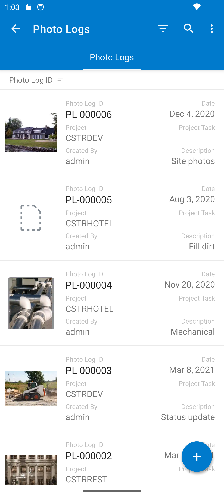

# Displaying Thumbnails {#_0a346082-bc2f-4bbe-b589-79ad3f2788a3 .concept}

In Acumatica ERP, the system can display thumbnails—that is, small images—for the records in the list view of a mobile app screen. For each listed record, a thumbnail can be displayed next to the record description if the record includes a field containing an image. An example is shown in the following screenshot, where thumbnails are displayed for each record in the Photo Log list view.



When the app displays the list view with the images, it asynchronously downloads the images for each record and displays them in the list. If an image is not available, the icon of an image file is displayed instead \(see the second record in the screenshot above\).

## Configuring Thumbnails { .section}

For thumbnails to be displayed in the list view of the mobile screen, you need to configure the mapping of the list in MSDL: In the list mapping, specify `elementType = FilePreview` in the field object that contains the image file.

**Important:** A field marked with FilePreview should have a FileID value that corresponds to the FileID value in the UploadFile table in the instance database.

The following code shows an example implementing the screenshot above.

```
add container "Photos"
{
  fieldsToShow = 5
  containerActionsToExpand = 1
  add field "Name" {
    listDisplayFormat = CaptionValue
  }
  add field "PhotoID" {
    listDisplayFormat = CaptionValue
  }
  add field "UploadedOn" {
    listDisplayFormat = CaptionValue
  }
  add field "UploadedBy"
  {
    displayName = "Created By"
    listDisplayFormat = CaptionValue
  }
  add field "Description" {
    listDisplayFormat = CaptionValue
  }
  **add field "FileId" \{
    elementType = FilePreview
  \}**
  add selectionAction "Delete" {
    icon = "system://Trash"
    behavior = Delete
    after = Close
  }
  add containerAction "ViewPhoto" {
    behavior = Open
    redirect = True
  }
}
```

**Parent topic:**[Configuring a Screen Layout](../StudioDeveloperGuide/MOBILE_MSDL_Layout.md)

