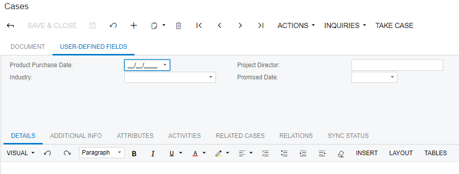
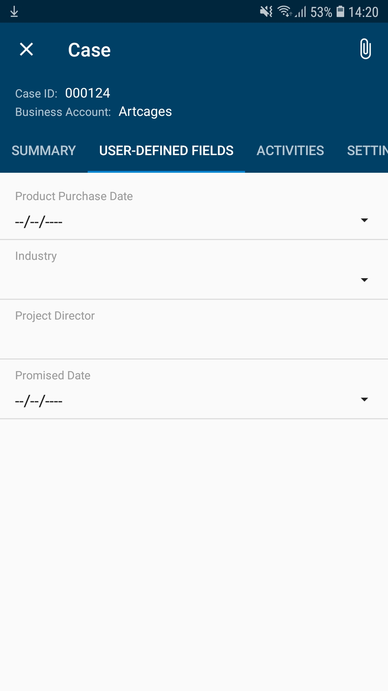
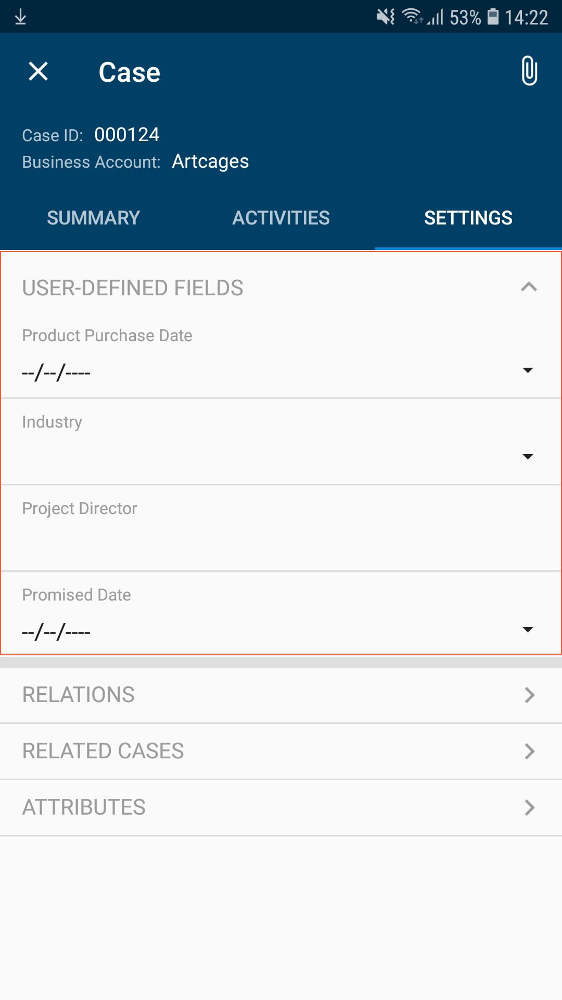

# Configuring User-Defined Fields {#_b2c1b484-af68-4dee-a7c7-349446cb4d80 .concept}

You can configure the mapping of user-defined field to a mobile app screen by using the `add UDFields` instruction.

Because not all system entities have entity classes, attributes cannot always be added to data entry forms via classes. In these cases, user-defined fields can be added directly to the data entry forms where these entities are created. When these fields are defined for a form, they are specified on the **User-Defined Fields** tab. By default, the **User-Defined Fields** tab is displayed on a mobile screen if the associated form has user-defined fields. For example, the following screenshots show user-defined fields displayed on the [Cases](../UserGuide/CR_30_60_00.md) \(CS306000\) form and on the Cases screen of the mobile app.





**Note:** User-defined fields that are attributes of the *Selector* control type specified on the [Attributes](../UserGuide/CS_20_50_00.md) \(CS205000\) form cannot be mapped.

## Organizing the Layout of User-Defined Fields { .section}

You can organize the layout of user-defined fields by putting all user-defined fields into an object of the following types:

-   layout
-   container
-   group

You do this by specifying the `add UDFields` instruction inside an object of the listed types.

For example, if user-defined fields should be displayed as a group of fields alongside other fields \(rather than on a separate tab\), a developer can use the following code. The add instruction should be used with an object of the UDFields type, as you can see from the highlighted line in the example.

```
update screen CR306000 {
  update container "CaseSummary" {
    update layout "Settings" {
      add group "UDFGroup" {
        displayName = "User-Defined Fields"
        **add UDFields "UDFInline"**
        placeAt 0
      }
    }
  }
}
```

The code above puts all user-defined fields in a group on the **Settings** tab of the Cases screen, as shown in the screenshot below.

**Note:** *UDFInline* is an arbitrary name that has not been used anywhere else in the mapping.



## Hiding User-Defined Fields { .section}

You can cancel the display of user-defined fields on a screen by using the hideUDF attribute of the screen object, as the following code shows.

```
update screen CR306000 {
hideUDF = True
}
```

**Note:** The hideUDF attribute and the `add UDFields` instruction cannot be used in the same screen mapping.

**Parent topic:**[Screens](../StudioDeveloperGuide/mobile_msdl_screens.md)

