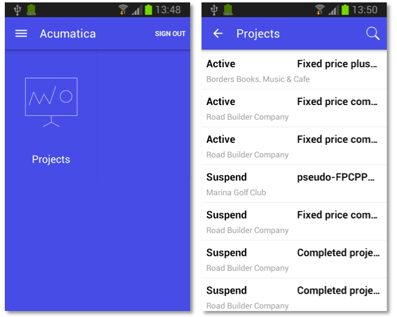
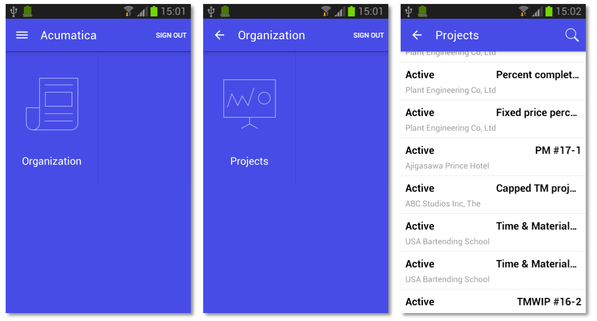
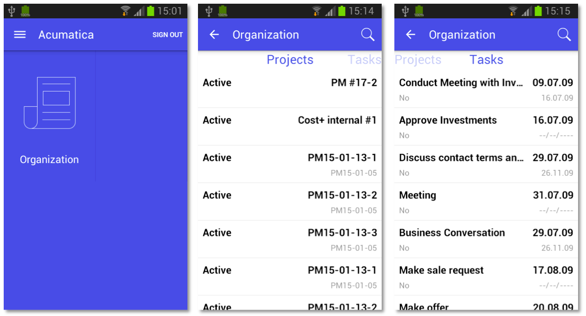
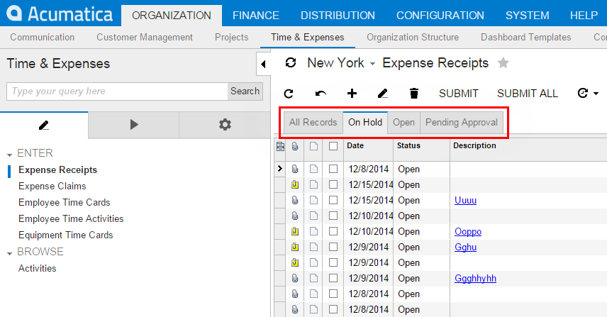
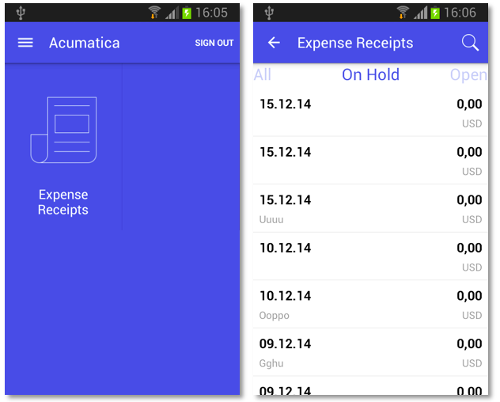

# Main Menu {#_372f52b4-f6b3-41e3-946f-cc5b4291ed21 .concept}

The main menu of the Acumatica mobile application consists of links to folders and screens. Clicking on a folder link opens the folder, which may include links to screens and other folders. Thus, the folders have a hierarchy, as the folders in file systems do. The main menu provides access to screens in the mobile site map, and folders are used to organize the screens.

**Note:** Access rights for screens in the mobile application are the same as the access rights for screens in Acumatica ERP.

The start page of the main menu contains all child tags of the sm:SiteMap tag.

In this topic, you can read about and perform several simple examples that demonstrate how to build the main menu of the mobile application.

## Example: Viewing the Simplest Configuration of the Mobile Application { .section}

To see an example of the mobile application with a simple configuration, copy the code below to an `.xml` file, place the file in the `\App_Data\Mobile` folder of the Acumatica ERP website, and start the mobile application.

```
<?xml version="1.0" encoding="UTF-8"?>
<sm:SiteMap xmlns:sm="http://acumatica.com/mobilesitemap" xmlns:xsi="http://www.w3.org/2001/XMLSchema-instance">
    <sm:Screen Id="PM301000" Type="SimpleScreen" DisplayName="Projects" Icon="system://Display1">
        <sm:Container Name="ProjectSummary">
            <sm:Field Name="Status" />
            <sm:Field Name="ProjectID" />
            <sm:Field Name="Customer" />
            <sm:Field Name="TemplateID" />
            <sm:Field Name="Hold" />
            <sm:Field Name="Description" />
        </sm:Container>
    </sm:Screen>
</sm:SiteMap>
```

On a mobile device, the mobile application will look like the application shown in the following screenshots.



Notice that the main menu contains only the link to the **Projects** screen; there are no folders on the menu.

## Example: Adding a Screen to a Folder { .section}

In this example, you will add a screen to a folder. If you copy the code below to an *.xml* file in the `\App_Data\Mobile` folder, the **Projects** screen will be located in the **Organization** folder.

```
<?xml version="1.0" encoding="UTF-8"?>
<sm:SiteMap xmlns:sm="http://acumatica.com/mobilesitemap" xmlns:xsi="http://www.w3.org/2001/XMLSchema-instance">

    <sm:Folder DisplayName="Organization" Icon="system://NewsPaper" >

        <sm:Screen Id="PM301000" Type="SimpleScreen" DisplayName="Projects" Icon="system://Display1">
            <sm:Container Name="ProjectSummary">
                <sm:Field Name="Status" />
                <sm:Field Name="ProjectID" />
                <sm:Field Name="Customer" />
                <sm:Field Name="TemplateID" />
                <sm:Field Name="Hold" />
                <sm:Field Name="Description" />
            </sm:Container>
        </sm:Screen>

    </sm:Folder>

</sm:SiteMap>
```

The screenshots below show the results of this code on the mobile device.



**Note:** A folder must include at least one screen.

A folder can be of one of the following types, which determine how the folder contents are displayed:

-   ListFolder \(default\): With a folder of this type, folders and screens are represented as icons \(see the example in this section, shown above\). You need to tap an icon to open a folder or screen.
-   HubFolder: In a folder of this type, the content of a screen is displayed like a tab item on a form. You swipe left and right to navigate through the contents of the folder, as the example in the next section shows.

**Note:** Nested folders of the HubFolder type are not supported. That is, you may not add a folder of the HubFolder type within another folder of HubFolder type.

## Example: Creating a Folder of the HubFolder Type { .section}

In this example, you will create a folder of the HubFolder type and add two screens to it. Copy the code below to an `.xml` file in the `\App_Data\Mobile` folder, and start the mobile application.

```
<?xml version="1.0" encoding="UTF-8"?>
<sm:SiteMap xmlns:sm="http://acumatica.com/mobilesitemap" xmlns:xsi="http://www.w3.org/2001/XMLSchema-instance">

    <sm:Folder DisplayName="Organization" Icon="system://NewsPaper" Type="HubFolder">

        <sm:Screen Id="PM301000" Type="SimpleScreen" DisplayName="Projects">
            <sm:Container Name="ProjectSummary">
                <sm:Field Name="Status" />
                <sm:Field Name="ProjectID" />
                <sm:Field Name="Customer" />
                <sm:Field Name="TemplateID" />
                <sm:Field Name="Hold" />
                <sm:Field Name="Description" />
            </sm:Container>
        </sm:Screen>
        <sm:Screen Id="CR306020" Type="SimpleScreen" DisplayName="Tasks">
            <sm:Container Name="Details">
                <sm:Field Name="Summary" />
                <sm:Field Name="StartDate" />
                <sm:Field Name="Internal" />
                <sm:Field Name="DueDate" />
                <sm:Field Name="Completion" />
                <sm:Field Name="Workgroup" />
                <sm:Field Name="Owner" />
                <sm:Field Name="Reminder" />
                <sm:Field Name="RemindAtReminderDateDate" />
                <sm:Field Name="RemindAtReminderDateTime" />
            </sm:Container>
        </sm:Screen>

    </sm:Folder>

</sm:SiteMap>
```

In the following screenshots, you can see the results of this code on a mobile device.



When you tap the **Organization** icon, the mobile application opens the folder with the **Projects** and **Tasks** lists in it. You can switch between these lists by swiping right and left.

## Example: Configuring Screens with Tabs { .section}

Some Acumatica ERP forms display lists on multiple tabs \(as the following screenshot shows\).



In the mobile application, such a form is represented as multiple screens, with each screen corresponding to a single tab. However, you have to configure the screen only once because the mobile API server automatically performs the screen expansion into multiple screens.

Copy the code below to an `.xml` file in the `\App_Data\Mobile` folder, and start the mobile application. In this example, you will notice that the **Expense Receipts** form \(EP301010\) is represented by a number of screens, each corresponding to a single tab \(**All Records**, **On Hold**, **Open**, or **Pending Approval**\). This example adds the screens to a folder of the HubFolder type, so you will switch between tabs by swiping right and left. If you changed the folder type to ListFolder, the tabs would be represented by icons.

```
<?xml version="1.0" encoding="UTF-8"?>
<sm:SiteMap xmlns:sm="http://acumatica.com/mobilesitemap" xmlns:xsi="http://www.w3.org/2001/XMLSchema-instance">

    <sm:Folder DisplayName="Expense Receipts" Type="HubFolder" Icon="system://NewsPaper">

        <sm:Screen Id="EP301010" Type="SimpleScreen" DisplayName="Expense Receipts">
            <sm:Container Name="ExpenseReceipts">
                <sm:Field Name="Date" />
                <sm:Field Name="ClaimAmount"/>
                <sm:Field Name="DescriptionTranDesc"/>
                <sm:Field Name="Currency" />
            </sm:Container>
        </sm:Screen>

    </sm:Folder>

</sm:SiteMap>
```

The following screenshots show the result of this code on a mobile device.



**Parent topic:**[Configuring the Mobile Site Map by Using XML \(deprecated\)](../StudioDeveloperGuide/MOBILE_UIStructure.md)

