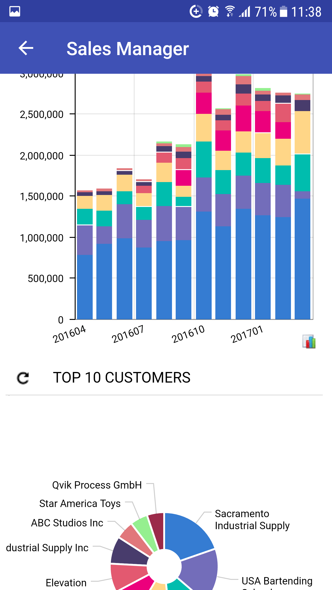

# Mapping Dashboards {#_4fccbb78-66c6-43f0-99f9-d345dc642a2a .concept}

You can add a dashboard to the mobile site map. To do this, you have to add to the mobile site map the sm:Screen tag with the Id attribute set to the dashboard’s form ID and the Type attribute set to *Dashboard*. The following example provides mapping of three dashboard screens for the mobile app.

```
...
<sm:Folder DisplayName="Dashboards" Icon="system://Folder" Type="ListFolder">
  <sm:Screen DisplayName="Controller" Icon="system://Graph1" Id="DH000025" Type="Dashboard" />
  <sm:Screen DisplayName="Financial" Icon="system://Graph1" Id="DH000045" Type="Dashboard" />
  <sm:Screen DisplayName="Sales Manager" Icon="system://Graph1" Id="DH000005" Type="Dashboard" />
</sm:Folder>
...
```

A screen of the *Dashboard* type can display the following types of dashboard widgets:

-   Chart
-   Data Table
-   Score Card
-   Trend Card

Widgets of other types will be hidden.

If you click a dashboard widget, the mobile app tries to open the appropriate screen. If the screen is absent in the mobile site map, the mobile app displays a warning.

The following screenshot displays a screen for the Sales Manager dashboard page that is defined in an instance of Acumatica ERP.



**Parent topic:**[Screens](../StudioDeveloperGuide/MOBILE_Screens.md)

