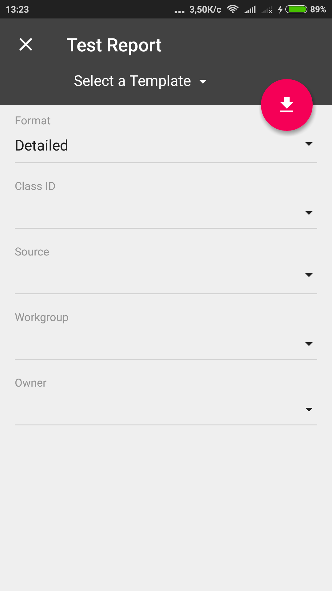
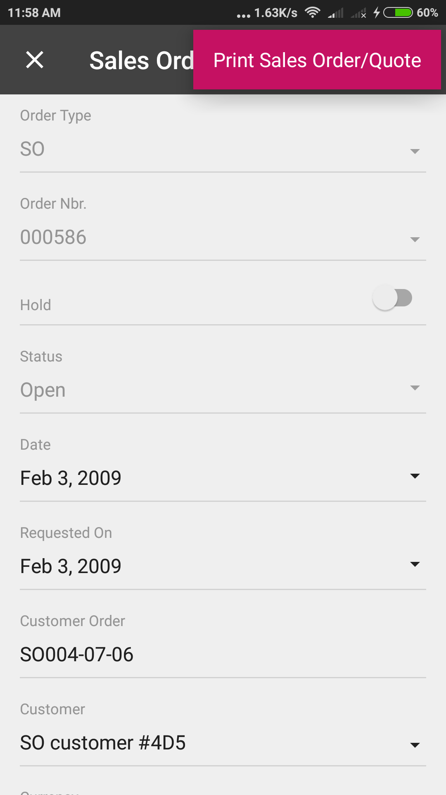
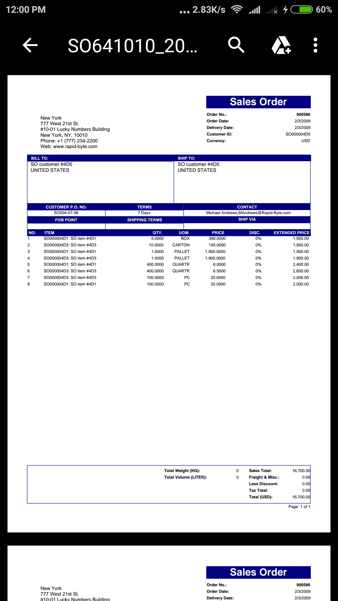

# Mapping Reports {#_ad60cae3-691f-4c19-a17b-e7586bc59f73 .concept}

The user can create and view an Acumatica Report Designer report through the mobile app, if the following conditions are met:

-   The report form is implemented in Acumatica ERP.
-   The report form metadata is added to the mobile site map.
-   The user is granted the access rights to the report.

To map a report form, you have to add to the mobile site map the sm:Screen tag with the Id attribute set to the report form ID and the Type attribute set to *Report*. The following example provides mapping of the Shipment Summary report \(SO620500\).

```
...
<sm:Screen DisplayName="Shipment Summary" Icon="system://Credit" Id="SO620500" Type="Report"/>
...
```

**Note:** In the mobile site map, you cannot define the content of a report form, for example, to change the set of parameters or the form layout. The *Report* type of the screen forces the system to map the screen as is without changes. Therefore, within the sm:Screen tag with the Type attribute set to *Report*, a nested tag is ignored.

The following screenshot displays a screen of the *Report* type with the DisplayName attribute set to *Test Report*.



On the screenshot, the red button corresponds to the **Run Report** button of the report in Acumatica ERP.

In the main menu of the mobile app, to organize report screens, you can create a special folder of the *ListFolder* type and include in the folder the links to multiple reports, as in the following example.

```
...
<sm:Folder DisplayName="Reports" Icon="system://Folder" Type="ListFolder">
    <sm:Screen DisplayName="Test Report" Icon="system://Clock" Id="CR621010" Type="Report"/>
    <sm:Screen DisplayName="Sales Order Summary" Icon="system://Cash" Id="SO610500" Type="Report"/>
    <sm:Screen DisplayName="Shipment Summary" Icon="system://Credit" Id="SO620500" Type="Report"/>
</sm:Folder>
...
```

## Using an Action to Generate a Report { .section}

The system supports the Acumatica ERP actions that generate reports. To enable such action for a business entity in the mobile app, you should map the action, for example, in the entry form for the entity. In the mobile site map, the sm:Action tag has to contain the Redirect attribute set to *true*, as in the following example.

```
...
<sm:Screen DisplayName="Sales Orders">
...
  <sm:Container Name="OrderSummary">
...
    <sm:Action Behavior="Record" Context="Record" Name="PrintSalesOrderQuoteReport" Redirect="true"/>
...
  </sm:Container>
...
</sm:Screen>
```



**Note:** For a report action, the appropriate report form must be mapped because the action uses this form to create the report.

Once the action is performed by using the mobile app, the app immediately receives the corresponding report in PDF format from the Acumatica ERP server and displays the report for the user, as shown in the following screenshot.



**Parent topic:**[Screens](../StudioDeveloperGuide/MOBILE_Screens.md)

