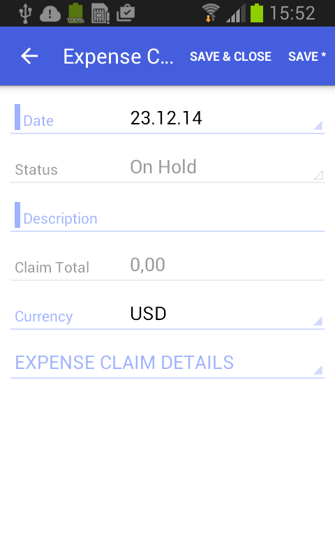
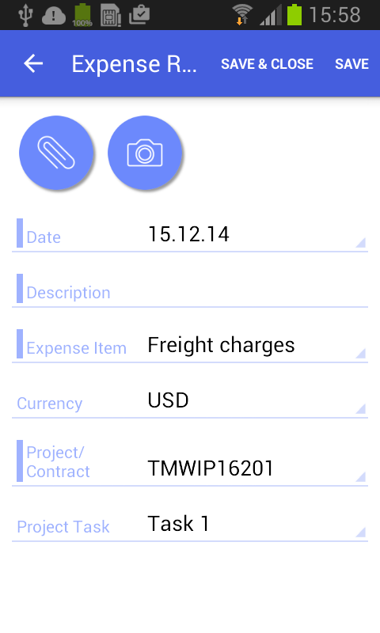
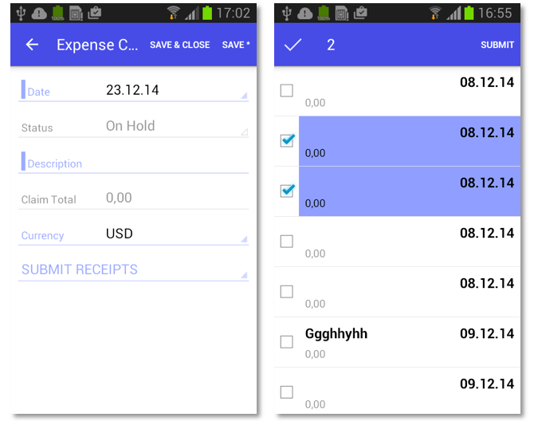
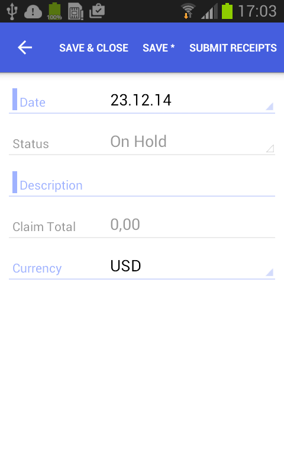

# Configuring Nested Containers {#_4175ff17-adda-4c68-a86d-34b40a125d7c .concept}

This topic describes how to configure the types of related containers on the same screen.

## Example: Configuring a Screen with One-to-Many \(Master-Detail\) Containers {#MasterDetail .section}

With one-to-many containers, one container declared inside the sm:Screen tag is considered the master container, while all other containers are considered detail containers.

To see an example of configuring one-to-many containers, copy the code below to an `.xml` file, put the file in the `\App_Data\Mobile` folder of the Acumatica ERP website, and start the mobile application.

```
<?xml version="1.0" encoding="UTF-8"?>
<sm:SiteMap xmlns:sm="http://acumatica.com/mobilesitemap" xmlns:xsi="http://www.w3.org/2001/XMLSchema-instance">

    <sm:Folder DisplayName="Expense Claims" Type="HubFolder" Icon="system://Folder" IsDefaultFavorite="true">
        <sm:Screen Id="EP301030" Type="FilterListScreen" DisplayName="Expense Claims" Visible="true" >

            <sm:Container Name="Selection">
                <sm:Field Name="Employee"/>
            </sm:Container>

            <sm:Container Name="Claim" >
                <sm:Field Name="Date" />
                <sm:Field Name="Status" />
                <sm:Field Name="Description" />
                <sm:Field Name="ClaimTotal" />

                <sm:Action Name="CreateNew" Context="Container" Behavior="Create" Redirect="true" Icon="system://Plus" />
                <sm:Action Name="EditDetail" Context="Container" Behavior="Open" Redirect="true" />
            </sm:Container>
        </sm:Screen>
    </sm:Folder>
    <sm:Screen Id="EP301000" Type="SimpleScreen" DisplayName="Expense Claim" Visible="false" OpenAs="Form">

        <sm:Container Name="DocumentSummary" >
            <sm:Attachments Disabled="true"/>

            <sm:Field Name="Date" />
            <sm:Field Name="Status" />
            <sm:Field Name="Description" />
            <sm:Field Name="ClaimTotal" />
            <sm:Field Name="Currency" />

            <sm:Action Name="Save" Context="Record" Behavior="Save" />
            <sm:Action Name="Cancel" Context="Record" Behavior="Cancel" />
        </sm:Container>

        <sm:Container Name="ExpenseClaimDetails" >
            <sm:Attachments Disabled="true"/>
            <sm:Field Name="Date" ListPrioruty="99" FormPriority="99" />
            <sm:Field Name="Description" FormPriority="98" />
            <sm:Field Name="ExpenseItem" FormPriority="97"/>
            <sm:Field Name="Currency" FormPriority="95"/>

            <sm:Field Name="TotalAmount" ListPriority="96" FormPriority="94" />
            <sm:Field Name="ProjectContract" Container="ReceiptClassification" FormPriority="93" />
            <sm:Field Name="ProjectTask" Container="ReceiptClassification" FormPriority="92" />

            <sm:Action Name="Insert" Context="Container" Behavior="Create" Icon="system://Plus"/>
            <sm:Action Name="Delete" Context="Selection" Behavior="Delete" />
            <sm:Action Name="Save" Context="Record" Behavior="Save" />
            <sm:Action Name="Cancel" Context="Record" Behavior="Cancel" />
        </sm:Container>

    </sm:Screen>
</sm:SiteMap>
```

All declared detail containers are displayed on a screen below the screen fields in the order of their declaration.

To add, update, and delete data records in a detail container, you use the `Behavior="Create"`, `Behavior="Open"` and `Behavior="Delete"` actions, as you do on the master screen.

The screenshot below shows the resulting screen in the mobile application.



## Example: Configuring a Screen with Many-as-One Containers {#OneToOne .section}

Some screens include multiple containers that are displayed as one container.

The screen in this example includes the ReceiptDetails and ReceiptClassification containers, which have a many-as-one relationship. You do not declare both containers; instead, you use the Container attribute of the sm:Field tag to display fields from the ReceiptClassification container.

To configure these containers, copy the code below to an `.xml` file, put the file in the `\App_Data\Mobile` folder of the Acumatica ERP website, and start the mobile application.

```
<?xml version="1.0" encoding="UTF-8"?>
<sm:SiteMap xmlns:sm="http://acumatica.com/mobilesitemap" xmlns:xsi="http://www.w3.org/2001/XMLSchema-instance">

    <sm:Folder DisplayName="Expense Receipts" Type="HubFolder" Icon="system://NewsPaper" >
        <sm:Screen Id="EP301010" Type="SimpleScreen" DisplayName="Expense Receipts" >
            <sm:Container Name="ExpenseReceipts" >
                <sm:Field Name="Date" />
                <sm:Field Name="ClaimAmount" />
                <sm:Field Name="DescriptionTranDesc" />
                <sm:Field Name="Currency" />

                <sm:Action Name="addNew" Context="Container" Behavior="Create" Redirect="true" Icon="system://Plus" />
                <sm:Action Name="editDetail" Context="Container" Behavior="Open" Redirect="true" />
                <sm:Action Name="Delete" Context="Selection" Behavior="Delete" Icon="system://Trash" />
            </sm:Container>
        </sm:Screen>
    </sm:Folder>

    <sm:Screen Id="EP301020" Type="SimpleScreen" Icon="system://Display1" DisplayName="Expense Receipt" Visible="false" OpenAs="Form">
        <sm:Container Name="ReceiptDetails" >

            <sm:Field Name="Date" />
            <sm:Field Name="Description" />
            <sm:Field Name="ExpenseItem" />
            <sm:Field Name="Currency" />

            <sm:Field Name="ProjectContract" Container="ReceiptClassification" />
            <sm:Field Name="ProjectTask" Container="ReceiptClassification" />

            <sm:Action Name="Save" Context="Record" Behavior="Save" />
            <sm:Action Name="Cancel" Context="Record" Behavior="Cancel" />
        </sm:Container>
    </sm:Screen>
</sm:SiteMap>
```

The following screenshot shows the resulting screen in the mobile application.



## Example: Configuring a Screen with Many-to-One \(Master-Detail\) Containers with Multi-Selection {#Multi .section}

Acumatica ERP includes a special type of container that supports multi-selection—selection of multiple items or options.

To see an example of configuring a container with multi-selection, copy the code below to an `.xml` file, put the file in the `\App_Data\Mobile` folder of the Acumatica ERP website, and start the mobile application.

```
<?xml version="1.0" encoding="UTF-8"?>
<sm:SiteMap xmlns:sm="http://acumatica.com/mobilesitemap" xmlns:xsi="http://www.w3.org/2001/XMLSchema-instance">

    <sm:Folder DisplayName="Expense Claims" Type="HubFolder" Icon="system://Folder" IsDefaultFavorite="true">
        <sm:Screen Id="EP301030" Type="FilterListScreen" DisplayName="Expense Claims" Visible="true" >

            <sm:Container Name="Selection">
                <sm:Field Name="Employee"/>
            </sm:Container>

            <sm:Container Name="Claim" >
                <sm:Field Name="Date" />
                <sm:Field Name="Status" />
                <sm:Field Name="Description" />
                <sm:Field Name="ClaimTotal" />

                <sm:Action Name="CreateNew" Context="Container" Behavior="Create" Redirect="true" Icon="system://Plus" />
                <sm:Action Name="EditDetail" Context="Container" Behavior="Open" Redirect="true" />
            </sm:Container>
        </sm:Screen>
    </sm:Folder>

    <sm:Screen Id="EP301000" Type="SimpleScreen" DisplayName="Expense Claim" Visible="false" OpenAs="Form">

        <sm:Container Name="DocumentSummary" >
            <sm:Attachments Disabled="true"/>

            <sm:Field Name="Date" />
            <sm:Field Name="Status" />
            <sm:Field Name="Description" />
            <sm:Field Name="ClaimTotal" />
            <sm:Field Name="Currency" />

            <sm:Action Name="Save" Context="Record" Behavior="Save" />
            <sm:Action Name="Cancel" Context="Record" Behavior="Cancel" />
        </sm:Container>

        <sm:Container Name="SubmitReceipts" Type="SelectionActionList" >
            <sm:Field Name="Description" />
            <sm:Field Name="Date" />
            <sm:Field Name="ClaimAmount"  />
            <sm:Action Name="SubmitReceipt" Context="List" Behavior="Void" Icon="system://Plus" />
        </sm:Container>

    </sm:Screen>
</sm:SiteMap>
```

In the code, you enable multi-selection by setting the container type with `Type="SelectionActionList"` and specifying the action context with `Context="List"`.

The screenshots below show the resulting screen in the mobile application.



The left screenshot shows the content of the DocumentSummary container of the Expense Claim screen and the header of the SubmitReceipts nested container. If the user taps the header of the nested container, the mobile application displays the content of this container and provides multi-selection, as the second screenshot shows.

**Note:** The DisplayName attribute is not defined for the nested container, therefore for the container, the mobile application displays the *Submit Receipts* name that is obtained from the Mobile API server.

## Example: Configuring a Screen with a Container Link {#ContainerLink .section}

In the mobile application, a container can contain a link to another container on the action panel or on the screen among the fields. To create a container link on the action panel, use the sm:ContainerLink tag, as the following example shows.

To see an example of creating a container link on the action panel, copy the code below to an `.xml` file, put the file in the `\App_Data\Mobile` folder of the Acumatica ERP website, and start the mobile application.

```
<?xml version="1.0" encoding="UTF-8"?>
<sm:SiteMap xmlns:sm="http://acumatica.com/mobilesitemap" xmlns:xsi="http://www.w3.org/2001/XMLSchema-instance">

    <sm:Folder DisplayName="Expense Claims" Type="HubFolder" Icon="system://Folder" IsDefaultFavorite="true">
        <sm:Screen Id="EP301030" Type="FilterListScreen" DisplayName="Expense Claims" Visible="true" >

            <sm:Container Name="Selection">
                <sm:Field Name="Employee"/>
            </sm:Container>

            <sm:Container Name="Claim" >
                <sm:Field Name="Date" />
                <sm:Field Name="Status" />
                <sm:Field Name="Description" />
                <sm:Field Name="ClaimTotal" />

                <sm:Action Name="CreateNew" Context="Container" Behavior="Create" Redirect="true" Icon="system://Plus" />
                <sm:Action Name="EditDetail" Context="Container" Behavior="Open" Redirect="true" />
            </sm:Container>
        </sm:Screen>
    </sm:Folder>
    <sm:Screen Id="EP301000" Type="SimpleScreen" DisplayName="Expense Claim" Visible="false" OpenAs="Form">

        <sm:Container Name="DocumentSummary" >
            <sm:Attachments Disabled="true"/>

            <sm:Field Name="Date" />
            <sm:Field Name="Status" />
            <sm:Field Name="Description" />
            <sm:Field Name="ClaimTotal" />
            <sm:Field Name="Currency" />

            <sm:ContainerLink Container="SubmitReceipts" Control="Button"/>

            <sm:Action Name="Save" Context="Record" Behavior="Save" />
            <sm:Action Name="Cancel" Context="Record" Behavior="Cancel" />
        </sm:Container>

        <sm:Container Name="SubmitReceipts" Type="SelectionActionList" >
            <sm:Field Name="Description" />
            <sm:Field Name="Date" />
            <sm:Field Name="ClaimAmount"  />
            <sm:Action Name="SubmitReceipt" Context="List" Behavior="Void" Icon="system://Plus" />
        </sm:Container>

    </sm:Screen>
</sm:SiteMap>
```

In this code, you can open the SubmitReceipts container by using the button in the action panel \(because of the `Control="Button"` attribute of sm:ContainerLink\).

The screenshot below shows the resulting screen, which displays the container link on the action panel in the mobile application.



To locate the container link among the screen fields, you use the `Control="ListItem"` attribute instead of the `Control="Button"` one. To set the exact position of the container link among the screen fields, specify the appropriate value for the Priority attribute.

**Parent topic:**[Screens](../StudioDeveloperGuide/MOBILE_Screens.md)

