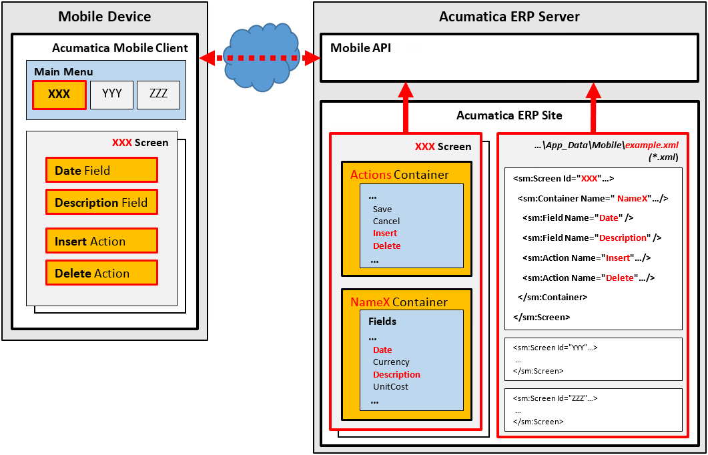

# To Add a Form to the Mobile Site Map by Using an XML File {#_c06263e7-31d5-4d82-bbb9-e57fc2ea99af .concept}

To add the metadata for an Acumatica ERP form to the mobile site map, you have to include it in a new `.xml` file in the `\App_Data\Mobile` folder of the website. If the metadata must contain multiple new `.xml.inc` files, place the files in the `\App_Data\Mobile\includes` folder of the website.

Suppose that you need to add to the mobile site map an Acumatica ERP form with the *XXX* screen ID, and you are sure that the mobile site map does not contain the XML metadata for this form. Further suppose that you have to add the Date and Description fields and the Insert and Delete actions of the original *XXX* screen of Acumatica ERP to the screen on the mobile device, as the following diagram shows.



The diagram shows how Acumatica Mobile Framework uses the metadata of the `example.xml` file to configure the *XXX* screen in the mobile app. \(See [Configuring the Mobile Site Map by Using XML \(deprecated\)](MOBILE_UIStructure.md) for details.\)

To create the metadata for the form, perform the following actions:

1.  In the `\App_Data\Mobile` folder, create the `example.xml` file, which contains the XML header and the sm:SiteMap tag, as follows.

    ```
    <?xml version="1.0" encoding="UTF-8"?>
    <sm:SiteMap xmlns:sm="http://acumatica.com/mobilesitemap" xmlns:xsi="http://www.w3.org/2001/XMLSchema-instance">
    
    </sm:SiteMap>
    ```

    **Note:** See [Mobile Site Map Reference](MOBILE_Reference.md) for detailed descriptions of all tags used in the mobile site map.

2.  Get the WSDL schema for the original *XXX* screen of Acumatica ERP, as described in [Getting the WSDL Schema](MOBILE_BasicInfo.md).
3.  Add the sm:Screen tag to the sm:SiteMap tag, as described in [Configuring Lists](MOBILE_ConfiguringLists.md).
4.  In the WSDL schema, find the Insert and Delete actions and make sure that these actions belong to the *Action* container.
5.  In the WSDL schema, find the Date and Description fields and make sure that these fields belong to the *NameX* container.
6.  Add the sm:Container tag to the sm:Screen tag, assigning it the *NameX* name to map the *NameX* container of the original *XXX* screen of Acumatica ERP to the *XXX* screen in the mobile app \(see the figure above\).
7.  For each required field, add an sm:Field tag with the original name to the container tag to map the field to the *XXX* screen in the mobile app.
8.  For each required action, add an sm:Action tag with the original name to the container tag to map the action to the *XXX* screen in the mobile app.

**Note:** Once you have changed the mobile site map, you can include the added `.xml` and `.xml.inc` files in a customization project as *File* items to deploy the customization on the target system. For details, see [Custom Files](../CustomizationPlatform/CG_GL_Items_Files.md) in the Customization Guide.

**Parent topic:**[Configuring the Mobile Site Map by Using XML \(deprecated\)](../StudioDeveloperGuide/MOBILE_UIStructure.md)

