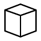
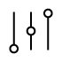
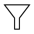
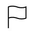
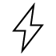
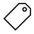

# Icons {#_892583da-6edd-4bba-b22a-9a1fd1e7b613 .concept}

In the mobile site map, you can use the Icon attribute to set the icon that is displayed on the UI for the following MSDL objects:

-   containerAction
-   listAction
-   recordAction
-   selectionAction
-   folder
-   item

To specify an icon for an MSDL object, use the following format of the attribute value: `system://IconName`, where the `IconName` is one of the following values.

|Icon Name|Description|
|---------|-----------|
|*Alarm*||
|*Albums*||
|*AngleDownCircle*||
|*AngleLeftCircle*||
|*AngleRightCircle*||
|*AngleUpCircle*||
|*Attention*||
|*Bell*||
|*Bookmarks*||
|*BottomArrow*||
|*Box1*||
|*Box2*||
|*Browser*||
|*Calculator*||
|*Camera*||
|*Cart*||
|*Cash*||
|*Chat*||
|*Check*||
|*Clock*||
|*CloseCircle*||
|*Cloud*||
|*CloudDownload*||
|*CloudUpload*||
|*Comment*||
|*Compass*||
|*Config*||
|*CopyFile*||
|*Credit*||
|*Culture*||
|*Date*||
|*Display1*||
|*Display2*||
|*Download*||
|*Drawer*||
|*Drop*||
|*Edit*||
|*File*||
|*Filter*||
|*Flag*||
|*Folder*||
|*Gleam*||
|*Global*||
|*Graph*||
|*Graph1*||
|*Graph2*||
|*Graph3*||
|*Home*||
|*Id*||
|*Info*||
|*Key*||
|*Keypad*||
|*LeftArrow*||
|*Less*||
|*Link*||
|*Lock*||
|*Mail*||
|*MailOpen*||
|*MailOpenFile*||
|*Map*||
|*MapMarker*||
|*Menu*||
|*Monitor*||
|*More*||
|*Network*||
|*NewsPaper*||
|*Next*||
|*Note*||
|*Note2*||
|*Notebook*||
|*Paperclip*||
|*PaperPlane*||
|*Pen*||
|*Phone*||
|*PhotoGallery*||
|*Plane*||
|*Plus*||
|*Portfolio*||
|*Prev*||
|*Print*||
|*Refresh*||
|*RefreshCloud*||
|*Repeat*||
|*Request*||
|*Ribbon*||
|*RightArrow*||
|*Safe*||
|*Search*||
|*Server*||
|*Share*||
|*Shopbag*||
|*Signal*||
|*Star*||
|*Stopwatch*||
|*Target*||
|*Ticket*||
|*Timer*||
|*Trash*||
|*Umbrella*||
|*Unlock*||
|*UpArrow*||
|*Upload*||
|*User*||
|*UserFemale*||
|*UserFilter*||
|*Users*||
|*Way*||
|*World*||

**Parent topic:**[Mobile Site Map Reference](../StudioDeveloperGuide/MOBILE_Reference.md)

