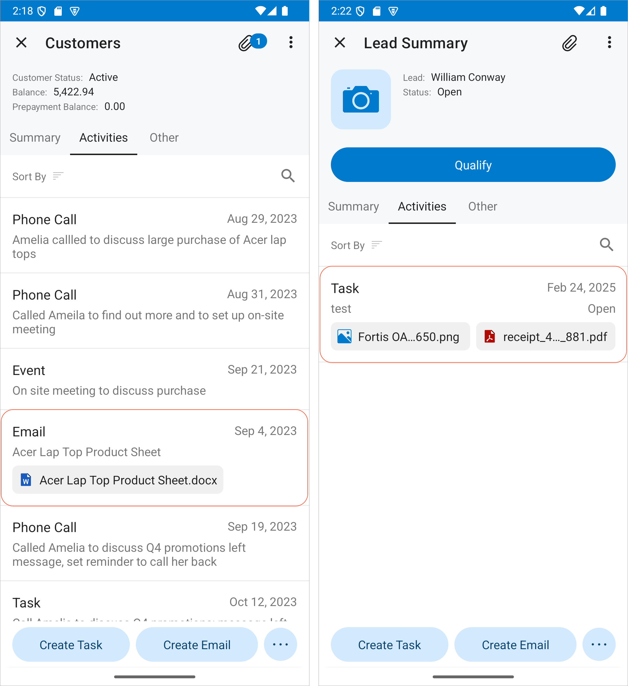

# attachments {#_25caf6fa-e86d-4923-a18e-b066e1c3f148 .concept}

In a container in the mobile site map of the Acumatica ERP instance, switches the MSDL interpreter to the mode in which the attachment attributes can be set.

**Note:** On iOS devices, it is possible to upload only image files. Files of other types are not supported.

*Syntax:*

```
attachments {}
```

The braces are mandatory. Within the braces, you can add assignment commands for the attributes of the instruction.

*Attributes*:

|Attribute|Description|
|---------|-----------|
|Disabled|An indicator of whether attachments are disabled. If its value is *true*, the attachments are disabled.|
|DisplayInListview|An indicator of whether attachements should be displayes as tiles with full names \(see screenshot below\).

|
|ImageAdjustmentPreset|The type of the image adjustment that is processed by the application for enhancing images taken from the camera of a mobile device. The only value of this attribute is *Receipt*, which is an indicator that a special camera mode is switched on in the Acumatica mobile app. In this mode, the following enhancements of the image captured by the camera are preformed automatically:-   The image is cropped based the bounding box of the receipt's detected edges.
-   The image distortion is removed.
-   The image is converted into black and white.
-   The contrast of the image is maximized.

|
|Name|The identifier of the attachments, as found in the WSDL schema.|
|MaxFileSize|The maximum size of an attached file.|
|MaxImageHeight|The maximum height of an attached image \(in pixels\).|
|MaxImageWidth|The maximum width of an attached image \(in pixels\).|

*Example:*

Suppose that you need to specify the following requirements related to attachments:

-   The attachments of an Acumatica ERP form are allowed in the container.
-   The attachments can contain files that have the `JPG` or `PNG` extension.
-   Image adjustment is not used for an attached file.

You can add the following code within the instruction for the appropriate container.

```
 any instruction for the container {
 ...
  attachments {
    disabled = false
    add type "jpg"
    add type "png"
    imageAdjustmentPreset = Receipt
  }
}
```

**Parent topic:**[Instructions](../StudioDeveloperGuide/MOBILE_Ref_MSDL_Instructions.md)

