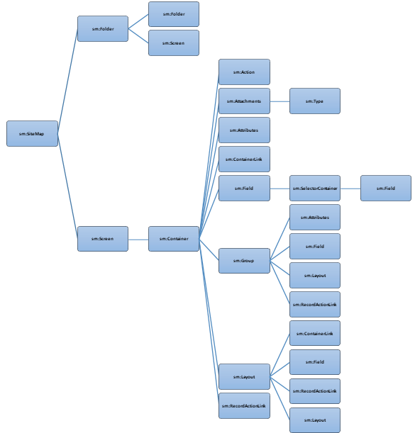

# XML Tags {#_c329935f-2792-42c1-a3bb-2e077f4a0a80 .concept}

**Note:** XML tags for customizing the Mobile Site Map is deprecated since Acumatica 2026 R1. Use [MSDL](MOBILE_Ref_MSDL.md) instead.

The figure below shows the relationships between tag types in the mobile site map. In the figure, each line connecting a left tag type and a right tag type indicates that the left tag may contain any number of right tags. The exception to this rule is the sm:Container tag, which may include only a single sm:Attachments tag.

The sm:Include tag can be located in any place of another tag.

## In This Section { .section}

-   [&lt;sm:Action&gt;](MOBILE_sm_Action.md#)
-   [&lt;sm:Attachments&gt;](MOBILE_sm_Attachments.md#)
-   [&lt;sm:Attributes&gt;](MOBILE_sm_Attributes.md#)
-   [&lt;sm:Container&gt;](MOBILE_sm_Container.md#)
-   [&lt;sm:ContainerLink&gt;](MOBILE_sm_ContainerLink.md#)
-   [&lt;sm:Field&gt;](MOBILE_sm_Field.md#)
-   [&lt;sm:Folder&gt;](MOBILE_sm_Folder.md#)
-   [&lt;sm:Group&gt;](MOBILE_sm_Group.md#)
-   [&lt;sm:Include&gt;](MOBILE_sm_Include.md)
-   [&lt;sm:Layout&gt;](MOBILE_sm_Layout.md)
-   [&lt;sm:RecordActionLink&gt;](MOBILE_sm_RecordActionLink.md)
-   [&lt;sm:Screen&gt;](MOBILE_sm_Screen.md#)
-   [&lt;sm:SelectorContainer&gt;](MOBILE_sm_SelectorContainer.md#)
-   [&lt;sm:Type&gt;](MOBILE_sm_Type.md#)

-   **[&lt;sm:Action&gt;](../StudioDeveloperGuide/MOBILE_sm_Action.md)**  

-   **[&lt;sm:Attachments&gt;](../StudioDeveloperGuide/MOBILE_sm_Attachments.md)**  

-   **[&lt;sm:Attributes&gt;](../StudioDeveloperGuide/MOBILE_sm_Attributes.md)**  

-   **[&lt;sm:Container&gt;](../StudioDeveloperGuide/MOBILE_sm_Container.md)**  

-   **[&lt;sm:ContainerLink&gt;](../StudioDeveloperGuide/MOBILE_sm_ContainerLink.md)**  

-   **[&lt;sm:Field&gt;](../StudioDeveloperGuide/MOBILE_sm_Field.md)**  

-   **[&lt;sm:Folder&gt;](../StudioDeveloperGuide/MOBILE_sm_Folder.md)**  

-   **[&lt;sm:Group&gt;](../StudioDeveloperGuide/MOBILE_sm_Group.md)**  

-   **[&lt;sm:Include&gt;](../StudioDeveloperGuide/MOBILE_sm_Include.md)**  

-   **[&lt;sm:Layout&gt;](../StudioDeveloperGuide/MOBILE_sm_Layout.md)**  

-   **[&lt;sm:RecordActionLink&gt;](../StudioDeveloperGuide/MOBILE_sm_RecordActionLink.md)**  

-   **[&lt;sm:Screen&gt;](../StudioDeveloperGuide/MOBILE_sm_Screen.md)**  

-   **[&lt;sm:SelectorContainer&gt;](../StudioDeveloperGuide/MOBILE_sm_SelectorContainer.md)**  

-   **[&lt;sm:Type&gt;](../StudioDeveloperGuide/MOBILE_sm_Type.md)**  

**Parent topic:**[Mobile Site Map Reference](../StudioDeveloperGuide/MOBILE_Reference.md)

