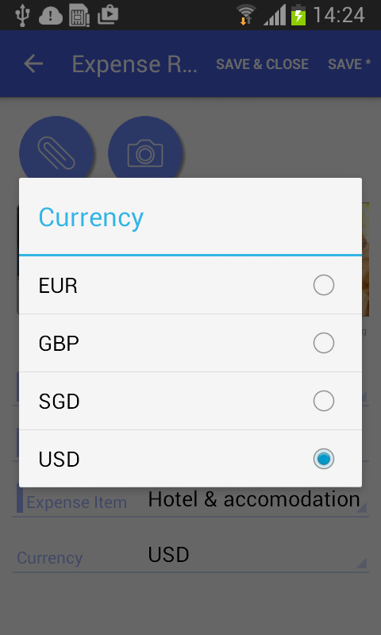
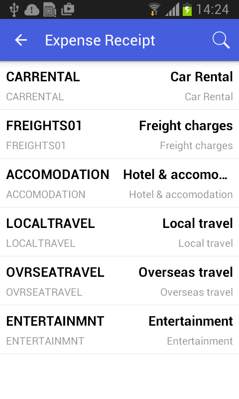

# Configuring Selectors {#_63e43f6d-7379-43df-9d76-4392bd15dfab .concept}

You can configure selector fields to be displayed as pop-up windows or grids.

## Example: Configuring a Screen with Selectors { .section}

To see an example of configuring a selector field, copy the code below to an `.xml` file, put the file in the `\App_Data\Mobile` folder of the Acumatica ERP website, and start the mobile application.

```
<?xml version="1.0" encoding="UTF-8"?>
<sm:SiteMap xmlns:sm="http://acumatica.com/mobilesitemap" xmlns:xsi="http://www.w3.org/2001/XMLSchema-instance">

    <sm:Folder DisplayName="Expense Receipts" Type="HubFolder" Icon="system://NewsPaper" >
        <sm:Screen Id="EP301010" Type="SimpleScreen" DisplayName="Expense Receipts" >
            <sm:Container Name="ExpenseReceipts" >
                <sm:Field Name="Date" />
                <sm:Field Name="ClaimAmount" />
                <sm:Field Name="DescriptionTranDesc" />
                <sm:Field Name="Currency" />

                <sm:Action Name="addNew" Context="Container" Behavior="Create" Redirect="true" Icon="system://Plus" />
                <sm:Action Name="editDetail" Context="Container" Behavior="Open" Redirect="true" />
                <sm:Action Name="Delete" Context="Selection" Behavior="Delete" Icon="system://Trash" />
            </sm:Container>
        </sm:Screen>
    </sm:Folder>

    <sm:Screen Id="EP301020" Type="SimpleScreen" Icon="system://Display1" DisplayName="Expense Receipt" Visible="false" OpenAs="Form">
        <sm:Container Name="ReceiptDetails" >

            <sm:Field Name="Date" />
            <sm:Field Name="Description" />

            <sm:Field Name="ExpenseItem" >
                <sm:SelectorContainer FieldsToShow="2" PickerType="Detached">
                    <sm:Field Name="InventoryID" />
                    <sm:Field Name="Description" />
                </sm:SelectorContainer>
            </sm:Field>

            <sm:Field Name="Currency" >
                <sm:SelectorContainer PickerType="Attached">
                    <sm:Field Name="CurrencyID" />
                </sm:SelectorContainer>
            </sm:Field>

            <sm:Action Name="Save" Context="Record" Behavior="Save" />
            <sm:Action Name="Cancel" Context="Record" Behavior="Cancel" />
        </sm:Container>
    </sm:Screen>
</sm:SiteMap>
```

To configure a selector field, you use the sm:SelectorContainer tag inside the sm:Field tag. The PickerType attribute specifies which of the two ways the selector should be displayed.

A selector with `PickerType="Attached"` is displayed as a pop-up window \(see the screenshot below\).



A selector with `PickerType="Detached"` is displayed as a grid \(as shown in the screenshot below\). You can configure the fields to display by adding nested sm:Field tags.



**Parent topic:**[Screens](../StudioDeveloperGuide/MOBILE_Screens.md)

