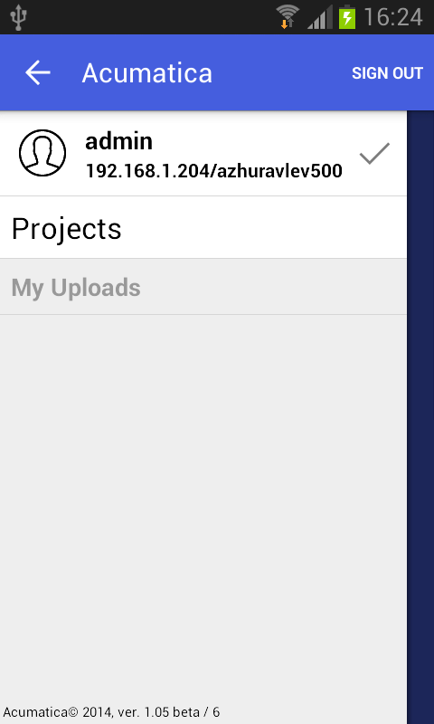

# Sidebar Menu {#_4357519f-bf25-40a7-9f71-a9223031367a .concept}

The mobile application has a *sidebar menu*, which is the shortcut menu for favorite folders and screens. You can insert links to folders and screens into the sidebar menu.

## Example: Adding a Screen to the Sidebar Menu { .section}

To add a folder or screen to the sidebar menu, you need to set the IsDefaultFavorite attribute of the folder or screen to *true*.

Copy the code below to an `.xml` file, put the file in the `\App_Data\Mobile` folder of the Acumatica ERP website, and start the mobile application.

```
<?xml version="1.0" encoding="UTF-8"?>
<sm:SiteMap xmlns:sm="http://acumatica.com/mobilesitemap" xmlns:xsi="http://www.w3.org/2001/XMLSchema-instance">

    <sm:Folder DisplayName="Organization" Icon="system://NewsPaper" >

        <sm:Screen Id="PM301000" Type="SimpleScreen" DisplayName="Projects" Icon="system://Display1" IsDefaultFavorite="true">
            <sm:Container Name="ProjectSummary">
                <sm:Field Name="Status" />
                <sm:Field Name="ProjectID" />
                <sm:Field Name="Customer" />
                <sm:Field Name="TemplateID" />
                <sm:Field Name="Hold" />
                <sm:Field Name="Description" />
            </sm:Container>
        </sm:Screen>

    </sm:Folder>

</sm:SiteMap>
```

The resulting sidebar menu of the mobile application will include a link for quick access to the Projects screen.



**Parent topic:**[Configuring the Mobile Site Map by Using XML \(deprecated\)](../StudioDeveloperGuide/MOBILE_UIStructure.md)

