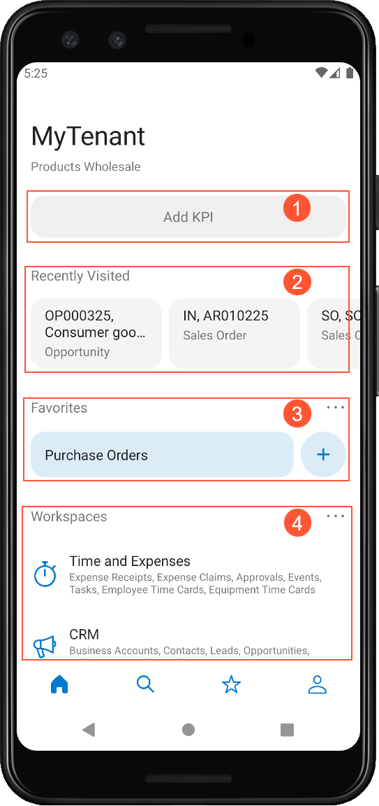
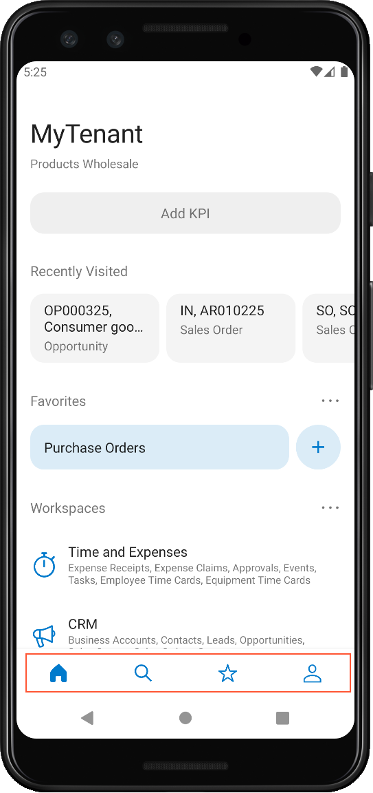

# To Start Acumatica ERP on a Mobile Device {#_7950e5dd-d413-48e4-896c-34e2095a3317 .concept}

The Acumatica mobile app provides access to the functionality of Acumatica ERP, such as approving documents, managing time cards, processing sales orders, and handling expense receipts and claims.

The Acumatica mobile app is an out-of-the-box solution that gives users the ability to access Acumatica ERP from mobile devices so that they can enter and manage their work documents. This application provides the user interface to access the data and functionality of Acumatica ERP by using the predefined original mobile site map.

To start using Acumatica ERP on a mobile device, perform the following actions:

1.  Download the free Acumatica mobile app from Apple Store or Google Play, and install it on the mobile device.
2.  Launch the app.
3.  Enter the URL and optional name of your Acumatica site \(for example, *https://your.acumatica.site.com*\), and tap **Next**.

    **Note:** If both the Acumatica ERP server and the mobile device use the same local wireless network, you can specify the URL in one of the following ways:

    -   *http://&lt;Computer Name&gt;/&lt;Website Name&gt;*, such as *http://MyComputer/MySite*
    -   *http://&lt;IP Address&gt;/&lt;Website Name&gt;*, such as *http://111.222.3.44/MySite*
4.  Enter the credentials of your user account.
5.  Tap **Sign In** to enter the site.

The app connects to the Acumatica ERP server, and the server authorizes the user and returns the metadata to render the Home screen of the mobile app.

The following screenshot shows the Home screen of the mobile app. The screen contains a placeholder for adding KPI widgets \(see Item 1 in the screenshot\), the list of recently visited screens and records \(Item 2\), the list of screens and records marked as favorites \(Item 3\), and the tiles with the workspaces \(Item 4\).

At the bottom of the Home screen, there is a navigation bar highlighted in the following screenshot. The navigation bar contains access to the following:

-   The Home screen of the app
-   Search in the documents and mapped screens
-   The list of favorite workspaces and screens
-   Settings of the app where you can sign out of the instance

