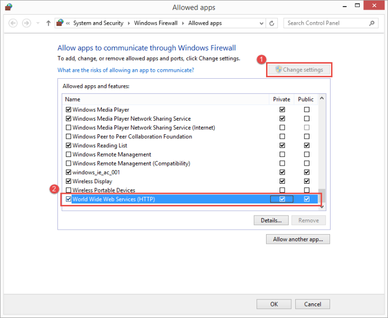
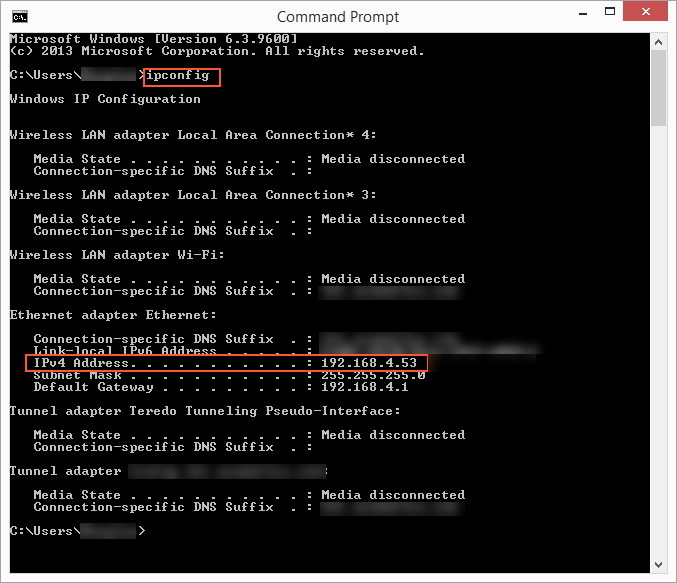

# To Access an Acumatica ERP Instance Running Locally from the Acumatica Mobile App {#_778d796d-04e1-4f80-a942-2256764e4174 .concept}

When you are trying to access an Acumatica ERP instance that is running on a computer in your local network from the Acumatica mobile app, you may encounter some connection issues that prevent you from accessing this instance. The following sections describe the actions that can help you to resolve such issues.

## Check the Network Connection and Firewall Settings { .section}

You must make sure that the mobile device that is running the Acumatica mobile app is connected to the same WiFi network as the computer with the Acumatica ERP instance installed. Once you have confirmed that this is the case, you should check the firewall settings on the computer to ensure that it can accept inbound connections from other devices over this network. Do the following:

1.  On the computer, run the *Allow an app through Windows Firewall* program. You can find the program by opening the **Start** menu and typing the name of the program in the search box.
2.  Click the **Change settings** button.
3.  In the **Allowed apps and features** table, find the *World Wide Web Services \(HTTP\)* row. In this row, make sure that the check box left of its name is selected.

    Also, if the local network that you are connected to is a private network, you should select the check box in the **Private** column. If it is a public network, you should select the check box in the **Public** column. If you are unsure about the type of the network to which you are connected, you should select both check boxes. The following screenshot shows an example.

    

4.  Click **OK** to save your changes.

**Note:** For security reasons, you should revert the changes you have made to the firewall settings after you no longer need to access your Acumatica ERP instance from another device on your local network.

## Check the Connection URL { .section}

To access the Acumatica ERP instance that is installed on the computer from the Acumatica mobile app, you need to know the IP address of this computer. Do the following:

1.  Run the Command Prompt program on the computer. You can find the program by opening the **Start** menu and typing the name of the program in the search box.
2.  Once the program launches, type `ipconfig`, and press *Enter* on your keyboard. The program displays the Windows IP configuration, as shown in the following screenshot.

    

    To construct the connection URL, you should follow this pattern: *http://&lt;IP Address&gt;/&lt;Website Name&gt;*. Suppose that the name of your Acumatica ERP instance is *MyAcumatica* and the IP address of the computer that is running this instance is the same as the one highlighted in the previous screenshot. In this case, your connection URL will be *http://192.168.4.53/MyAcumatica*.

3.  In the mobile app, enter the URL that you have constructed based on the instance name and your own computer's IP address, and tap **Next**.
4.  Enter the credentials of your user account.
5.  Tap **Sign In** to enter the site.

**Parent topic:**[Troubleshooting Tips](../StudioDeveloperGuide/MOBILE_Troubleshooting.md)

