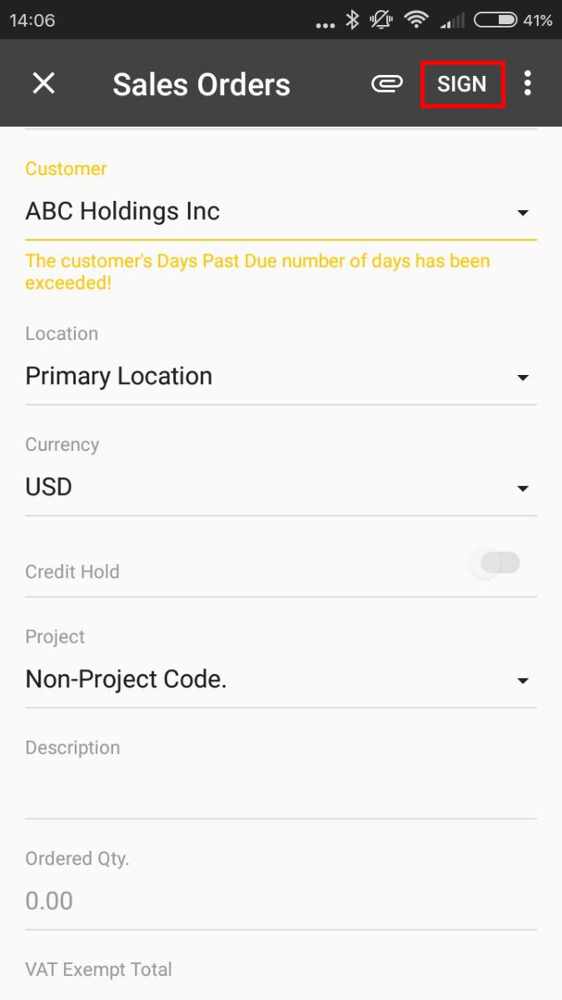
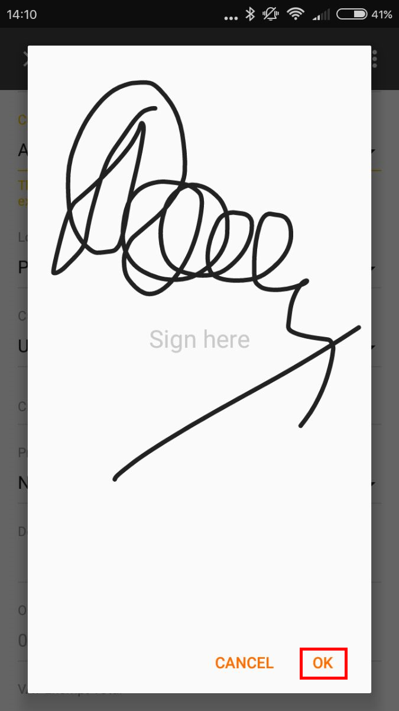
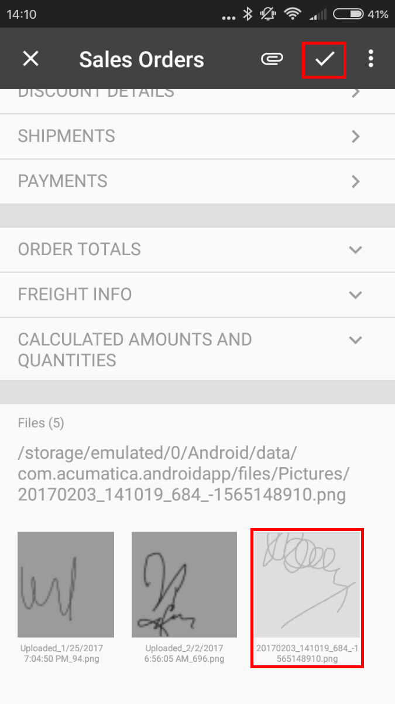
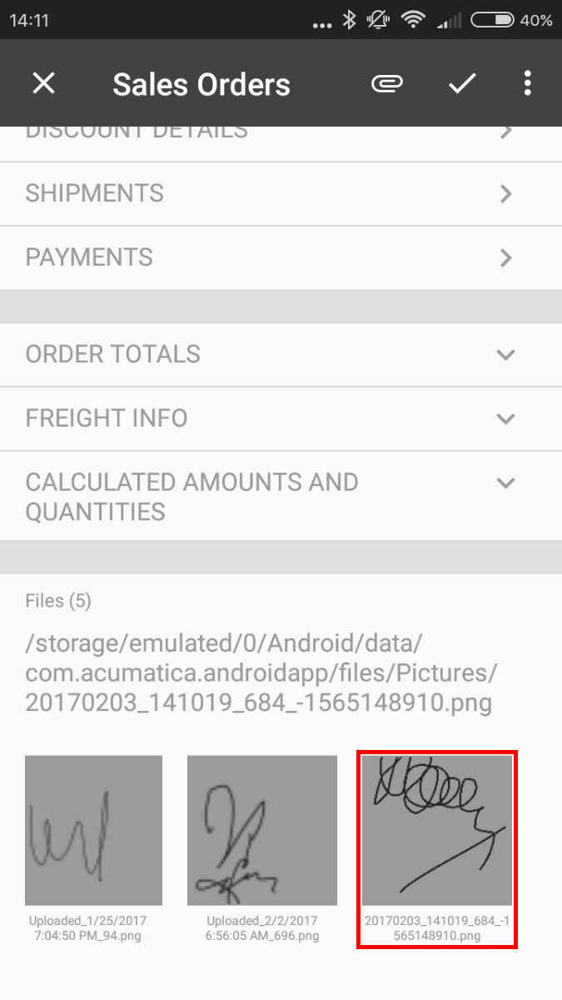

# Creating the User Signature {#_ef1e53fe-0b91-4e6d-9ea8-3a61ea872b39 .concept}

The mobile app provides an additional functionality to create the user signature and attach the signature image file to an Acumatica ERP form that supports file attachments.

**Note:** This functionality does not work in the [&lt;sm:Container&gt;](MOBILE_sm_Container.md) tag that contains the [&lt;sm:Attachments&gt;](MOBILE_sm_Attachments.md) tag with the Disabled attribute set to *true*.

To add this functionality to the mobile site map, you should add the [&lt;sm:Action&gt;](MOBILE_sm_Action.md) tag with the Behavior attribute set to *SignReport* to a container of a screen that is mapped to a form, which supports attachments. In the action tag, you should also specify the Name and Context attributes as shown in the following example.

```
...
<sm:Action Behavior="SignReport" Context="Record" DisplayName="Sign" Name="SignReport"/>
...
```

As a result, the **SIGN** action will appear on the appropriate screen of the mobile app, as the following screenshot shows.



When the user clicks this action, the application displays a blank form with the **Cancel** and **OK** buttons and suggests the user to add the signature, as shown in the following screenshot.



After the user signs the form and clicks **OK**, an attachment with the signature adds to the screen in the mobile app \(see the following screenshot\). To save the signature file in the database, the user should click the Save button.



After the user clicks Save on the screen toolbar, the mobile app sends the signature file to the Acumatica ERP server that saves the file in the database as a file attached to the appropriate form. In the mobile application, the attachment is displayed as an image that is attached to the Acumatica ERP form.



**Parent topic:**[Screens](../StudioDeveloperGuide/MOBILE_Screens.md)

