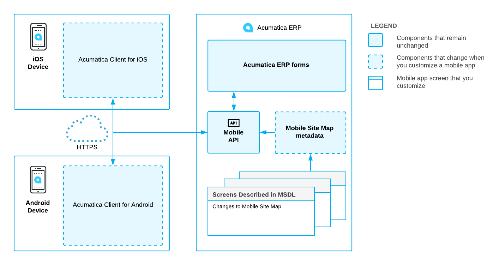

# Working with the Mobile Framework {#_5dacbf34-ac82-41b4-b498-839c173f587c .concept}

By using Acumatica Mobile Framework, you can access and use Acumatica ERP through a mobile device wherever you are.

Acumatica Mobile Framework is a modern web development platform that provides the following key features:

-   **Real-time access:** The Acumatica mobile app connects to your Acumatica ERP instance in real time, so users always have access to up-to-date information.
-   **Developer-selected functionality:** Any Acumatica ERP functionality can be exposed on a mobile device.
-   **Mobile device integration:** The Acumatica mobile app uses the unique capabilities of the applicable mobile device, such as the camera or fingerprint reader.
-   **Ease of customization:** The framework gives you the ability to configure the mobile app by using metadata without coding. You do not need to learn how to program for iOS or Android.

The framework contains the following components \(see the diagram below\):

-   The native mobile client application that Acumatica provides for iOS devices
-   The native mobile client application that Acumatica provides for Android devices
-   The Mobile API, which is a part of the Acumatica Framework API

An Acumatica mobile client application uses the Mobile API to access the data of the forms that are mapped for mobile apps in the Acumatica ERP instance. The metadata of the mobile site map is used to configure the user interface of the mobile client application. You can expose any form of Acumatica ERP on your mobile device if the mobile site map includes the metadata for the form.

**Note:** The Acumatica mobile app is like a browser for an instance of Acumatica ERP in that it does not have built-in ERP-related functionality. The Acumatica mobile app instead uses the configuration and data in Acumatica ERP and displays it to the user.

This part of the guide describes how to configure the Acumatica ERP mobile site map. The part is intended for application developers who are learning how to customize Acumatica ERP or other Acumatica Framework–based applications.

