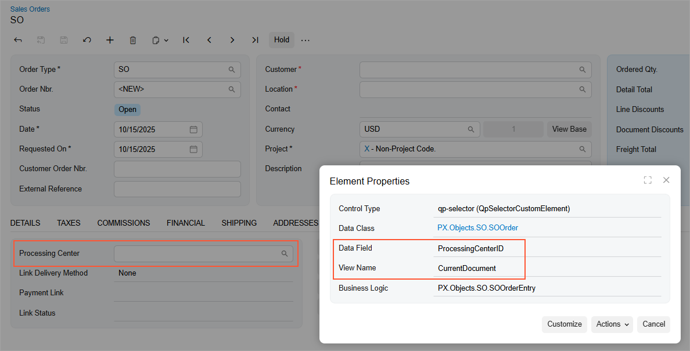

# To Map a Screen in the Modern UI {#_f38ca323-21f4-4e7b-94fa-af9eef079417 .concept}

## To Convert Screen Mapping Written for the Classic UI { .section}

All screens that were originally mapped with the Classic UI version should be displayed in the Acumatica mobile app without any changes in the mapping.

For the forms that have both the Classic UI and the Modern UI version, the MSDL mapping is based on the Classic UI version, that is, the ASPX file. If you want to map a new field that was added only in the Modern UI, you should also add it in the ASPX file for the object to be displayed in the mobile app.

## To Map a Screen That Exists Only in the Modern UI { .section}

You can map a screen that is defined only in the Modern UI and does not have any ASPX file for the Classic UI. You can use the same approach as for the Classic UI, meaning mapping objects and adding instructions. To determine the object name for mapping, you can use one of the sources:

-   Container and field names from the Element Inspector: In the Modern UI, you can safely use the Element Inspector to determine the container name and field name for mapping.

    The container name corresponds to the **View Name** value in the **Element Properties** dialog box.

    The field name corresponds to the **Data Field** value in the **Element Properties** dialog box.

    Suppose that you want to map the **Processing Center** box on the Sales Orders \(SO301000\) form. To determine the container and field names, you use the Element Inspector on the **Processing Center** box, and in the **Element Properties** dialog box, use the View Name value \(`CurrentDocument`\) and **Data Field** value \(`ProcessingCenterID`\).

    

    The resulting mapping looks as follows.

    ``` {#codeblock_czl_ftb_zgc}
    add container "CurrentDocument" {
      add field "ProcessingCenterID"
    }
    ```

    **Important:** This approach is recommended if you are mapping the screen in the Modern UI.

-   Element names from WSDL schema: This approach was used in the Classic UI, but does not always work because some object names may not be correct in the WSDL schema for mapping.

**Parent topic:**[Mobile Site Map](../StudioDeveloperGuide/MOBILE_MobileSiteMap.md)

