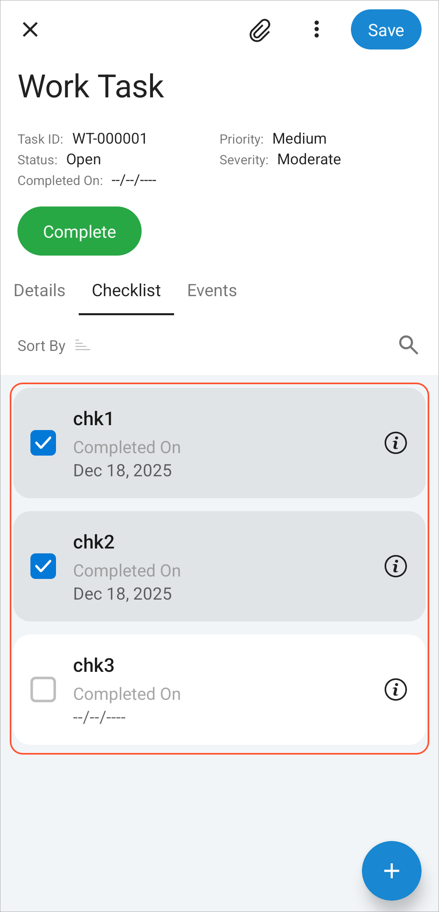

# Providing a Selection List {#_f5245c75-63af-43e9-b478-3e1b2066542b .reference}

In a list of records in the Acumatica mobile app, users can review key data for each record and act upon records, depending on how you’ve configured the list.

You can give users the ability to select individual records before performing an action on all selected records. This topic describes how to do this by using the SelectionList container type for a container that is displayed as a list of records.

To use the SelectionList container type, you specify `Type = SelectionList` for a container. When this type is specified for a container displayed as a list of records, a user can select any record individually in the resulting list. However, the user can't do the following:

-   Select all records
-   Clear all selected records

Below you can see a list of records based on this container.

**Parent topic:**[Configuring a Screen Layout](../StudioDeveloperGuide/MOBILE_MSDL_Layout.md)

