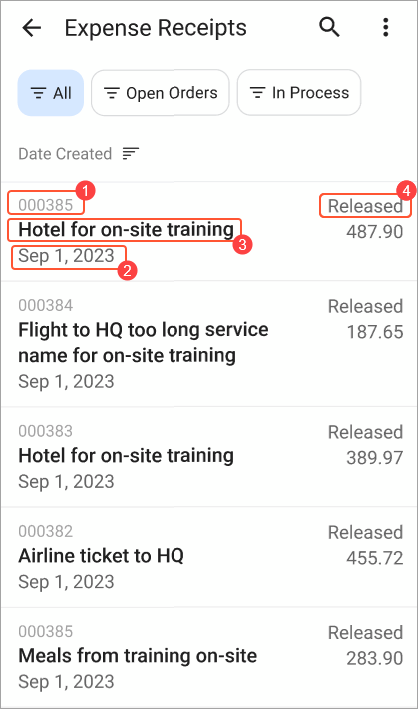
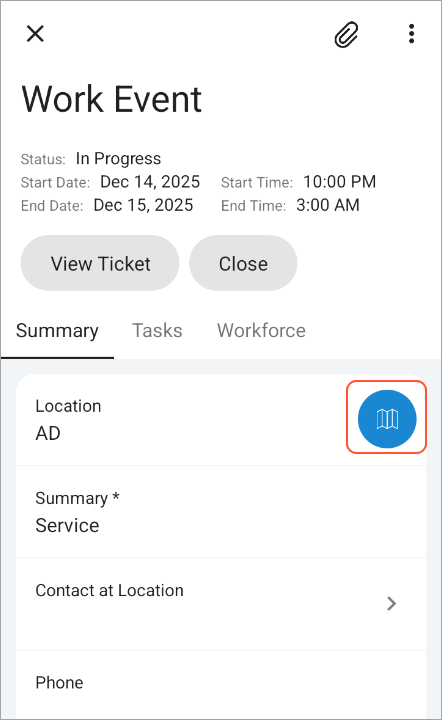
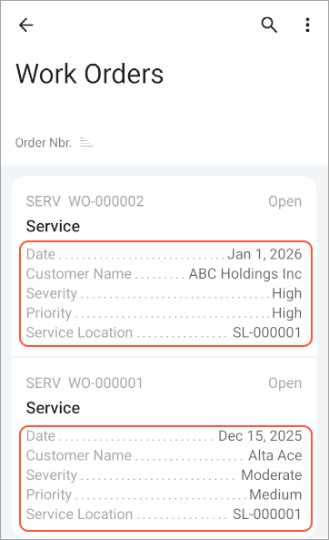
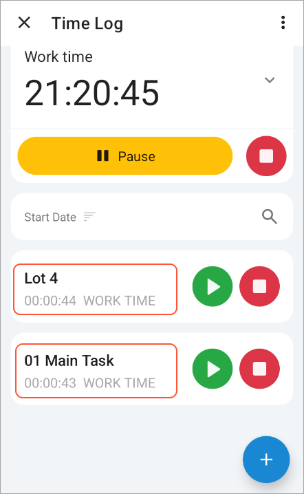

# Customizing the Design and Layout for a List of Records {#_81d99dbe-9295-4ebe-a979-4aafedcfd590 .reference}

Lists of records often appear on screens of the Acumatica mobile app. In a list of records, users can review key information, open individual records, and perform actions. You can control how records and their fields look in these lists and what users can do with them.

You can do the following:

-   Highlight important fields
-   Specify the alignment of fields
-   Display fields in a table layout and organize the corresponding fields as name–value pairs in individual rows
-   Place fields in a vertical stack
-   Specify the default placement of actions associated with recordActionLink objects
-   Specify styles for actions associated with recordActionLink objects
-   Display available actions
-   Modify numeric values directly in the list, without having to open the record
-   Display the list of records as a selection list, which allows individual record selection but removes the ability to select or clear all records in the list

The following sections describe these customization capabilities and the ways you can use them to improve lists of records in the mobile app.

**Tip:** For information about customizing a list of records to display available actions, allow the editing of fields, and display the list as a selection list, see the following topics:

-   [Displaying the Available Actions In a List of Records](Mobile_msdl_screen_display_actions.md)
-   [Making a Record’s Fields Editable in a List of Records](Mobile_msdl_screen_edit_record_field.md)
-   [Providing a Selection List](Mobile_msdl_screen_configure_selection_list.md)

## Using the ListView Template { .section}

The *ListView* template gives you the ability to customize how fields and actions appear in a list of records.

To use this template, you specify *ListView* as the value of the layout attribute of a [layout](mobile_ref_msdl_objtypes_layout.md) object in Mobile Site Map Definition Language \(MSDL\).

Note that the use of the *ListView* template is optional when you’re defining a list of records:

-   If the *ListView* template is not specified, the mobile app uses the mapping in the container to display the list of records \(by using the simple list view layout\) as well as the form view of an individual record. For details, see [Configuring Lists](mobile_msdl_screen_list.md).
-   If the *ListView* template is specified, the mobile app:
    -   Uses this template exclusively to display a list of records and ignore any fields defined outside of the template while displaying the list.
    -   Uses fields defined outside of this template to display the form view of an individual record and ignore the contents of the template when displaying the form.

Within a *ListView* template, you can control a [field's](mobile_ref_msdl_objtypes_field.md) visual emphasis by specifying one of the following options for the style property:

-   *importance-low*: Uses a smaller font size and lighter weight \(Item 1 below\) than medium
-   *importance-medium* \(default\): Uses the medium font size and weight \(Item 2\). You don’t need to specify this value explicitly.
-   *importance-high*: Uses a larger font size than medium and bold for the font weight \(Item 3\).

To specify the alignment of a [field](mobile_ref_msdl_objtypes_field.md), you can specify one of the following values for the style property:

-   *column-left* \(default\): Aligns the field to the left side of its container.
-   *column-right*: Aligns the field to the right side of its container \(Item 4\).

**Attention:** The options of the style property in the preceding list are mentioned in the context of a [field](mobile_ref_msdl_objtypes_field.md) object. They work only when they’re defined within the scope of the *ListView* template and are ignored outside of this scope. However, you can use the style property outside of the scope of the *ListView* template, such as in the context of a [recordActionLink](MOBILE_ref_MSDL_objtypes_RecordActionLink.md) object. For details, see the following section.



The following MSDL code corresponds to the screenshot above.

```
add container "ExpReceipts" { 
  add layout "ListViewLayout" {
    layout = ListView
    add layout "line1" {
      layout = Inline
      add field "ReceiptNumber" {
        style = "importance-low"
      }
      add field "Status" {
        style = "column-right"
      }
    }
    add layout "line2" {
      layout = Inline
      add field "Description" {
        style = "importance-high"
      }
      add field "ClaimAmount"
    }
    add field "Date"
  }
  ...
}

  
```

## Customizing the Appearance of RecordActionLink Objects in a ListView Template { .section}

A *ListView* template may include [recordActionLink](MOBILE_ref_MSDL_objtypes_RecordActionLink.md) objects. You can control the alignment of the corresponding actions by using the style property and specifying one of the alignment options described in the previous section.

You can also use the style property for recordActionLink objects to control how an action is displayed in the UI and whether its button has a background. You can specify one of the following values:

-   *text*: Displays the action as text only without an icon
-   *icon*: Displays the action as an icon only without any accompanying text
-   *text-icon*: Displays the action with both an icon and text
-   *background-none*: Removes the background from the button that represents the action

**Tip:** You can also use all the available options of the style property in the context of recordActionLink objects outside of the scope of a *ListView* template. For the list of available options, see [recordActionLink](MOBILE_ref_MSDL_objtypes_RecordActionLink.md).



## Using the CaptionValueTable Template Within a ListView Template { .section}

Within a *ListView* template, you can use *CaptionValueTable* as the value for the layout attribute of a nested layout object. This template displays fields in a table format, organized as name–value pairs in individual rows. This can improve the readability of fields, as shown below.



The following MSDL code corresponds to the use of the *CaptionValueTable* template in the screenshot above.

```
add container "Document" { 
  add layout "listview" {
    displayName = "listview"
    layout = "ListView"
    ...
    add layout "table" {
      displayName = "table"
      layout = "CaptionValueTable"
      add field "Date"
      add field "Customer" {
        selectorDisplayFormat = Key
      }
        add field "CustomerName"
        add field "Severity"
        add field "Priority"
        add field "ServiceLocation"
    }
  }
  ...
}
  
```

**Attention:** The *CaptionValueTable* template works only when it's defined within the scope of the *ListView* template; it is ignored outside of this scope.

## Using the Column Template Within a ListView Template { .section}

Within a *ListView* template, you can also use *Column* as the value for the layout attribute of a nested layout object. This template lets you stack fields vertically, as shown below.



The following MSDL code uses the *Column* template for the list of records shown in the preceding screenshot.

```
add container "ActiveTimers" {
  ...
  add layout "listview" {
    layout = "ListView"
    add layout "line1" {
      layout = Inline
      add layout "column1" {
          layout = Column
          add field "DocumentDescr" {
            style = "importance-low"
          }
          add field "Summary" {
            style = "importance-high"
          }
          add layout "line3" {
            layout = "Inline"
            add layout "timer" {
              ...
            }
            add field "Type" {
              style = "importance-low"
            }
          }
      }
      add recordActionLink "DetailStart" { style = "icon column-right" }
      add recordActionLink "DetailStop" { style = "icon column-right" }
    }
  }
  ...
}
```

**Attention:** The *Column* template works only when it's defined within the scope of the *ListView* template and is ignored outside of this scope.

**Parent topic:**[Configuring a Screen Layout](../StudioDeveloperGuide/MOBILE_MSDL_Layout.md)

