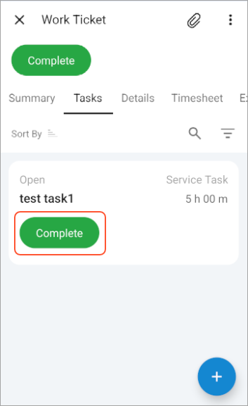

# Displaying the Available Actions In a List of Records {#_e88f5b0d-5382-47b5-a22b-71bfe0f4a3cd .reference}

Screens of the Acumatica mobile app often display lists of records, such as the details of a document or all records created on a particular screen. While viewing a list of records, a user may want to act upon individual records.

In this topic, you’ll learn how to display each record’s available actions in a list of records.

## Displaying the Available Actions for a Record { .section}

You can display the available actions for each record in a list of records by setting the showActionsOnList property to `True` in the MSDL code of the corresponding container. The available actions are rendered at the bottom of each record, as shown below.



The following MSDL code uses the showActionsOnList property for the list of records shown in the preceding screenshot

```
add container "WorkTasks" {
  containerActionsToExpand = 1
  filter = "TicketWorkTasksFilter"
  showActionsOnList = True
  add layout "listview" {
    displayName = "listview"
    layout = "ListView"
    add layout "line1" {
        ...
    }
    add layout "line2" {
        ...
    }
  }
  ...
}
  
```

**Attention:** An action can be displayed for a record only if it has the DisplayOnMainToolbar property of the PXButton attribute set to `true`.

The system collects these actions in the following ways:

-   For substitute screens, the actions are typically collected from the graph of the corresponding entry screen. For example, actions for sales orders on the Sales Orders \(SO3010PL\) screen are collected from the [Sales Orders](../UserGuide/SO_30_10_00.md) \(SO301000\) screen.
-   For secondary containers on a screen—such as the container corresponding to the **Details** tab on the [Sales Orders](../UserGuide/SO_30_10_00.md) screen—the actions are collected from the current graph of the screen.

**Parent topic:**[Configuring a Screen Layout](../StudioDeveloperGuide/MOBILE_MSDL_Layout.md)

