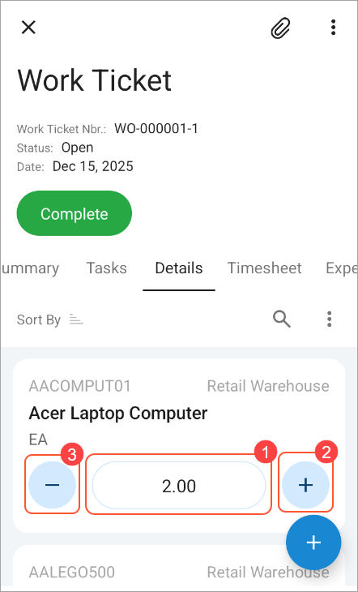

# Making a Record’s Fields Editable in a List of Records {#_4933532f-772e-4fec-b5ec-18de88f332d1 .reference}

In a list of records in the Acumatica mobile app, users can view each record’s data. Depending on how the list has been configured, they may also be able to act upon records.

This topic describes how you can allow users to edit the values of a record’s fields directly in the list of records—without opening the record first.

## Making a Record’s Fields Editable in a List { .section}

A user can edit the values of certain fields of a record directly in a list of records. To make this possible, you specify the Special = Counter property in the MSDL code for the relevant fields of the record.

This property is particularly useful for numeric fields, such as those used to specify the quantity of each listed item. The Special = Counter property makes a field editable \(Item 1 below\), and the UI provides buttons for increasing \(Item 2\) or decreasing \(Item 3\) its value.

**Parent topic:**[Configuring a Screen Layout](../StudioDeveloperGuide/MOBILE_MSDL_Layout.md)

