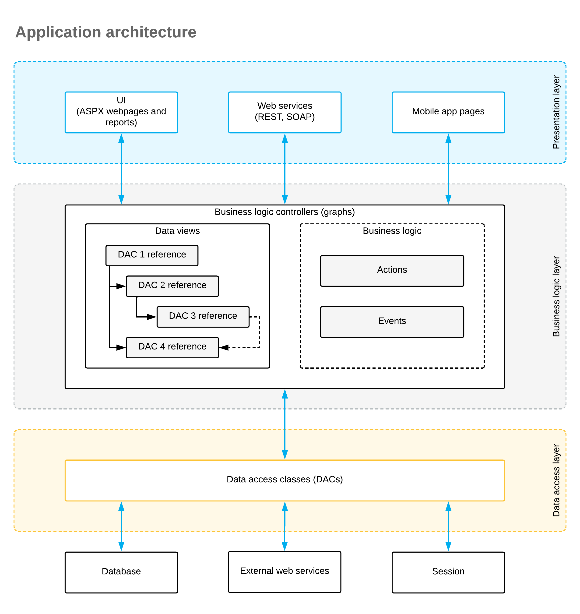

# Application Programming Overview {#_6c91a5d7-70d6-4a7e-9cfd-7d59faeae258 .concept}

In this topic, you’ll review the architecture of an application created based on the Acumatica Framework—such as Acumatica ERP, customizations of it, and applications based purely on the Acumatica Framework.

## Runtime Structure and Components { .section}

An application written with the Acumatica Framework has an **n-tier architecture** with a clear separation of the presentation, business, and data access layers, as shown in the following diagram. You can find details about each layer in the sections below.

## Data Access Layer { .section}

The data access layer of an application created with the Acumatica Framework is implemented as **a set of data access classes \(DACs\)**that wrap data from database tables or data received through external sources \(such as Amazon Web Services\).

The instances of DACs are maintained by the business logic layer. Between requests, these instances are stored in a session. On a standalone Acumatica ERP server, session data is stored in the server’s memory. In a cluster of application servers, session data is serialized and stored in a high-performance remote server through a custom optimized serialization mechanism.

For details about data storage in a session, see [Session](AD__con_Session.md). To learn about working with the data access layer, see [Accessing Data](AD__mng.md).

## Business Logic Layer { .section}

The business logic is implemented through **business logic controllers** \(also called *graphs*\). Graphs are classes derived from the special API class PXGraph and tied to one or more DACs.

Each graph conceptually consists of two parts:

-   **Data views**, which include references to the required DACs, their relationships, and other meta information
-   **Business logic**, which consists of actions and events associated with the modified data

Each graph can be accessed from the presentation layer or from application code implemented within another graph. When the graph receives an execution request, it:

1.  Extracts the data required for request execution from the DACs included in the data views
2.  Triggers the business logic execution
3.  Returns the execution’s result to the requesting party
4.  Updates the data access classes’ instances with the modified data

For details on working with the business logic layer, see [Implementing Business Logic](BL__mng.md).

## Presentation Layer { .section}

The presentation layer provides access to the application’s business logic through **the UI, web services, and the Acumatica mobile app**. The presentation layer is completely declarative and contains no business logic.

The Modern UI is a .NET-compatible product that delivers updated UI capabilities without relying on ASPX pages. On the server side, the Modern UI is represented by web services. On the client side, it’s represented by a template-based single-page application \(SPA\) framework based on [Aurelia](https://aurelia.io/).

The application code is written in TypeScript. The framework transcribes this code into JavaScript code for execution in the web browser. This approach simplifies code maintenance. Developers use HTML and CSS to design form layouts.

For details on the configuration of the UI, see [Modern UI Development: General Information](../DeveloperGuide/UIDev_ModernUI_GeneralInfo.md).

The UI also includes reports created with the Acumatica Report Designer.

Web services and mobile app pages provide alternative interfaces to the application business logic. Whether a request comes from a webpage, the web services, or a mobile app page, the graph handles it identically, executing the same business logic.

**Parent topic:**[Acumatica Framework Overview](../StudioDeveloperGuide/OV__mng.md)

