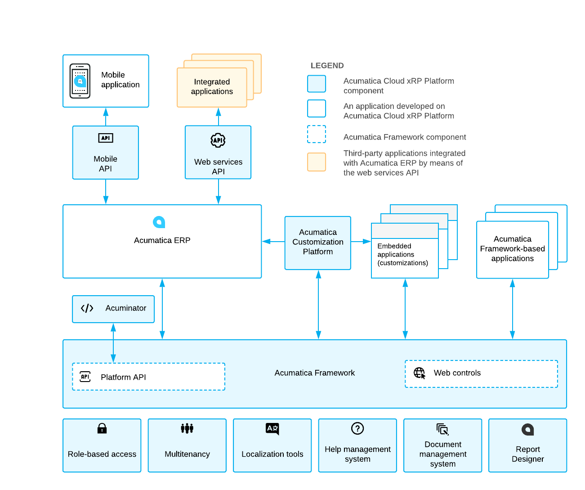

# Acumatica Cloud xRP Platform {#_a296caef-aee5-4190-90d0-e43c6378c1b5 .concept}

The Acumatica Cloud xRP Platform is the foundation for building Acumatica ERP and its customizations, the Acumatica mobile app, and applications integrated with Acumatica ERP through the web services API.

The Acumatica Cloud xRP Platform consists of a number of components, which are highlighted with light blue in the following diagram. These components serve different purposes, which are described in detail in this topic, and can be used either separately or combined to achieve your business purposes.



## Basic Components and Tools { .section}

The base of the Acumatica Cloud xRP Platform is formed by the components and tools that provide the basic application functionality, such as multitenancy support, role-based access, and localization tools. These components and tools are available out-of-the-box in Acumatica ERP, any embedded in Acumatica ERP applications, or applications based purely on Acumatica Framework applications. This means that you do not need to worry about implementing mechanisms similar to these components during the design or programming of your application based on the Acumatica Cloud xRP Platform.

Acumatica Cloud xRP Platform contains the basic components and tools listed in the following table.

|Component or Tool|Description|
|-----------------|-----------|
|Role-based access|A set of components responsible for user authorization, access rights verification, and audit on the data access and business logic levels. For more information, see [User Roles: General Information](../UserGuide/User_Roles_GeneralInfo.md) in the System Administration Guide.|
|Multitenancy|A component responsible for hosting multiple tenants on a single application server. For details about multitenancy, see [Managing Tenants Locally](../UserGuide/SA_MNG_Managing_Tenants_Locally.md) and [Managing Tenants by Using the Web Interface](../UserGuide/SA_Managing_Tenants_Using_Web_Mapref.md).|
|Localization tools|The tools that help you to perform the localization of the application to multiple languages. For more information about localization, see [Translation Process](../UserGuide/SM__con_Translation_Process.md).|
|Help management system|The integrated wiki-based help content editing, management, and search system. For details about the help management system, see [Wiki Overview](../UserGuide/SM__con_Wiki_Management.md).|
|Document management system|The integrated document storage and management system.|
|Report Designer|A separate utility \(which can be installed along with Acumatica ERP or Acumatica Framework\) that you can use to design custom reports. For details on this tool, see [Acumatica Report Designer Guide](../UserGuide/ReportDesigner_Main.md).|

## Acumatica Framework { .section}

The Acumatica Framework provides the platform API and web controls for the development of the UI and business logic of an ERP application. The platform API is used for the development of Acumatica ERP and any embedded applications \(that is, customizations of Acumatica ERP\). You can also use the Acumatica Framework to develop an ERP application from scratch.

The platform API provided with Acumatica Framework is an event-driven programming API, which is traditional in rich GUI applications. This model covers database access, business logic, GUI behavior, and error handling. All coding is done with only C\#.

The following code gives an example of the business logic implemented in the business logic controller: The code updates the receipt total when one of the transactions related to the receipt is updated.

```
public virtual void DocTransation_RowUpdated(PXCache cache,
                                             PXRowUpdatedEventArgs e)
{
    DocTransaction old = e.OldRow as DocTransaction;
    DocTransaction trn = e.Row as DocTransaction;
    if ((trn != null) && (trn.TranQty != old.TranQty ||
                                   trn.UnitPrice != old.UnitPrice))
    {
        Document doc = Receipts.Current;
        if (doc != null)
        {
            doc.TotalAmt -= old.TranQty * old.UnitPrice;
            doc.TotalAmt += trn.TranQty * trn.UnitPrice;
            Receipts.Update(doc);
        }
    }
}
```

When a user selects a document transaction in the table on a form and updates the settings of the transaction, the RowUpdated event is triggered, and the code above is executed and updates the receipt total.

You can find detailed information about the development of applications with Acumatica Framework in this guide.

## Acuminator { .section}

Acuminator is a static code analysis and colorizer tool for Visual Studio that simplifies development with Acumatica Framework. Acuminator provides diagnostics and code fixes for common developer challenges related to the platform API. Also, Acuminator can colorize and format business query language \(BQL\) statements, and can collapse attributes and parts of BQL queries. You can find related information and download Acuminator at [Visual Studio Marketplace](https://marketplace.visualstudio.com/items?itemName=V-for-Volodymyr.Acuminator#overview).

## Acumatica Customization Platform { .section}

The Acumatica Customization Platform provides customization tools you can use to develop applications embedded in Acumatica ERP. As you work with the Acumatica Customization Platform, you use the platform API provided by Acumatica Framework.

With Acumatica Customization Platform, you can perform end-customer customizations and create complex solutions for multiple customers. In these customizations, you can modify the user interface, business logic, and database schema without recompilation and reinstallation of the application. Customizations are stored separately from the core application code as metadata and can be modified, exported, or imported. Because customizations are stored separately, they are preserved with the updates and upgrades of the core application.

For details on Acumatica Customization Platform, see [Acumatica Customization Platform](../CustomizationPlatform/CG_Platform.md).

## Web Services APIs { .section}

The Acumatica Cloud xRP Platform provides multiple types of web services APIs for development of applications integrated with Acumatica ERP. These applications can perform data migration and data import, integration of Acumatica ERP with external systems, and execution of long-running operations.

You can use the contract-based REST API or screen-based SOAP API to access the same business logic as is accessed in the UI. All types of the web services APIs can be used with any customization applied to Acumatica ERP. The contract-based REST API supports the OpenAPI 3.0 specification.

For details on the web services APIs, see [Contract-Based REST API](../IntegrationDevelopmentGuide/IS__con_CB_API.md) and [Screen-Based Web Services API](../IntegrationDevelopmentGuide/IS__con_SB_API.md).

Acumatica ERP supports the OAuth 2.0 mechanism of authorization for add-on applications that interact with Acumatica ERP through application programming interfaces \(APIs\). For details on the authorization of applications, see [Authorizing Client Applications to Work with Acumatica ERP](../IntegrationDevelopmentGuide/IS__mng_Authorizing_with_OAuth2.md).

## Mobile API { .section}

Acumatica ERP provides the Acumatica mobile application, which allows a user to work with Acumatica ERP through the mobile devices. You can customize the mobile application by using the mobile API. For details on the mobile API, see [Working with the Mobile Framework](Mobile_Framework_Guide.md).

**Parent topic:**[Acumatica Framework Overview](../StudioDeveloperGuide/OV__mng.md)

