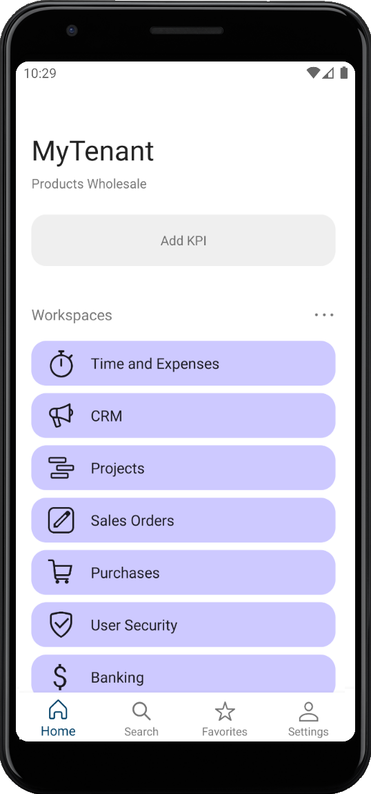
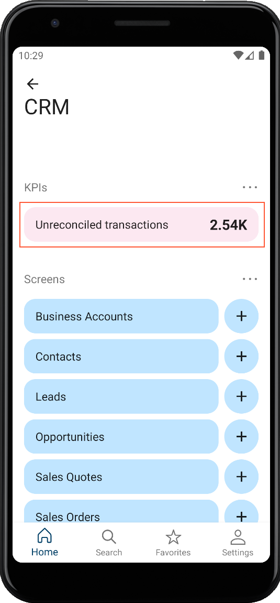
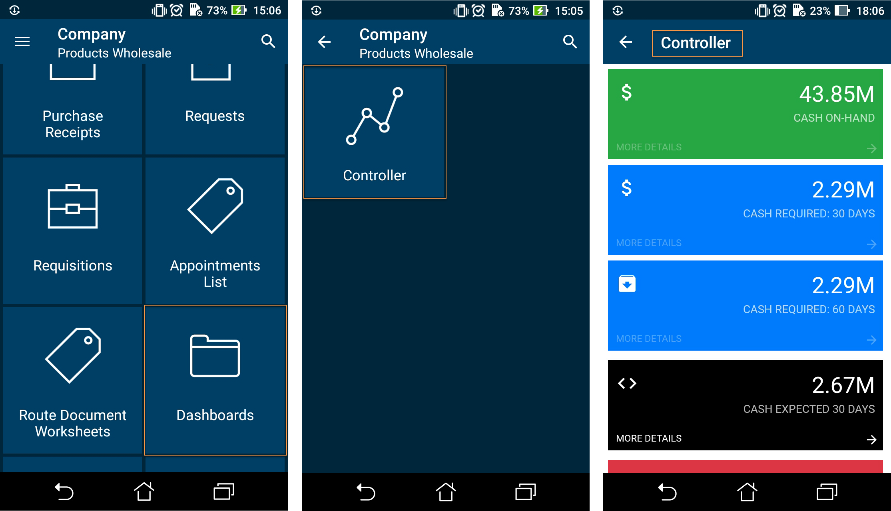
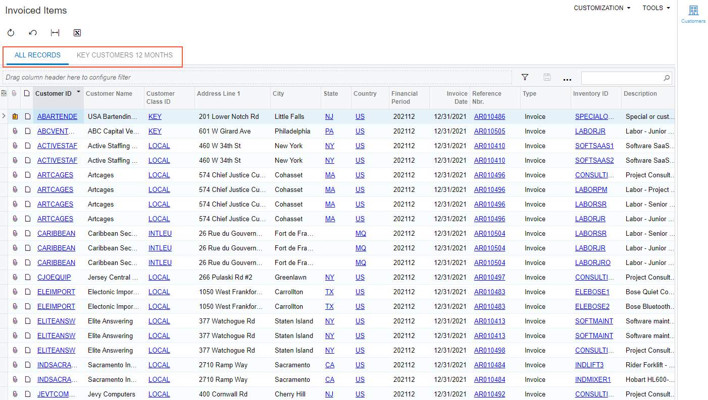
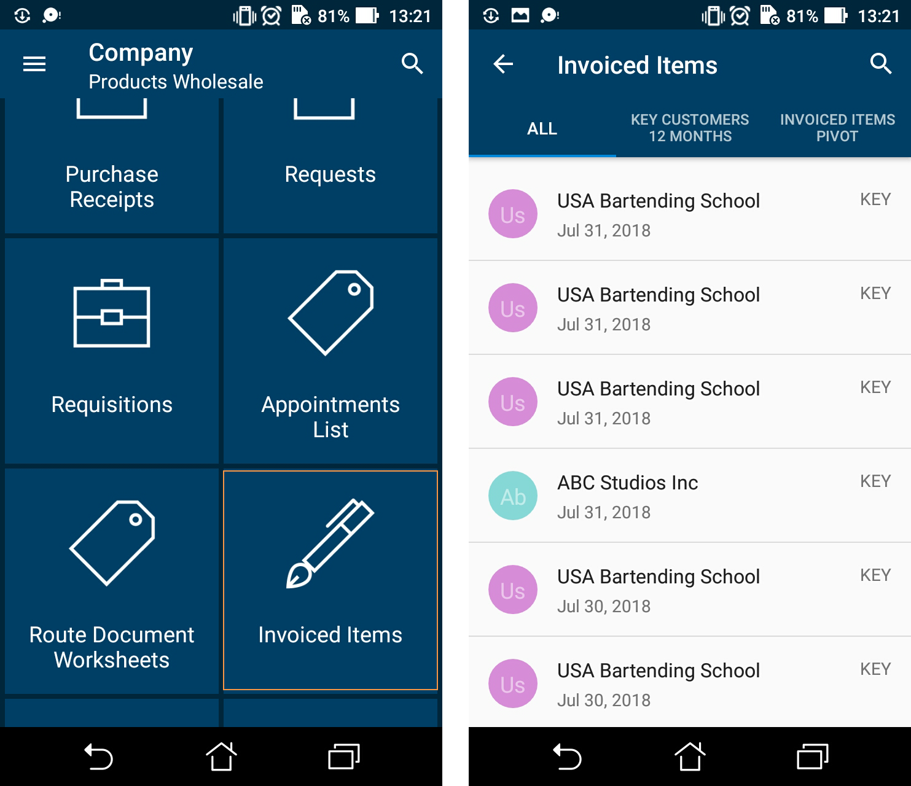

# Home Screen {#_c7e5bca7-aebc-4c40-878e-94535fa91c9e .concept}

The Home screen of the Acumatica mobile app consists of workspaces, a placeholder for adding KPI widgets, the list of recently visited screens and records, the list of screens and records marked as favorites, and the bottom menu with the **Home**, **Search**, **Favorites**, and **Settings** buttons. A user can go to any of these parts of the mobile app by tapping the needed part of the screen.

**Note:** The workspaces in the mobile app are not the same as the workspaces in the web version. You configure mobile workspaces separately \(see [To Manage the Workspaces of the Mobile App](MOBILE_Workspaces.md)\).

To add a link to screen \(form\) so that a user can access it from the Home screen, you perform the following steps:

1.  Map the screen to the mobile site map, as described in [To Add a Screen to the Mobile Site Map \(Example\)](MOBILE_MobileSiteMap_AddingMSDL.md)
2.  Add the screen to the mobile site map, as described in [To Update the Site Map of a Mobile App](mobile_updatemainmenu.md)
3.  Add the screen to a workspace, as described in [To Manage the Workspaces of the Mobile App](MOBILE_Workspaces.md)

**Note:** The access rights for screens in the mobile application are the same as the access rights for screens in Acumatica ERP.

In this topic, you can read about and perform several simple examples that demonstrate how to build the site map of the mobile application.

## Exploring of the Original Code of the Site Map { .section}

The code of the site map defines which screens will be accessible from different workspaces on the Home screen. The mobile app's Home screen is shown in the following screenshot.



You can view the original code of the site map of the Acumatica mobile app by doing the following:

1.  Open the [Customization Projects](../UserGuide/SM_20_45_05.md) \(SM204505\) form, and in the **Project Name** column, click the link of the customization project. The Customization Project Editor opens.
2.  Open the Mobile Application page.
3.  On the More menu of the page, click **Update Sitemap**.

    The Update: SITEMAP page opens. The *Update: SITEMAP* screen appears in the list of modified screens on the Mobile Application page.

4.  On the Update: SITEMAP page, explore the original code of the site map in the **Result Preview** area.

## Example: Adding a Screen to a Workspace { .section}

Adding a screen to a workspace consists of two actions:

-   Adding the new screen to the mobile site map, as described in [To Add a Screen to the Mobile Site Map \(Example\)](MOBILE_MobileSiteMap_AddingMSDL.md)
-   Adding the new screen to a workspace

In this example, you will add the *Unreconciled transactions* widget of the *Controller* dashboard to the **CRM** workspace by using the [Mobile Workspaces](../UserGuide/AU_22_00_12.md) \(AU220012\) and [Mobile Workspace](../UserGuide/AU_22_00_13.md) \(AU220013\) forms.

To add the widget, perform the following steps:

1.  Open the [Mobile Workspaces](../UserGuide/AU_22_00_12.md) form.
2.  In the **Workspace ID** column, click *CRM*.

    The [Mobile Workspace](../UserGuide/AU_22_00_13.md) form opens.

3.  On the table toolbar of the **Widgets** tab, click **Add Row**, and specify the following settings in the added row:
    -   **Dashboard**: *Controller*
    -   **Widget**: *Unreconciled transactions*
4.  Save your changes.
5.  Sign out of the mobile app, and then sign in again.
6.  On the Home screen, tap **CRM**.

    The workspace should look similar to the one shown in the following screenshot:

    


## Example: Adding a Screen to a Folder { .section}

**Important:** As of Acumatica ERP 2026 R1, the adding of screens by methods described in the section has been deprecated. We recommend that you use the workspace functionality as described in [To Configure Workspaces in the Acumatica ERP Instance](MOBILE_Workspaces_Instance.md).

Adding a screen to a folder consists of two actions:

-   Adding a new screen to the mobile site map, as described in [To Add a Screen to the Mobile Site Map \(Example\)](MOBILE_MobileSiteMap_AddingMSDL.md)
-   Adding the new screen shortcut to the main menu.

In this example, you will add a shortcut of the Controller screen to the Dashboards folder of the main menu. Copy the code below to the Commands area of the Update: SITEMAP page in the Customization Project Editor.

```
update sitemap {  
  add folder "Folder_0" {
    displayName = "Dashboards"    
    icon = "system://Folder"    
    add item "DB000015" {      
      displayName = "Controller"      
      icon = "system://Graph1"    
    }  
  }
}
```

The screenshots below show the results of this code on the mobile device.



**Note:** A folder must include at least one screen.

A folder can be of one of the following types, which determine how the folder contents are displayed:

-   ListFolder \(default\): With a folder of this type, folders and screens are represented as tiles with icons \(see the first screenshot in the example in this section, shown above\). You need to tap an icon to open a folder or screen.
-   HubFolder: In a folder of this type \(see an example in the right screenshot at the end of the next section\), the content of a screen is displayed like a tab item on a form. You swipe left and right to navigate through the contents of the folder.

**Note:** Nested folders of the HubFolder type are not supported. That is, you may not add a folder of the HubFolder type within another folder of HubFolder type.

## Example: Configuring Screens for Forms with Tabs { .section}

Some Acumatica ERP forms display lists on multiple tabs \(as the following screenshot shows\).



In the mobile app, such a form is represented as multiple subscreens, with each subscreen corresponding to a single tab. However, you have to configure only one screen because the mobile API server automatically performs the screen expansion into multiple screens.

**Note:** In the following example and the screenshot shown above, we will use the Invoiced Items generic inquiry \(GI000008\). If you don't have this generic inquiry in your instance of Acumatica ERP you can create this generic inquiry. For details, see [Managing Generic Inquiries](../UserGuide/SM__MNG_Managing_Generic_Inquiry.md).

To configure a screen for a form, do the following:

1.  Add the GI000008 screen to the mobile site map by performing the steps described in [To Add a Screen to the Mobile Site Map \(Example\)](MOBILE_MobileSiteMap_AddingMSDL.md).
2.  Copy the following code to the **Commands** area of the Add: GI000008 page, and save your changes.

    ```
    add screen GI000008 {
      add container "Result" {
        add field "AccountName"
        add field "CustomerClassID"
        add field "InvoiceDate"
      }
    }
    ```

3.  Update the site map of the mobile app with the following code. For details, see [To Update the Site Map of a Mobile App](mobile_updatemainmenu.md).

    ```
    add folder "Invoiced_Items" {
      type = HubFolder
      displayName = "Invoiced Items"
      icon = "system://Pen"
      add item "GI000008" {
        displayName = "Invoiced Items"
      }
    }
    ```

4.  Add the screens to the **CRM** workspace, as described in [To Configure Workspaces in the Acumatica ERP Instance](MOBILE_Workspaces_Instance.md).
5.  Publish your customization project, and open the mobile app.

The following screenshots show the result of this code on a mobile device. The first screenshot shows the changes to the main menu. The second screenshot shows the added screen with tabs.



**Parent topic:**[Configuring the Mobile Site Map](../StudioDeveloperGuide/MOBILE_MSDL.md)

