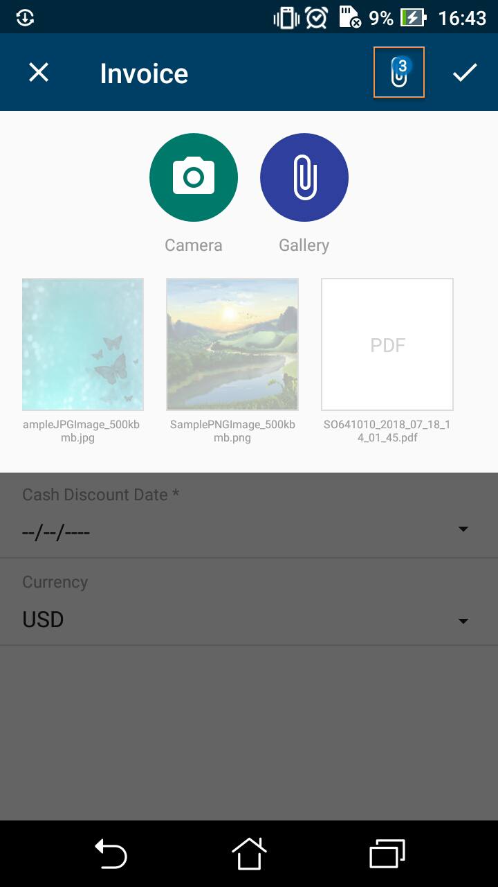
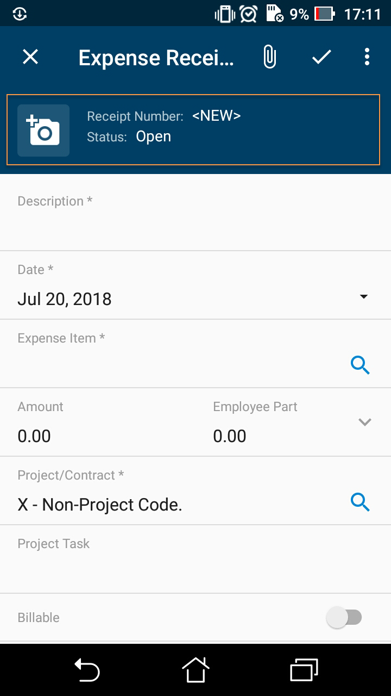

# Configuring Attachments {#_fd9cb8aa-609c-46d4-8c8d-f29dda804721 .reference}

By default, the mobile application enables file attachments and displays them on a screen if the screen supports the attachments. However, the default handling of attachments can be overridden.

**Note:** On iOS devices, it is possible to upload only image files. Files of other types are not supported.

## Example: Configuring a Screen with Attachments { .section}

The following sample code gives the Invoices \(SO303000\) screen the ability to accept attachments of various formats. To see an example, add the Invoices \(SO303000\) screen to your customization project \(as described in [To Add a Screen to the Mobile Site Map \(Example\)](MOBILE_MobileSiteMap_AddingMSDL.md)\), copy the code below to the **Commands** area of the Add: SO303000 page, and publish the project.

```
add screen SO303000 {
  add container "InvoiceSummary" {
    add field "Customer"
    add field "Location"
    add field "Terms"
    add field "DueDate"
    add field "CashDiscountDate"
     add field "Currency" {
      selector {
        add field "CurrencyID"
      }
      PickerType = Attached
    }
    add recordAction "Save" {
      behavior = Save
    }
    add recordAction "Cancel" {
      behavior = Cancel
    }
    attachments {
      add type "jpg" {
        extension = "jpg"      
      }
      add type "png" {
        extension = "png"
      }
      add type "pdf" {
        extension = "pdf"
      }
    }
  }
}
```

To enable or disable attachments and configure the file types that are allowed, you use the attachments instruction inside the container object.

**Note:** If a screen does not support attachments, the attachments are not displayed even if you set the disabled attribute of the attachments instruction to *False*.

The screenshot below shows the resulting screen in the mobile application. To attach an item, the user taps the paper clip symbol in the top right corner of the screen. After at least one item has been attached, the number next to the paper clip indicates how many items have been attached.



## The Enhancement of Images Taken from the Camera { .section}

The functionality of enhancing images taken from the camera of a mobile device is implemented in the Acumatica mobile app with the help of Azure Form Recognizer \(AFR\) version 4.0. This image enhancement makes the image look better and more readable. This functionality is useful for any printed document, such as expense receipts that may be attached to documents in Acumatica ERP.

To switch on image enhancement in the Acumatica mobile app, you should set the imageAdjustmentPreset attribute to *Receipt* in the attachments instruction of the mobile site map as follows.

```
attachments {
      imageAdjustmentPreset = Receipt
}
```

When the imageAdjustmentPreset attribute is set to *Receipt*, a corresponding button appears in the attachment area \(see the screenshot below\). When a user taps the highlighted button, a special camera mode is switched on in the Acumatica mobile app. In this mode, the following enhancements of the image captured by the camera are performed:

-   The image is cropped by the bounding box of the detected edges.
-   Any image distortion is removed.
-   The image is converted into black and white.
-   The contrast of the image is maximized.

Each of these enhancements is first performed automatically and then the user can also add manual adjustments. The automatic changes cannot be undone.



If the imageAdjustmentPreset attribute is not specified or has value other than `Receipt`, the Acumatica mobile app attaches the original image taken from the camera.

## Attachments as Tiles {#section_g1j_dqb_zgc .section}

You can configure the Acumatica mobile app to display attachments in tiles. Mobile users will see all attachments as tiles with full names \(shown below\)— and be able to access the attachment just by clicking the tile.


To display attachments as tiles, specify DisplayInListview = True in the attachments instruction. The following code shows how to enable the list of attachments for the **Activities** tab of the CR301000 screen.

``` {#codeblock_tb1_fqb_zgc}
add screen CR301000 {
  add container "Activities" {
  ...
    attachments {
      DisplayInListview = True
    }
  }
}
```

**Parent topic:**[Configuring Specific Functionality of a Screen](../StudioDeveloperGuide/MOBILE_MSDL_ScreenFunctionality.md)

