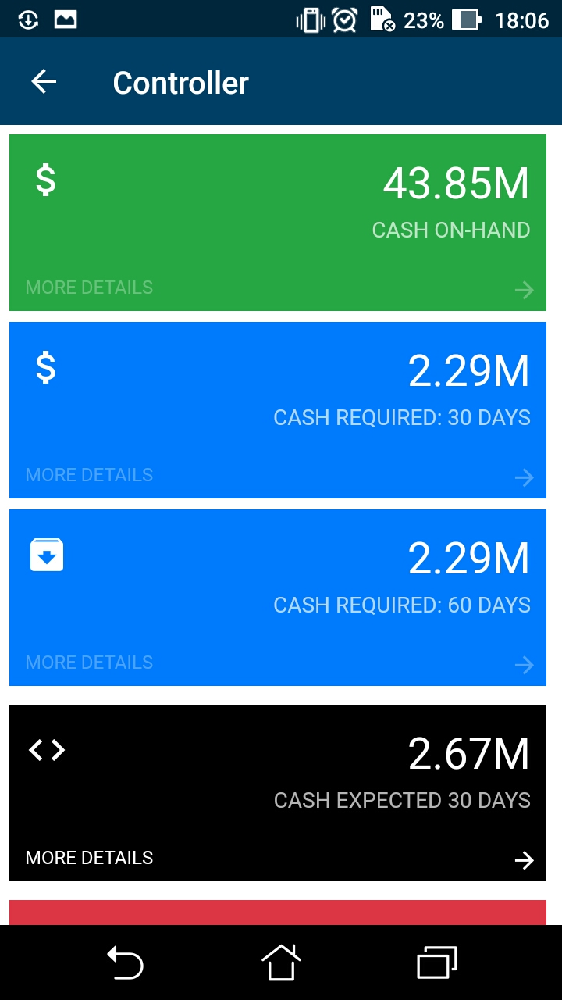

# Mapping Dashboards {#_da5fdd07-4e9c-4fe3-873b-72503e30182d .concept}

To map a dashboard to the mobile app, you have to do the following:

-   Add a screen with the corresponding dashboard. For details, see [To Add a Screen to the Mobile Site Map \(Example\)](MOBILE_MobileSiteMap_AddingMSDL.md).

    **Note:** If a user taps a dashboard widget, the mobile app tries to open the appropriate screen that supplies data to the widget. You may also want to add the screens that contain the data on which dashboard widgets are based. If the screen is absent in the mobile site map, the mobile app displays a warning.

-   Add the dashboard to the mobile site map
-   Add the dashboard to a workspace

A screen of the *Dashboard* type can display the following types of dashboard widgets:

-   Chart
-   Data Table
-   Score Card
-   Trend Card

Widgets of other types are not available in the mobile app. For details on widget types, see [Configuring Widgets](../UserGuide/RPT_Configuring_Widgets_Mapref.md).

## Example: Adding a Dashboard Screen { .section}

In this example, you will add the Controller \(DB000015\) screen with a set of dashboard widgets. Do the following:

-   Add the Controller \(DB000015\) screen in the Customization Project Editor by using the following code.

    ```
    add screen DB000015 {
      type = Dashboard
    }
    ```

-   Add the `Dashboards` folder and the Controller \(DB000015\) screen to the main menu of the mobile app, as shown in the following code. The code must be inside the `sitemap` instruction.

    ```
    ...
    add folder "Folder_0" {
      displayName = "Dashboards"
      icon = "system://Folder"
      add item "DB000015" {
        displayName = "Controller"
        icon = "system://Graph1"
      }
    }
    ...
    ```


The following screenshot displays the Controller \(DB000015\) screen for that is defined in an instance of Acumatica ERP. If you click on any widget, the screen is not displayed because the appropriate screens were not added to the mobile site map. You can add them to the mobile site map later.



**Parent topic:**[Screens](../StudioDeveloperGuide/mobile_msdl_screens.md)

